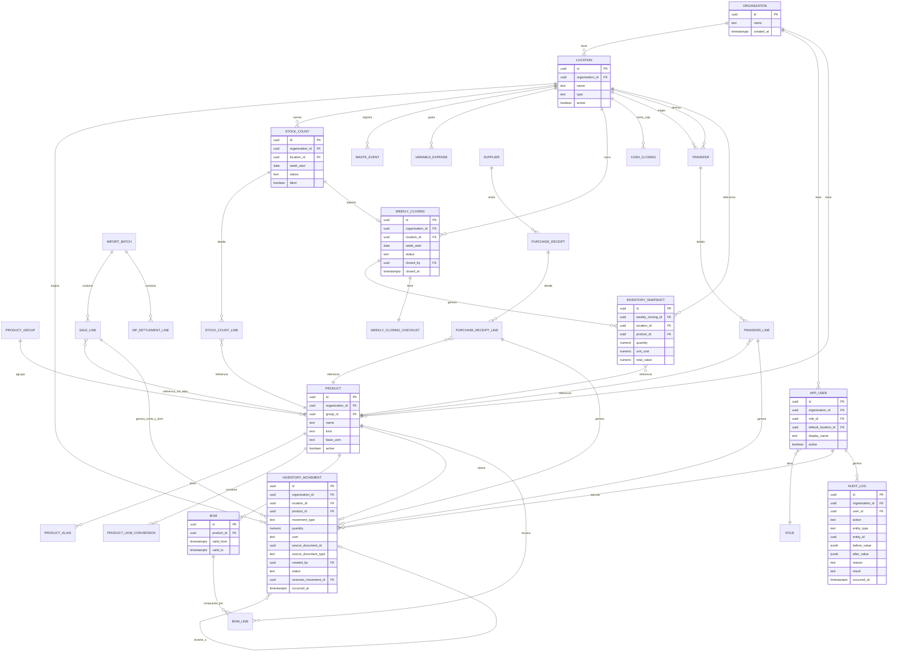
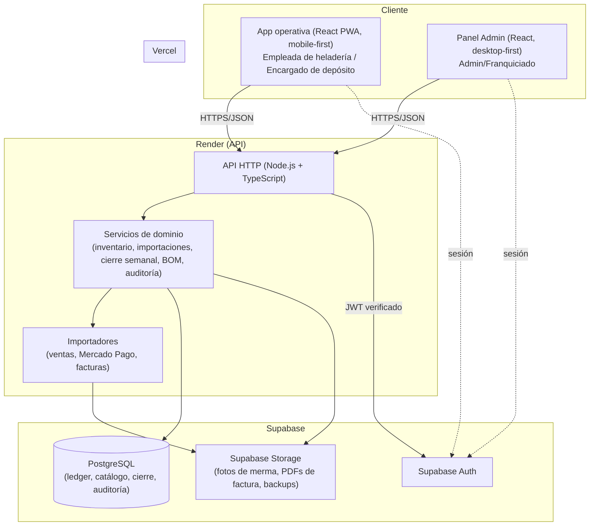
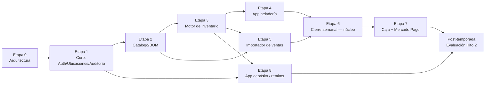

# ETAPA 0 — Análisis, Arquitectura y Plan Maestro
### Sistema de Control de Stock, Caja y Rentabilidad para Heladerías Grido (Heladerías Habash)

Versión: 1.2 (P-001 resuelta al iniciar Etapa 1) · Fecha original: 2026-09-02 · Autor: Claude (arquitecto de software, a pedido del socio programador)

> **Nota de versión**: este documento fue corregido puntualmente en la Etapa 0.1 (v1.1, ver `docs/ETAPA-0.1-CORRECCIONES.md`) y actualizado nuevamente en v1.2 para registrar que el cliente resolvió la pregunta bloqueante **P-001** al encargar la Etapa 1: **cada persona tendrá usuario individual — Opción A de la sección 18.2 (identidad individual real)**. No se reescribió ninguna otra sección; el resto del documento sigue vigente tal como quedó en v1.1.

> **Alcance de este documento**: análisis integral, arquitectura propuesta, modelo de datos, estrategia técnica y plan de implementación por etapas. **No contiene código, migraciones definitivas ni implementación.** Todo lo aquí escrito se deriva del material entregado por el cliente (ZIP `sistema_grido.zip`) y está clasificado explícitamente según su origen (confirmado, evidencia del sistema actual, recomendación, supuesto, pendiente o futuro), tal como exige el encargo.

---

## 0. Cómo leer este informe

El ZIP entregado contiene **dos fuentes de verdad de naturaleza distinta**, y este informe las trata por separado en todo momento:

1. **El documento de requisitos del cliente** (`Informe Corregido Grido Stock v2 (2).docx`, agosto 2026) — es un relevamiento funcional ya cerrado, redactado por el franquiciado/socio de negocio, con alcance dividido en **Hito 1** (validación interna, núcleo) e **Hito 2** (comercialización). Es la fuente **normativa**: cuando este informe dice "confirmado", casi siempre proviene de ahí.
2. **El sistema actualmente en uso** ("Heladerías Habash", Google Apps Script + Google Sheets, sucursales Aristóbulo del Valle / JJ Paso) — es un prototipo funcional real, en producción, que ya implementa una porción del alcance descripto en el documento de requisitos (ledger de stock, importación de ventas, BOM, mermas, bajas de lata, caja semanal, auditoría, backups). Se trata como **evidencia de comportamiento real y de estructuras de datos**, nunca como especificación a copiar automáticamente.

Además se inspeccionaron archivos operativos reales: catálogo maestro de Grido (1174 artículos), exports de ventas (mix de ventas agrupado/desagrupado), informe de comandas, informe de turnos, estadística de sabores, dos facturas de proveedores reales, un resumen de Mercado Pago real, una planilla de costeo de insumos, y capturas de pantalla del sistema POS nativo de Grido. Esto permite documentar **formatos reales de importación**, no hipotéticos — cumpliendo la instrucción explícita del propio documento del cliente ("no inventes columnas de archivos ni integraciones: los exports reales... se inspeccionarán antes de construir cada importador", §32).

Cada afirmación relevante de este informe lleva una etiqueta de estado:

| Etiqueta | Significado |
|---|---|
| **CONFIRMADO** | Está explícitamente en el documento de requisitos del cliente. |
| **RESPALDADO** | Se infiere con alta confianza cruzando el documento de requisitos con evidencia real (archivos, código). |
| **EXISTENTE EN SISTEMA ACTUAL** | Es comportamiento del prototipo Habash, no necesariamente un requisito del nuevo sistema. |
| **RECOMENDACIÓN TÉCNICA** | Propuesta de este informe, no pedida explícitamente. |
| **SUPUESTO (revisable)** | Interpretación razonable ante un vacío del material; no se construye sobre esto sin confirmación. |
| **PENDIENTE DE DEFINICIÓN** | Falta información del cliente; ver sección 26. |
| **FUERA DE ALCANCE / FUTURO** | Pertenece a Hito 2 o a una fase posterior; no se implementa ahora. |

---

## 1. Resumen ejecutivo

El cliente (Nabil Habash, franquiciado Grido) necesita reemplazar una operación hoy dispersa en papel, WhatsApp, Excel y un prototipo de Google Apps Script, por un sistema único de stock, caja y rentabilidad para sus dos heladerías (Saavedra y Aristóbulo del Valle/"El Pozo") y un depósito central. El proyecto está **dividido en dos hitos por decisión explícita del cliente**: **Hito 1** (núcleo operativo interno, objetivo: antes de noviembre 2026) e **Hito 2** (comercialización a ~20 franquiciados de Santa Fe, posterior a una temporada completa de validación). Este informe modela el sistema pensando en Hito 2 (`organization_id` desde el día 1) pero **construye únicamente lo necesario para Hito 1**.

El material entregado es inusualmente completo para una Etapa 0: no sólo hay un documento de requisitos ya estructurado, sino un **sistema previo funcional completo** (backend + frontend) que ya resuelve, con distinto grado de madurez, buena parte del núcleo pedido (ledger de movimientos, importación de ventas con detección de duplicados por hash, BOM con descuento automático de insumos, mermas con foto, bajas de lata, caja semanal con parseo de Mercado Pago, auditoría, backups, chequeos de integridad). Este prototipo **no se voltea ni se ignora**: se trata como el mejor punto de partida disponible para validar reglas de negocio y como fuente de datos de referencia (catálogo semilla de ~160 productos, mapeos de alias ya cargados, 181 líneas de BOM ya relevadas). Al mismo tiempo, tiene limitaciones estructurales serias para escalar a Hito 2 (autenticación por PIN compartido sin identidad individual, ausencia de `organization_id`, ausencia de transacciones atómicas reales, Google Sheets como motor de datos) que **no deben heredarse**.

**Veredicto de esta etapa (v1.2): A — Listo para comenzar desarrollo** — ver sección 27. (En v1.0/v1.1 el veredicto era B, por una única decisión bloqueante — P-001 — que condicionaba el diseño de Auth de Etapa 1.)

> **Actualización v1.2 — P-001 RESUELTA**: al encargar la Etapa 1, el cliente resolvió P-001 explícitamente: **cada persona que use el sistema tiene su propio usuario individual** (Opción A de la sección 18.2). No se usan cuentas compartidas por sucursal/rol como modelo principal de identidad. Las operaciones relevantes quedan asociadas al usuario real que las ejecutó (`created_by_user_id` o equivalente), para sostener auditoría, trazabilidad, identificación de responsables e historial de acciones. Esta decisión ya está incorporada en el modelo de `app_user` (sección 10.1) y en la Etapa 1 del plan maestro (sección 23).

---

## 2. Inventario del material analizado

| # | Archivo | Tipo | Qué aporta |
|---|---|---|---|
| 1 | `Informe Corregido Grido Stock v2 (2).docx` | Documento de requisitos (38 KB, 307 líneas de texto + 3 tablas) | Fuente normativa: visión, alcance Hito 1/Hito 2, roles, reglas de negocio, ledger, importaciones, cierre semanal, plan de etapas del propio cliente. |
| 2 | `heladerias-habash/` (28 archivos `.gs`, `.html`, `.css`, `.js`, `README.md`) | Código fuente completo (backend Google Apps Script + frontend SPA) | Sistema actualmente en producción. Ledger real, importador de ventas con hash anti-duplicado, BOM, auditoría, backups, chequeo de integridad, migración en 3 pasos, ~160 productos semilla. |
| 3 | `HELADERIAS_HABASH — Base de Datos.xlsx` | Base de datos real del sistema actual (20 hojas) | Esquema de datos en producción: PRODUCTOS, ENVIOS, VENTAS, STOCK, INGRESOS, PESAJES, ALIAS, PARAMETROS, VENTAS_DETALLE, IMPORTACIONES_VENTAS, ALIAS_ARTICULO, BOM_VENTA, CONSUMO_INSUMOS, MERMAS, BAJAS_LATA, CAJA_SEMANAL, AUDITORIA, IMPORTACIONES, HISTORIAL_COSTOS, BACKUPS. |
| 4 | `lisarticulos.xls` | Export real del ERP/POS de Grido (1174 artículos × 106 columnas) | Catálogo maestro oficial de Grido: precios, rubros, stock mín/óptimo, **composición de artículos (hasta 10 componentes por artículo — evidencia directa de BOM)**, disponibilidad por día/horario, códigos SAP. |
| 5 | `mixventas.xls` / `mixventas desa.xls` | Export real "Mix de Ventas" (agrupado / desagrupado) | **Formato real y confirmado del importador de ventas** (RF del documento §21): columnas cantidad, bultos, precio promedio, total, % total pesos, kilos, grupo/subgrupo, artículo, promoción, período. |
| 6 | `infcomandas.xls` | Export real "Informe de Pedidos" (822 filas) | Detalle por comprobante/venta individual: turno, caja, comprobante fiscal, forma de pago (EF/OT/MU), estado (Normal/Anulado). Complementario al mix de ventas. |
| 7 | `infturnos.xls` | Export real de cierres de turno/caja | Efectivo, tarjeta, tickets, cuenta corriente, caja teórica vs contada, diferencia, % Club Grido, % sobreventa — por turno (más granular que el cierre semanal pedido). |
| 8 | `estadsabores.xls` | Export real "Estadística de sabores" | Confirma que Grido ya reporta consumo por sabor (cajas, kilos, costo) por período y sucursal — es el dato exacto que el documento de requisitos (§0.5, §17.4) señala como differencial comercial para la proyección de compra anual. |
| 9 | `Planilla_Insumos_Roxana (1).xlsx` | Planilla de costeo manual (2 hojas: GRUPOS, INSUMOS — 303 filas) | Evidencia de un proceso manual de costeo/margen de insumos, con columnas separadas para canal "Venta Heladería" y canal "Venta Express" (este último pertenece al negocio mayorista **Habash Express**, explícitamente fuera de este proyecto). |
| 10 | `2_7_814229_(COPIA_1).pdf` | Factura real — Mundo Helado (insumos) | Formato real de factura de insumos: CUIT, condición cuenta corriente, línea por producto con cantidad/precio unitario/total, IVA, percepciones IIBB. |
| 11 | `2_26_8405_(COPIA_1) (1).pdf` | Factura real — Helacor S.A. (helado/producto Grido) | Formato real de factura de mercadería Grido (helado, tortas, bombones), 2 páginas, total de artículos/cajas/peso neto. |
| 12 | `mercadopago.pdf` | Export real (impresión de email) — resumen diario Mercado Pago Point Smart | **Confirma exactamente** lo declarado en el documento (§0.4): Mercado Pago manda por email un resumen de cobros (fecha/hora desde-hasta, total, desglose por Débito/Crédito/QR/Link de pago). Es el insumo real del importador de caja. |
| 13 | `mov stock.png` | Captura del ERP nativo de Grido | Pantalla real "Movimientos de stock entre depósitos" (remito interno, bultos, unidades, $/unidad, kilos, importe) — evidencia de que Grido ya soporta transferencias inter-depósito con remito. |
| 14 | `infpedidos.png` | Captura del ERP nativo de Grido | Pantalla real "Informe de Pedidos" con los mismos filtros/columnas que `infcomandas.xls`. |
| 15 | `mix desagrupado.png` / `mixde ventas img.png` | Capturas del ERP nativo de Grido | Pantalla real "Mix de Ventas" en modo Agrupado/Desagrupado — confirma visualmente el origen y el modo de exportación de `mixventas.xls` / `mixventas desa.xls`. |

**Nota de auditoría de datos**: en `PARAMETROS` (hoja del sistema actual) hay valores de PIN en texto plano y sus hashes v2 preparados-pero-no-activados. Este informe no reproduce esos valores; se los menciona sólo como evidencia del **mecanismo** de autenticación actual (PIN de 4 dígitos por rol/ubicación), relevante para la sección 18 (Seguridad).

---

## 3. Funcionamiento del negocio reconstruido

**CONFIRMADO** (documento del cliente) + **RESPALDADO** (cruce con archivos reales):

- Operación: depósito central + 2 heladerías (Saavedra, Aristóbulo del Valle/"El Pozo"), propiedad de un único franquiciado Grido.
- Cadena de valor: **pedido a Grido (martes) → factura por email → recepción en depósito → transferencia a heladería → venta en heladería (POS propio del franquiciado, no de Grido) → consumo de insumos (BOM) → mermas → conteo físico semanal (lunes) → cierre semanal (comparación teórico/real) → caja (efectivo + Mercado Pago)**.
- El "sistema de ventas" que exporta Excel (mix de ventas, comandas, turnos) es el **POS/ERP propio de las heladerías** (evidenciado por las capturas de pantalla), no un sistema de Grido — Grido sólo provee la factura de compra y el catálogo maestro de artículos.
- Grido exige al franquiciado una proyección anual de compra en kilos por sabor, hoy estimada "a ojo"; el conteo de latas (cerradas/abiertas/fracción) es el dato que permitiría calcularla con precisión — es el argumento comercial central del Hito 2 (**CONFIRMADO**, §0.5).
- Existe un negocio paralelo, **Habash Express** (distribución mayorista, corre sobre el mismo prototipo Apps Script/Sheets), explícitamente **fuera de este proyecto** y sin integración (**CONFIRMADO**, §0/portada). La `Planilla_Insumos_Roxana.xlsx` mezcla columnas de ambos canales — al construir cualquier importador de costos/precios, **las columnas "Venta Express" deben excluirse**.
- El "papel" sigue siendo el método real de captura en las heladerías: las empleadas completan una planilla física de conteo que nadie transcribe a Excel después. El criterio de diseño explícito del cliente es que la primera pantalla construida (conteo/merma/baja de lata) **calque esa planilla**, no que la reinvente (**CONFIRMADO**, §0.6, §3.5).

---

## 4. Requisitos funcionales

Prioridad: **P1** = núcleo Hito 1 (obligatorio antes de noviembre 2026), **P2** = Hito 1b (segunda etapa, durante temporada), **P3** = Fase 2 / Hito 2 (fuera de alcance de construcción ahora, sólo se modela).

### 4.1 Catálogo maestro, sabores, grupos, presentaciones

| ID | Descripción | Evidencia | Actor | Datos | Reglas | Depende de | Prioridad | Estado |
|---|---|---|---|---|---|---|---|---|
| RF-001 | Catálogo único de productos con UUID propio (nunca el nombre como clave) | Doc §7 | Admin | `product` | RN-001, RN-002 | — | P1 | CONFIRMADO |
| RF-002 | Cada producto tiene grupo, subgrupo, tipo, unidad base, unidades por presentación, estado activo/inactivo | Doc §7 | Admin | `product`, `product_group` | RN-002, RN-004 | RF-001 | P1 | CONFIRMADO |
| RF-003 | Sabores de helado a granel se registran individualmente aunque compartan precio/costo de grupo | Doc §8 | Admin | `product` (tipo SABOR) | RN-003 | RF-001 | P1 | CONFIRMADO |
| RF-004 | Tabla de alias/equivalencias de nombres por fuente (ventas, facturas, catálogo Grido), con sugerencia automática y confirmación manual del Admin | Doc §7.1; evidencia: hojas `ALIAS`, `ALIAS_ARTICULO` y función `matchProducto()` (fuzzy match por tokens) en el sistema actual | Admin | `product_alias` | RN-005 | RF-001 | P1 | CONFIRMADO + EXISTENTE EN SISTEMA ACTUAL (mecanismo de matching ya construido y usable como referencia) |
| RF-005 | Conversión automática entre presentaciones (ej. 2 cajas + 5 unidades → 21 unidades); el usuario nunca multiplica a mano | Doc §9 | Empleada, Encargado depósito | `product_uom`, `product_uom_conversion` | RN-006 | RF-002 | P1 | CONFIRMADO |
| RF-006 | Depósito cuenta en packs + cajas sueltas; heladería cuenta en cajas + unidades sueltas (unidades de conteo distintas por tipo de ubicación) | Doc, tabla §9 | Encargado depósito, Empleada | `location`, `product_uom` | RN-006 | RF-005 | P1 | CONFIRMADO |
| RF-007 | Receta/BOM por producto (packaging, insumos) cuando corresponda | Doc §7, §18 | Admin | `bom`, `bom_line` | RN-020..RN-024 | RF-001 | P1 | CONFIRMADO |

> **RF-008 — retirado en Etapa 0.1 (ver `docs/ETAPA-0.1-CORRECCIONES.md`)**: la versión 1.0 de este informe listaba aquí "importar catálogo maestro de Grido y sugerir automáticamente equivalencias/BOM" como un RF con prioridad propia. Es una corrección de alcance: la **necesidad confirmada** por el cliente es únicamente (a) tener un catálogo utilizable — ya cubierto por RF-001 a RF-007 — y (b) relacionar ventas con su consumo de insumos cuando corresponda — ya cubierto por RF-033 a RF-035. **Construir ese catálogo importando automáticamente el archivo de Grido, y generar el BOM de forma asistida por coincidencia de nombre, es un mecanismo técnico posible (existe evidencia de que ya se construyó en el prototipo actual), no un requisito pedido por el cliente.** Se reclasificó como recomendación **R-002** (sección 20) — el catálogo y el BOM del Hito 1 pueden poblarse íntegramente a mano si el cliente no aprueba automatizarlo.

### 4.2 Stock: ledger, conteo, teórico/real, diferencias, ajustes

| ID | Descripción | Evidencia | Actor | Datos | Reglas | Depende de | Prioridad | Estado |
|---|---|---|---|---|---|---|---|---|
| RF-009 | Ledger central de movimientos de inventario; el saldo nunca se edita directamente | Doc §3.2, §10 | Sistema | `inventory_movement` | RN-007..RN-010 | RF-001 | P1 | CONFIRMADO |
| RF-010 | Tipos de movimiento: `INITIAL_STOCK, PURCHASE_RECEIPT, TRANSFER_OUT, TRANSFER_IN, SALE, BOM_CONSUMPTION, WASTE, ICE_CREAM_CONTAINER_CLOSE, ADJUSTMENT, EXTERNAL_OUT, COUNT_CORRECTION` | Doc §10 (lista textual del cliente) | Sistema | `inventory_movement.type` | RN-007 | RF-009 | P1 | CONFIRMADO |
| RF-011 | Stock inicial oficial cargado por conteo físico completo al arrancar | Doc §15 | Admin, Encargado depósito, Empleada | `inventory_movement` (INITIAL_STOCK) | RN-011 | RF-009 | P1 | CONFIRMADO |
| RF-012 | Conteo semanal ciego (no se ve el teórico mientras se cuenta) los lunes por la mañana | Doc §15, §15.1 | Empleada, Encargado depósito | `stock_count`, `stock_count_line` | RN-012 | RF-009 | P1 | CONFIRMADO |
| RF-013 | Autoguardado local de borradores de conteo (no perder trabajo por corte de conexión) | Doc §15.2 — "requisito no negociable" | Empleada | Cliente (local storage/IndexedDB) | RN-013 | RF-012 | P1 | CONFIRMADO |
| RF-014 | Reconteo con umbral de diferencia, **distinto para producto cerrado (caja/unidad) que para helado a granel (fracción estimada)** | Doc §15.3 (corrección explícita del cliente) | Empleada, Sistema | `stock_count` | RN-014 | RF-012 | P1 | CONFIRMADO |
| RF-015 | Cálculo de stock teórico = inicial + ingresos + transferencias recibidas − ventas − transferencias enviadas − mermas ± ajustes | Doc §16 | Sistema | `inventory_movement` (vista/función) | RN-015 | RF-009..RF-014 | P1 | CONFIRMADO |
| RF-016 | Diferencia = real − teórico, calculada al cerrar el conteo | Doc §16 | Sistema | `stock_count` | RN-016 | RF-015 | P1 | CONFIRMADO |
| RF-017 | Sólo el Admin justifica diferencias (merma no registrada, transferencia no registrada, error de conteo/importación, faltante/sobrante) | Doc §16.1 | Admin | `stock_count_line`, `adjustment` | RN-017 | RF-016 | P1 | CONFIRMADO |
| RF-018 | Al cerrar el período, el stock real pasa a ser el nuevo punto de partida operativo; la diferencia histórica se conserva | Doc §16, §24 | Sistema | `inventory_movement` (COUNT_CORRECTION) | RN-018 | RF-016 | P1 | CONFIRMADO |
| RF-019 | Marcar "SIN STOCK" con un toque; si depósito tiene stock → "reposición urgente posible"; si depósito también está en cero → "faltante de abastecimiento" | Doc §20 | Empleada, Sistema | `stockout_event` | RN-019 | RF-009 | P1 | CONFIRMADO |

### 4.3 Helado a granel (latas)

| ID | Descripción | Evidencia | Actor | Datos | Reglas | Depende de | Prioridad | Estado |
|---|---|---|---|---|---|---|---|---|
| RF-020 | Conteo por sabor: latas cerradas, latas abiertas, fracción estimada (llena, 3/4, 1/2, 1/4, casi vacía) | Doc §17.1 | Empleada | `stock_count_line` (campos específicos de granel) | RN-025, RN-026 | RF-012 | P1 | CONFIRMADO |
| RF-021 | Baja normal de lata en un toque: sabor → "Dar de baja lata"; registra usuario, local, fecha y hora | Doc §17.2 — "pantalla de mayor prioridad de validación" | Empleada | `inventory_movement` (ICE_CREAM_CONTAINER_CLOSE) | RN-027 | RF-020 | P1 | CONFIRMADO |
| RF-022 | Corregir/deshacer una baja de lata ya registrada, mediante el mecanismo general de reversión de un movimiento (sección 11.4) | Evidencia: `deshacerBajaLata_` en sistema actual aplica un límite concreto ("mismo día, excepto Admin") | Empleada, Encargado depósito, Admin (alcance exacto pendiente) | `inventory_movement` (reversión) | RN-009 | RF-021 | P1 | **EXISTENTE EN SISTEMA ACTUAL / PENDIENTE DE CONFIRMACIÓN (ver P-009)** — el límite de "mismo día, excepto Admin" es comportamiento heredado del prototipo, no un requisito confirmado por el cliente. No se implementa ninguna restricción temporal ni de rol hasta que el cliente confirme qué correcciones necesita permitir realmente. |
| RF-023 | Consumo semanal por sabor = stock inicial + ingresos − stock final − mermas/ajustes; alimenta la futura proyección de compra anual para Grido | Doc §17.4, §0.5 | Sistema | Vista agregada sobre `inventory_movement` | RN-028 | RF-020, RF-015 | P1 (captura) / P3 (proyección) | CONFIRMADO |

**Nota sobre pesajes**: el sistema actual tiene un módulo separado de "pesaje" (`Pesajes.gs`) que registra el **peso real en kg** de latas abiertas, pesadas con balanza. El documento de requisitos del cliente (§17.1) reemplaza ese enfoque por **fracción estimada a ojo** (llena, 3/4, 1/2, 1/4, casi vacía) dentro del propio conteo — no pide pesaje real. Por lo tanto, "pesaje con balanza" **no se incorpora como requisito** del Hito 1: es EXISTENTE EN SISTEMA ACTUAL pero explícitamente reemplazado, no heredado, por la regla confirmada en RF-020/RN-025.

### 4.4 Mermas y gasto variable

| ID | Descripción | Evidencia | Actor | Datos | Reglas | Depende de | Prioridad | Estado |
|---|---|---|---|---|---|---|---|---|
| RF-024 | Registrar merma con producto/sabor, cantidad o fracción, motivo, foto, local/usuario/fecha/hora | Doc §19; evidencia: `MERMAS` + `guardarFotoDrive_` en sistema actual | Empleada, Encargado depósito | `waste_event` | RN-029..RN-031 | RF-001 | P1 | CONFIRMADO |
| RF-025 | Merma confirmada descuenta stock teórico; el sistema muestra costo perdido (para rentabilidad) y valor de venta perdido por separado, evitando doble contabilización | Doc §19 | Sistema | `waste_event`, `inventory_movement` (WASTE) | RN-032 | RF-024 | P1 | CONFIRMADO |
| RF-026 | Gasto variable de cada heladería: monto, categoría, descripción, comprobante, local, usuario, fecha | Doc §19 | Empleada, Admin | `variable_expense` | RN-033 | — | P1 | CONFIRMADO |

### 4.5 Importación de ventas

| ID | Descripción | Evidencia | Actor | Datos | Reglas | Depende de | Prioridad | Estado |
|---|---|---|---|---|---|---|---|---|
| RF-027 | Importar export "Mix de Ventas" del POS por rango de fechas: producto, cantidad, importe real, promociones, descuentos, Canje | Doc §21; **formato real confirmado** en `mixventas.xls`/`mixventas desa.xls` (columnas: succodigo, grudescrip, artdescrip, cantidad, bultos, preciopromedio, total, kilos, desde, hasta, grupo, subgrupo, articulo, promocion) | Admin | `sale_import`, `sale_line` | RN-034..RN-037 | RF-001, RF-004 | P1 | CONFIRMADO + formato RESPALDADO por archivo real |
| RF-028 | El Admin debe exportar el reporte en modo **"Desagrupado"** para que las líneas de Canje/promoción queden separadas de la venta base | Evidencia visual: capturas `mix desagrupado.png` vs `mixde ventas img.png` muestran el mismo período con selector "Precios: Agrupados/Desagrupados"; sólo el modo desagrupado separa `Bombon Crocante en Caja x 8 (Canje...)` como línea propia | Admin | — (instrucción operativa) | RN-038 | RF-027 | P1 | RESPALDADO por evidencia directa — recomendado documentarlo como instructivo operativo para quien exporta |
| RF-029 | Canje Club Grido (~50% descuento, absorbido por la franquicia) es venta real con descuento, no merma; descuenta stock normalmente y la rentabilidad usa el ingreso realmente cobrado | Doc §21.1 | Sistema | `sale_line` | RN-039 | RF-027 | P1 | CONFIRMADO |
| RF-030 | Importación idempotente: subir el mismo archivo dos veces nunca duplica ventas ni movimientos (hash de archivo + fuente + ubicación + período) | Doc §21.2; evidencia: `IMPORTACIONES_VENTAS` + control de hash ya implementado en `importarVentasDetalle_` | Sistema | `import_batch` | RN-040 | RF-027 | P1 | CONFIRMADO + EXISTENTE EN SISTEMA ACTUAL (mecanismo ya probado) |
| RF-031 | Líneas de venta sin código de artículo (ej. "Envío a Domicilio") se registran (suman importe) pero no descuentan insumo, y no se reportan como error | Evidencia: comportamiento explícito de `importarVentasDetalle_` en sistema actual | Sistema | `sale_line` | RN-041 | RF-027 | P1 | EXISTENTE EN SISTEMA ACTUAL — tratado como **RECOMENDACIÓN TÉCNICA** de bajo impacto (no confirmado explícitamente por el cliente; si el cliente prefiriera que estas líneas se marquen para revisión en vez de aceptarse en silencio, es un cambio de validación menor, no de arquitectura) |
| RF-032 | Códigos de artículo sin alias mapeado se listan para que el Admin los mapee antes de la próxima importación | Doc §7.1; evidencia: `sinMatchear` en sistema actual | Admin | `product_alias` (pendientes) | RN-005 | RF-004, RF-027 | P1 | CONFIRMADO |

### 4.6 Insumos y BOM — consumo automático

| ID | Descripción | Evidencia | Actor | Datos | Reglas | Depende de | Prioridad | Estado |
|---|---|---|---|---|---|---|---|---|
| RF-033 | Las ventas descuentan automáticamente los insumos conocidos (pote, tapa, etc.) vía receta/BOM | Doc §18 | Sistema | `bom_consumption` | RN-020..RN-024 | RF-007, RF-027 | P1 | CONFIRMADO |
| RF-034 | Las recetas se gestionan en base de datos, nunca hardcodeadas en frontend/backend | Doc §18 | Admin | `bom`, `bom_line` | RN-020 | RF-007 | P1 | CONFIRMADO |
| RF-035 | BOM es por **artículo de venta**, nunca por sabor (una venta puede incluir varios sabores; no se debe intentar descontar un sabor desde el ticket) | Doc §17, coherente con evidencia: `BOM_VENTA` en sistema actual está indexado por `ARTICULO`, con comentario explícito "NUNCA por sabor" | Sistema | `bom.product_id` (artículo, no sabor) | RN-022 | RF-033 | P1 | CONFIRMADO + EXISTENTE EN SISTEMA ACTUAL (mismo criterio ya aplicado) |

### 4.7 Ingresos de mercadería (Hito 1b)

| ID | Descripción | Evidencia | Actor | Datos | Reglas | Depende de | Prioridad | Estado |
|---|---|---|---|---|---|---|---|---|
| RF-036 | Admin importa la factura de compra al recibir mercadería; el sistema lee cantidades/productos, mapea contra catálogo, valida errores/duplicados, muestra vista previa, Admin confirma | Doc §11; **formato real confirmado** en las 2 facturas PDF (Mundo Helado, Helacor S.A.) | Admin | `purchase_receipt`, `purchase_receipt_line` | RN-042..RN-044 | RF-001, RF-004 | P2 | CONFIRMADO + formato RESPALDADO por facturas reales |
| RF-037 | Se genera entrada de stock en la ubicación receptora (depósito) tras confirmar | Doc §11 | Sistema | `inventory_movement` (PURCHASE_RECEIPT) | RN-042 | RF-036 | P2 | CONFIRMADO |
| RF-038 | Matching factura→catálogo por similitud de texto (tokens), con selección manual de fallback | Evidencia: función `matchProducto()` en sistema actual, ya usada para este flujo exacto | Admin | `product_alias` | RN-005 | RF-004, RF-036 | P2 | EXISTENTE EN SISTEMA ACTUAL — se recomienda adoptar el algoritmo ya construido como base |
| RF-039 | Costo puesto en depósito = costo compra + IVA + transporte imputado por cubitaje/bultos equivalentes; el costo se conserva históricamente (nunca se sobrescribe) | Doc §12 | Sistema | `cost_history` | RN-045 | RF-036 | **P3 (fuera del Hito 1, explícito en Doc §0.3)** | FUERA DE ALCANCE / FUTURO |

### 4.8 Remitos y transferencias (Hito 1b)

| ID | Descripción | Evidencia | Actor | Datos | Reglas | Depende de | Prioridad | Estado |
|---|---|---|---|---|---|---|---|---|
| RF-040 | Encargado de depósito prepara y carga remito de salida hacia una heladería | Doc §14 | Encargado depósito | `transfer`, `transfer_line` | RN-046..RN-048 | RF-009 | P2 | CONFIRMADO |
| RF-041 | Al confirmar salida se descuenta stock de origen; la mercadería queda en estado `EN_TRÁNSITO` | Doc §14 | Sistema | `transfer.status` | RN-046 | RF-040 | P2 | CONFIRMADO |
| RF-042 | La heladería confirma recepción ítem por ítem; sólo lo realmente recibido suma stock en destino | Doc §14 | Empleada, Encargado depósito | `transfer_line.received_qty` | RN-047 | RF-041 | P2 | CONFIRMADO |
| RF-043 | Diferencia de transferencia (ej. salen 10, llegan 9) queda como incidencia para el Admin — nunca se corrige silenciosamente | Doc §14.1 | Sistema, Admin | `transfer_discrepancy` | RN-048 | RF-042 | P2 | CONFIRMADO |

### 4.9 Cierre semanal

| ID | Descripción | Evidencia | Actor | Datos | Reglas | Depende de | Prioridad | Estado |
|---|---|---|---|---|---|---|---|---|
| RF-044 | Cierre semanal lunes a domingo, se cierra el lunes siguiente | Doc §24 | Admin | `weekly_closing` | RN-049 | — | P1 | CONFIRMADO |
| RF-045 | Checklist del núcleo: ventas importadas, stock de cada heladería, stock depósito, mermas procesadas, gastos variables procesados, diferencias revisadas | Doc §24.1 (recorte al núcleo Hito 1 — efectivo contado queda en Hito 1b) | Admin | `weekly_closing_checklist` | RN-050 | RF-027, RF-012, RF-024, RF-026, RF-017 | P1 | CONFIRMADO |
| RF-046 | Estados: `OPEN, INCOMPLETE, READY_TO_CLOSE, CLOSED, REOPENED` | Doc §24.1 (lista textual del cliente) | Sistema | `weekly_closing.status` | RN-051 | RF-045 | P1 | CONFIRMADO |
| RF-047 | El sistema nunca cierra automáticamente; Admin confirma manualmente desde `READY_TO_CLOSE` | Doc §24.2 | Admin | `weekly_closing` | RN-052 | RF-046 | P1 | CONFIRMADO |
| RF-048 | Snapshot inmutable por ubicación/producto al cerrar: cantidad, costo, valor total | Doc §25 | Sistema | `inventory_snapshot` | RN-053 | RF-047 | P1 | CONFIRMADO |
| RF-049 | Vista de stock a costo por depósito, heladería y total consolidado (capital inmovilizado) | Doc §25, §27 | Admin | Vista sobre `inventory_snapshot` | RN-053 | RF-048 | P1 | CONFIRMADO |

### 4.10 Caja y medios de pago (Hito 1b)

| ID | Descripción | Evidencia | Actor | Datos | Reglas | Depende de | Prioridad | Estado |
|---|---|---|---|---|---|---|---|---|
| RF-050 | Efectivo semanal: retiro domingo a la noche a caja fuerte, conteo lunes a la mañana (mismo flujo que el conteo de stock) | Doc §0.4, §22.1 | Admin | `cash_closing` | RN-054 | RF-044 | P2 | CONFIRMADO |
| RF-051 | Importar cierre de lote de Mercado Pago desde el email/export descargado (no requiere integración directa con el POSNET) | Doc §0.4, §22; **formato real confirmado** en `mercadopago.pdf` (resumen diario Point Smart: total, desglose Débito/Crédito/QR/Link de pago) | Admin | `mp_settlement_import` | RN-055 | RF-050 | P2 | CONFIRMADO + formato RESPALDADO por archivo real |
| RF-052 | Importación de Mercado Pago idempotente, misma lógica de hash que ventas | Doc §0.4 | Sistema | `import_batch` | RN-040, RN-055 | RF-051, RF-030 | P2 | CONFIRMADO |
| RF-053 | Diferencia de caja = efectivo real − efectivo teórico; el desvío original se conserva aunque luego se justifique | Doc §22.1 | Sistema, Admin | `cash_closing` | RN-056 | RF-050 | P2 | CONFIRMADO |
| RF-054 | Parseo de texto pegado del resumen de Mercado Pago (vista previa antes de guardar) | Evidencia: `parsearResumenMP_` en sistema actual, coherente con Doc §0.4 (aunque el documento habla de "importar el archivo/email", no necesariamente pegar texto) | Admin | — (transformación, no persistencia hasta confirmar) | RN-055 | RF-051 | P2 | EXISTENTE EN SISTEMA ACTUAL — **PENDIENTE DE DEFINICIÓN** si el nuevo sistema debe soportar además carga de archivo/PDF real (ver P-004) |

### 4.11 Roles, auditoría y plataforma

| ID | Descripción | Evidencia | Actor | Datos | Reglas | Depende de | Prioridad | Estado |
|---|---|---|---|---|---|---|---|---|
| RF-055 | Tres roles operativos: Admin/Franquiciado, Encargado de depósito, Empleada de heladería, con permisos diferenciados (ver sección 7) | Doc §6 | — | `user`, `role` | RN-057..RN-059 | — | P1 | CONFIRMADO |
| RF-056 | Auditoría de operaciones sensibles: usuario, timestamp, entidad, antes/después, motivo | Doc §30; evidencia: hoja `AUDITORIA` + `registrarAuditoria_` ya implementados (aunque no activados por defecto en Router) | Sistema | `audit_log` | RN-060..RN-062 | Todas las entidades transaccionales | P1 | CONFIRMADO |
| RF-057 | Ninguna operación crítica desaparece silenciosamente: anulación/reversión/ajuste, nunca borrado físico de historial comercial | Doc §3.3 | Sistema | (todas las tablas transaccionales) | RN-009 | — | P1 | CONFIRMADO |
| RF-058 | Modelo preparado para multi-tenant (`organization_id` en todas las entidades operativas) desde el día 1, sin construir aislamiento (RLS) todavía | Doc §0.1, §5, §30 | — | Todas las tablas operativas | RN-063 | — | P1 (modelar) / P3 (RLS) | CONFIRMADO |
| RF-059 | Frontend Admin desktop-first (React) + app operativa PWA mobile-first (React) | Doc, tabla §4 | — | — | — | — | P1 | CONFIRMADO |
| RF-060 | Dashboard prioriza excepciones antes que gráficos; ficha de producto reconstruye historia completa (inicial, ingresos, salidas, ventas, mermas, ajustes, teórico, real, diferencias) por local y período | Doc §27 | Admin | Vistas agregadas | — | RF-009 | P1 | CONFIRMADO |

---

## 5. Reglas de negocio

| ID | Regla | Estado |
|---|---|---|
| RN-001 | La clave primaria de todo producto es un identificador interno propio (UUID); el nombre nunca es clave. | CONFIRMADO |
| RN-002 | Un producto pertenece a un grupo y opcionalmente a un subgrupo; el grupo es "regla comercial/económica" (precio/costo compartido), el sabor es "unidad individual de inventario y análisis". | CONFIRMADO |
| RN-003 | Los sabores de helado a granel siempre se registran, cuentan y analizan individualmente, aunque compartan precio/costo de grupo. La valorización de un sabor = stock equivalente del sabor × costo vigente del grupo. | CONFIRMADO |
| RN-004 | Un producto puede estar activo o inactivo; un producto inactivo no aparece para nuevas cargas pero conserva todo su historial. | RESPALDADO (implícito en "estado activo/inactivo", Doc §7) |
| RN-005 | Las coincidencias de nombre entre fuentes externas (ventas, facturas, catálogo Grido) y el catálogo interno pueden sugerirse automáticamente, pero **nunca impactan sin confirmación explícita del Admin**. | CONFIRMADO |
| RN-006 | Toda cantidad ingresada en una presentación no-base se convierte automáticamente a unidad base mediante el factor de conversión del producto; el usuario nunca calcula la conversión a mano. | CONFIRMADO |
| RN-007 | El stock de cada producto en cada ubicación es siempre la suma de sus movimientos en el ledger; no existe una operación que edite un saldo directamente. | CONFIRMADO |
| RN-008 | Cada movimiento de inventario es inmutable una vez creado: para corregirlo se crea un movimiento de reversión/ajuste que lo referencia, nunca se actualiza in-place. | RESPALDADO (consecuencia directa de RN-007 + RN-009) |
| RN-009 | Ninguna operación comercial (venta, movimiento, cierre, merma, transferencia) se borra físicamente; se anula o compensa dejando el registro original disponible para auditoría. | CONFIRMADO |
| RN-010 | Cada movimiento guarda: UUID, `organization_id`, ubicación, producto, cantidad, unidad, fecha/hora, usuario, referencia al documento origen y estado. | CONFIRMADO |
| RN-011 | El primer conteo físico completo de cada ubicación se registra como movimiento `INITIAL_STOCK` y es el punto de partida del ledger para esa ubicación/producto. | CONFIRMADO |
| RN-012 | El conteo semanal es ciego: el operador no ve el stock teórico mientras cuenta; el sistema calcula la comparación después de guardar. | CONFIRMADO |
| RN-013 | Todo conteo en curso se autoguarda localmente (borrador) antes de confirmarse en el servidor, para no perder trabajo por corte de conectividad. | CONFIRMADO — requisito "no negociable" |
| RN-014 | El umbral de diferencia que dispara un reconteo es distinto para producto cerrado (conteo exacto, umbral estricto) que para helado a granel (estimación visual, umbral más tolerante). Los valores concretos de ambos umbrales quedan **pendientes de definición** (ver P-002). | CONFIRMADO el principio; PENDIENTE el valor |
| RN-015 | Stock teórico = stock inicial + ingresos + transferencias recibidas − ventas − transferencias enviadas − mermas ± ajustes, calculado sobre el ledger, nunca almacenado como fuente de verdad (puede recalcularse). | CONFIRMADO |
| RN-016 | Diferencia = stock real (conteo) − stock teórico (ledger), calculada por producto/ubicación en el momento del cierre del conteo. | CONFIRMADO |
| RN-017 | Sólo el rol Admin puede justificar una diferencia de conteo; los motivos válidos incluyen merma no registrada, transferencia no registrada, error de conteo, error de importación y faltante/sobrante sin justificar. | CONFIRMADO |
| RN-018 | Al cerrar un período, el stock real contado se convierte en el nuevo punto de partida operativo (vía movimiento `COUNT_CORRECTION`), pero la diferencia original queda conservada para siempre en el historial. | CONFIRMADO |
| RN-019 | Un evento "sin stock" no es un movimiento de inventario; es un evento operativo que dispara una alerta (reposición urgente si depósito tiene stock, faltante de abastecimiento si depósito también está en cero). | RESPALDADO |
| RN-020 | La receta (BOM) de un artículo se gestiona exclusivamente en base de datos; nunca se hardcodea en frontend o backend. | CONFIRMADO |
| RN-021 | Un BOM puede tener múltiples líneas (múltiples insumos), cada una con su cantidad de consumo por unidad vendida del artículo. | RESPALDADO (evidencia: `BOM_VENTA` con múltiples filas por artículo en sistema actual) |
| RN-022 | El BOM se define por **artículo de venta**, no por sabor: una venta puede incluir varios sabores en un mismo ticket y no debe intentarse descontar un sabor específico a partir del artículo vendido salvo que el artículo mismo sea ese sabor envasado. | CONFIRMADO + EXISTENTE EN SISTEMA ACTUAL |
| RN-023 | El consumo de insumos por BOM se genera automáticamente al importar/confirmar una venta, como movimientos `BOM_CONSUMPTION` en la ubicación de la venta. | CONFIRMADO |
| RN-024 | Un artículo sin BOM definido no genera consumo de insumos al venderse (no es error bloqueante, pero debe quedar visible como "artículo sin receta" para revisión del Admin). | RESPALDADO (evidencia: comportamiento explícito en `importarVentasDetalle_`) |
| RN-025 | El conteo de helado a granel distingue tres estados físicos por sabor: latas cerradas (conteo exacto), latas abiertas (conteo exacto de unidades abiertas) y fracción estimada del contenido abierto (llena, 3/4, 1/2, 1/4, casi vacía). | CONFIRMADO |
| RN-026 | El peso de referencia de una lata es ~7,8 kg. Este dato está **CONFIRMADO explícitamente por el propio documento del cliente** (Doc §17: "Las latas son de aproximadamente 7,8 kg"), y coincide de forma independiente con dos fuentes de evidencia adicionales (`KG_POR_LATA=7.8` en el sistema actual, y `pesoxcaja≈7.8` en el export real `estadsabores.xls`). El campo debe implementarse **parametrizable, no hardcodeado** — igual que ya lo hace el sistema actual — para poder ajustarse si algún sabor/presentación difiere. | CONFIRMADO (Doc §17) + RESPALDADO por dos fuentes de evidencia independientes |
| RN-027 | Dar de baja una lata es un movimiento de consumo normal completo por sabor (no parcial); registra usuario, ubicación, fecha y hora. Puede corregirse/deshacerse mediante el mecanismo general de reversión de un movimiento (sección 11.4); **la política concreta de plazo y de quién puede hacerlo queda PENDIENTE DE DEFINICIÓN (ver P-009)** — no se asume el límite de "mismo día, excepto Admin" del sistema actual. | CONFIRMADO (el hecho de ser un movimiento completo, con metadatos) — la política de reversión es **PENDIENTE DE DEFINICIÓN** |
| RN-028 | El consumo semanal por sabor se calcula como stock inicial + ingresos − stock final − mermas/ajustes; este dato es la base directa de la futura proyección anual de compra en kilos exigida por Grido. | CONFIRMADO |
| RN-029 | Una merma requiere obligatoriamente: producto/sabor, cantidad o fracción, motivo, foto y metadatos de local/usuario/fecha/hora. | CONFIRMADO |
| RN-030 | Roles Empleada y Encargado de depósito pueden registrar mermas; el rol Depósito puro (según sistema actual, `DEPOSITO` sin más) queda restringido de mermas — **a confirmar si en el nuevo modelo Encargado de depósito puede registrar mermas de depósito** (ver P-005). | EXISTENTE EN SISTEMA ACTUAL (restricción de rol DEPOSITO) — parcialmente en tensión con Doc §6.2 que sí asigna "conteo físico" y "preparar salidas" a Encargado de depósito sin mencionar mermas explícitamente |
| RN-031 | Una merma anulada no se borra, cambia de estado a `ANULADO`. | EXISTENTE EN SISTEMA ACTUAL, coherente con RN-009 |
| RN-032 | Una merma confirmada genera un movimiento `WASTE` que descuenta stock teórico; el sistema reporta costo perdido (para cálculo de rentabilidad) y valor de venta perdido (informativo) como dos cifras separadas, nunca sumadas. | CONFIRMADO |
| RN-033 | Un gasto variable siempre pertenece a una ubicación (heladería) y requiere categoría, descripción, comprobante (si existe), usuario y fecha. | CONFIRMADO |
| RN-034 | La venta importada usa el importe real facturado/cobrado del export del POS, nunca una lista teórica de precios recalculada. | CONFIRMADO |
| RN-035 | El período de una importación de ventas queda delimitado por fecha desde/hasta, tomado del propio archivo exportado. | RESPALDADO (columnas `desde`/`hasta` presentes en el export real) |
| RN-036 | Cada línea de venta importada mantiene: sucursal, artículo (código Grido), descripción, grupo, cantidad, total, kilos, y el id de producto interno resuelto vía alias (si existe). | RESPALDADO (estructura real de `mixventas.xls` + esquema `VENTAS_DETALLE`) |
| RN-037 | Filas de subtotal del export (sin descripción de artículo) se descartan; filas reales sin código de artículo (ej. "Envío a Domicilio") se conservan como venta sin consumo de insumo asociado. | EXISTENTE EN SISTEMA ACTUAL, coherente con estructura real del archivo (fila de subtotal por grupo visible en `mixventas.xls` R11) |
| RN-038 | El archivo de ventas debe exportarse en modo "Desagrupado" del POS para que el Canje/promoción quede en línea propia, distinguible de la venta base al mismo precio de lista. | RESPALDADO (evidencia visual de las capturas de pantalla) |
| RN-039 | El Canje Club Grido es una venta con descuento (~50%, absorbido por la franquicia), no una merma: descuenta stock normalmente; la rentabilidad usa el ingreso realmente cobrado (el neto del canje), no el precio de lista. | CONFIRMADO |
| RN-040 | Toda importación de archivo (ventas, Mercado Pago, y en Hito 1b facturas) se identifica por hash del archivo + fuente + ubicación + período; un hash ya registrado rechaza la reimportación sin duplicar datos. | CONFIRMADO + EXISTENTE EN SISTEMA ACTUAL |
| RN-041 | Un código de artículo del POS sin alias mapeado no bloquea la importación de las demás líneas; se acumula en una lista de "sin matchear" para que el Admin lo resuelva. | EXISTENTE EN SISTEMA ACTUAL |
| RN-042 | Al confirmar una factura de compra como ingreso, se genera un movimiento `PURCHASE_RECEIPT` en la ubicación receptora (depósito) por cada línea mapeada. | CONFIRMADO |
| RN-043 | Duplicados de factura se detectan por combinación de proveedor + número de comprobante (evidencia: campos `NUMERO_COMPROBANTE`, `CUIT_PROVEEDOR`, `HASH_DOCUMENTO` ya presentes en el esquema `INGRESOS` del sistema actual). | RESPALDADO |
| RN-044 | El costo de compra puede actualizar el costo vigente del producto sólo si el Admin lo confirma explícitamente al importar la factura (no es automático). | EXISTENTE EN SISTEMA ACTUAL (checkbox "Actualizar también los costos") |
| RN-045 | El costo puesto en depósito (compra + IVA + transporte imputado) se conserva históricamente; un cambio de lista de precios nunca sobrescribe el costo vigente de movimientos ya confirmados. | CONFIRMADO — **FUERA DEL HITO 1** (ver RF-039) |
| RN-046 | Una transferencia depósito→heladería descuenta stock de origen al confirmarse la salida (estado `EN_TRÁNSITO`), no al crearse el remito. | CONFIRMADO |
| RN-047 | El destino sólo suma a su stock la cantidad efectivamente confirmada como recibida, ítem por ítem; no asume que lo enviado es igual a lo recibido. | CONFIRMADO |
| RN-048 | Toda diferencia entre cantidad enviada y recibida en una transferencia queda registrada como incidencia visible para el Admin; nunca se ajusta automáticamente. | CONFIRMADO |
| RN-049 | La semana operativa va de lunes a domingo; el cierre se realiza el lunes siguiente. | CONFIRMADO |
| RN-050 | Un cierre semanal no puede pasar a `READY_TO_CLOSE` si falta alguno de los ítems del checklist del núcleo (ventas importadas, stock de cada ubicación, mermas procesadas, gastos procesados, diferencias revisadas). | RESPALDADO |
| RN-051 | Estados válidos de un cierre semanal: `OPEN → INCOMPLETE/READY_TO_CLOSE → CLOSED → (REOPENED → …)`. Un cierre `CLOSED` sólo puede modificarse reabriéndolo explícitamente. | CONFIRMADO |
| RN-052 | El cierre nunca es automático: el sistema puede marcar `READY_TO_CLOSE`, pero sólo el Admin ejecuta el cierre con una confirmación explícita. | CONFIRMADO |
| RN-053 | Al cerrar, se genera una foto histórica inmutable (`inventory_snapshot`) por ubicación y producto con cantidad, costo vigente y valor total; snapshots de semanas cerradas nunca se recalculan retroactivamente. | CONFIRMADO |
| RN-054 | El efectivo se retira a caja fuerte el domingo a la noche y se cuenta el lunes a la mañana, en el mismo flujo operativo que el conteo de stock semanal. | CONFIRMADO |
| RN-055 | El cierre de lote de Mercado Pago se importa desde el archivo/email descargado, con la misma lógica de idempotencia que el importador de ventas (hash de archivo). | CONFIRMADO |
| RN-056 | Diferencia de caja = efectivo real contado − efectivo teórico (según ventas/importaciones); el desvío original se conserva siempre, incluso si luego se concilia con un gasto u otro movimiento — la conciliación se registra aparte, sin sobrescribir el valor inicial. | CONFIRMADO |
| RN-057 | El rol Admin/Franquiciado es el único que justifica diferencias y cierra/reabre semanas en el Hito 1 (cuello de botella conocido y aceptado para esta etapa). | CONFIRMADO |
| RN-058 | El rol Empleada de heladería no puede modificar stock directamente, justificar diferencias, alterar costos ni cerrar períodos — sólo captura observaciones físicas (conteo, merma, baja de lata, gasto de emergencia, marcar sin stock). | CONFIRMADO |
| RN-059 | El rol Encargado de depósito realiza conteo físico del depósito, prepara salidas, registra toda salida de mercadería y (en Hito 1b) genera remitos/transferencias. | CONFIRMADO |
| RN-060 | Toda operación de escritura sensible (creación, anulación, edición, ajuste, cierre) queda registrada en auditoría con usuario, rol, ubicación, acción, módulo, entidad afectada, valor anterior, valor nuevo, motivo (si aplica) y resultado. | CONFIRMADO |
| RN-061 | La auditoría es de sólo-append: nunca se edita ni se borra un registro de auditoría ya escrito. | RESPALDADO (consecuencia directa de RN-009 aplicada a la propia auditoría) |
| RN-062 | La auditoría debe registrar tanto operaciones exitosas como fallidas relevantes (ej. intentos de cierre rechazados, importaciones rechazadas por duplicado). | RESPALDADO (evidencia: `registrarAuditoria_` ya soporta `resultado: 'ERROR'`/`'RECHAZADO'` en el sistema actual) |
| RN-063 | Toda entidad operativa (no catálogos globales de referencia) incluye `organization_id` desde el diseño del esquema, aunque en el Hito 1 exista una sola organización activa y no se aplique aislamiento (RLS) todavía. | CONFIRMADO |

---

## 6. Requisitos no funcionales

| ID | Requisito | Estado |
|---|---|---|
| RNF-001 | Toda pantalla de carga para empleadas de heladería debe poder completarse en el tiempo que hoy toma anotarlo en papel, o menos ("principio de diseño agregado", tratado como criterio de aceptación, no sugerencia). | CONFIRMADO |
| RNF-002 | El conteo debe soportar autoguardado local y funcionar razonablemente con conectividad intermitente (PWA, cache de assets, cola de sincronización de borradores). | CONFIRMADO (autoguardado) + RECOMENDACIÓN TÉCNICA (mecanismo concreto de PWA/offline-first) |
| RNF-003 | Operaciones sensibles (confirmación de importación, cierre semanal, ajuste de stock, consumo BOM en cascada) deben ser atómicas y transaccionales — todo o nada. | CONFIRMADO |
| RNF-004 | Toda importación de archivo debe ser idempotente por diseño (no por convención de uso). | CONFIRMADO |
| RNF-005 | IDs persistentes deben ser UUID, no autoincrementales, para soportar generación offline/cliente y evitar colisiones entre ubicaciones. | CONFIRMADO |
| RNF-006 | El modelo de datos debe declarar Foreign Keys, `UNIQUE` y `CHECK` constraints e índices — la integridad se protege en la base, no sólo en la aplicación. | CONFIRMADO |
| RNF-007 | Backups automáticos de la base de datos con retención razonable y verificación de recencia (no basta con "backup activado", debe poder confirmarse que el último backup es reciente). | RESPALDADO (evidencia: `VERIFICAR_BACKUP_RECIENTE` ya construido en sistema actual como patrón deseable) |
| RNF-008 | Frontend Admin desktop-first; app operativa PWA mobile-first, instalable, con UX de "un toque" para las acciones de mayor frecuencia (baja de lata, marcar sin stock). | CONFIRMADO |
| RNF-009 | El sistema debe permitir reconstruir el stock completo desde el histórico de movimientos (el saldo cacheado, si existe por performance, es una proyección, no la fuente de verdad). | CONFIRMADO |
| RNF-010 | Trazabilidad completa: cualquier cifra mostrada (stock, caja, costo) debe poder explicarse hasta sus movimientos de origen. | RESPALDADO (consecuencia de RN-007, RF-060) |
| RNF-011 | El esquema debe soportar `organization_id` sin costo de reescritura mayor cuando llegue Hito 2 — decisión de diseño temprana, no de infraestructura temprana. | CONFIRMADO |
| RNF-012 | Testing: al menos pruebas automatizadas de las reglas críticas (cálculo de stock teórico, idempotencia de importación, transiciones de estado del cierre semanal, cálculo de diferencias). | RECOMENDACIÓN TÉCNICA (el documento no lo exige explícitamente, pero sí exige "criterios de aceptación" y "pruebas" por etapa en su propio prompt de trabajo, §32) |
| RNF-013 | Logging estructurado de errores de importación y de operaciones de escritura fallidas, separado del log de auditoría de negocio. | RECOMENDACIÓN TÉCNICA |
| RNF-014 | Manejo de archivos: tamaño máximo razonable, validación de tipo MIME real (no sólo extensión), cuarentena de archivo original para poder reprocesar/auditar una importación. | RECOMENDACIÓN TÉCNICA |
| RNF-015 | Permisos server-side siempre, nunca sólo ocultos en el frontend (el sistema actual ya tiene este patrón vía `soloAdmin_()` en cada acción del backend — se mantiene el principio, se cambia el mecanismo). | RESPALDADO + RECOMENDACIÓN TÉCNICA (mecanismo) |
| RNF-016 | Escalabilidad futura: el modelo debe soportar múltiples ubicaciones por organización y tipos de ubicación configurables (no "depósito" y "heladería" hardcodeados). | CONFIRMADO |
| RNF-017 | Mantenibilidad: recetas (BOM), alias y parámetros de negocio (IVA, umbrales de reconteo, costo de pallet, etc.) se gestionan en base de datos vía UI de Admin, no en código. | CONFIRMADO |
| RNF-018 | Disponibilidad razonable durante la temporada alta (nov–mar): el diseño debe evitar single points of failure evidentes en la cadena crítica del lunes (conteo + caja). | RECOMENDACIÓN TÉCNICA |
| RNF-019 | Inflación: cualquier comparación de valorización entre semanas debe poder anotarse o corregirse por un índice de referencia, para que la comparación no confunda variación real con efecto nominal. | CONFIRMADO (Doc §25, nota sobre inflación) — implementación en Hito 1b |
| RNF-020 | Accesibilidad de datos para IA/predicción futura: el modelo debe mantener series limpias y consistentes (consumo por sabor, diferencias, mermas) aunque la inteligencia en sí quede fuera del Hito 1. | CONFIRMADO |

---

## 7. Actores y permisos

| Actor | Responsabilidades confirmadas | Módulos accesibles | Operaciones permitidas | Operaciones restringidas | Autorización superior requerida | Estado |
|---|---|---|---|---|---|---|
| **Admin / Franquiciado** (Nabil, único en Hito 1) | Importar ventas y cierres de MP; cargar efectivo real; gestionar usuarios/configuración; revisar y justificar diferencias; ajustes; cerrar/reabrir semanas; ver dashboard/reportes/stock completos | Todos | Todo lo anterior + alta/edición de productos, costos, alias, BOM, parámetros | — | — (es la máxima autoridad en Hito 1) | CONFIRMADO — riesgo de cuello de botella ya señalado por el propio cliente (Doc §6.1) |
| **Encargado de depósito** | Conteo físico semanal del depósito; preparar salidas; registrar toda salida de mercadería; generar remitos/transferencias (Hito 1b) | Stock depósito, ingresos (recepción), transferencias | Conteo, registrar salida, confirmar remito | No ve ni opera ventas/caja de heladerías; no justifica diferencias; no cierra semanas | Admin, para diferencias e ingresos con impacto de costo | CONFIRMADO. **PENDIENTE**: si puede registrar mermas de depósito (ver P-005) |
| **Empleada de heladería** | Conteo físico; mermas con foto; baja normal de lata (un toque); gasto de emergencia/gasto variable; marcar SIN STOCK | Stock de su heladería, mermas, bajas de lata, gasto variable | Registrar conteo, merma, baja de lata, gasto, evento sin stock | No modifica stock directamente, no justifica diferencias, no altera costos, no cierra períodos | Admin, para cualquier corrección retroactiva | CONFIRMADO — prioridad de diseño explícita del cliente |
| **Sistema / Importador** (actor técnico) | Ejecutar importaciones, generar movimientos `BOM_CONSUMPTION`, calcular teórico/diferencias, generar snapshots | Todos los módulos transaccionales, sin UI propia | Crear movimientos derivados, nunca decide justificaciones ni cierra semanas | Toda decisión de negocio (justificar, cerrar, confirmar factura) requiere un actor humano | — | RESPALDADO (necesario para RN-023, RN-042, RN-053) |
| **Super Admin** (futuro, multi-organización) | Alta de organizaciones/franquiciados, soporte, facturación | Todo, entre organizaciones | — | — | — | FUERA DE ALCANCE / FUTURO — sólo se modela la jerarquía (Doc §5), no se construye |

**RESUELTO (P-001, v1.2)**: cada Empleada/Encargado/Admin se identifica **individualmente** con su propio usuario — no se comparte un acceso/dispositivo sin distinguir a la persona. Ver sección 18 (Opción A elegida) y la fila P-001 en la sección 22.

---

## 8. Modelo de dominio

Entidades confirmadas por el material (se excluyen del alcance de Hito 1 las marcadas FUTURO, que sólo se modelan):

| Entidad | Necesaria | Estado | Notas |
|---|---|---|---|
| `organization` | Sí (modelo), no operable aún | CONFIRMADO (modelar) | Una sola fila activa en Hito 1. |
| `location` | Sí | CONFIRMADO | Genérica, con `type` ∈ {DEPOT, ICE_CREAM_SHOP, STORE, OTHER} — explícitamente pedido así (Doc §5), no hardcodear "depósito"/"heladería". |
| `user` | Sí | CONFIRMADO — mecanismo de identidad **pendiente** (P-001) | Rol + ubicación asignada. |
| `role` | Sí | CONFIRMADO | ADMIN, DEPOSIT_MANAGER, SHOP_EMPLOYEE (nombres propuestos, en inglés por convención de esquema; ver sección 17). |
| `product` | Sí | CONFIRMADO | Incluye sabores, insumos, packaging. |
| `product_group` / subgrupo | Sí | CONFIRMADO | |
| `product_alias` | Sí | CONFIRMADO | Multi-fuente: ventas, facturas, catálogo Grido. |
| `product_uom` / `product_uom_conversion` | Sí | CONFIRMADO | |
| `bom` / `bom_line` | Sí | CONFIRMADO | Por artículo, no por sabor. |
| `inventory_movement` (ledger) | Sí | CONFIRMADO | Núcleo del sistema. |
| `stock_balance` (saldo cacheado) | Sí, como proyección | RECOMENDACIÓN TÉCNICA | Reconstruible desde el ledger; no es fuente de verdad. |
| `stock_count` / `stock_count_line` | Sí | CONFIRMADO | Conteo semanal + inicial. |
| `waste_event` (merma) | Sí | CONFIRMADO | |
| `variable_expense` (gasto) | Sí | CONFIRMADO | |
| `sale_import` (`import_batch`) / `sale_line` | Sí | CONFIRMADO | |
| `purchase_receipt` / `purchase_receipt_line` | Sí (Hito 1b) | CONFIRMADO | |
| `supplier` (proveedor) | Sí (Hito 1b) | RESPALDADO (evidencia: 2 proveedores reales distintos en las facturas — Mundo Helado para insumos, Helacor S.A. para producto Grido) | |
| `transfer` / `transfer_line` | Sí (Hito 1b) | CONFIRMADO | Remitos entre depósito y heladería. |
| `cash_closing` (caja semanal) | Sí (Hito 1b) | CONFIRMADO | |
| `mp_settlement_import` (Mercado Pago) | Sí (Hito 1b) | CONFIRMADO | |
| `weekly_closing` / checklist | Sí | CONFIRMADO | |
| `inventory_snapshot` | Sí | CONFIRMADO | |
| `audit_log` | Sí | CONFIRMADO | |
| `stockout_event` | Sí | CONFIRMADO | |
| `cost_history` | Sí, pero **FUERA DEL HITO 1** | CONFIRMADO (modelar en Hito 1b) | |
| `inventory_cost_layer` (FIFO) | No en Hito 1 | FUERA DE ALCANCE / FUTURO | Doc §13 — pregunta técnica abierta explícita del propio cliente. |

---

## 9. ERD propuesto (conceptual)



*(Diagrama conceptual — no exhaustivo en atributos; el detalle completo por entidad está en la sección 10.)*

---

## 10. Modelo PostgreSQL conceptual

Convenciones generales (aplican a **todas** las tablas salvo que se indique lo contrario):

- PK `id UUID DEFAULT gen_random_uuid()`.
- `organization_id UUID NOT NULL REFERENCES organization(id)` en toda entidad operativa (RNF-011).
- `created_at TIMESTAMPTZ NOT NULL DEFAULT now()` en toda tabla transaccional; `updated_at` sólo en tablas de catálogo/configuración editables in-place (producto, parámetros, BOM vigente) — **las tablas de movimiento nunca tienen `updated_at`** (son append-only, RN-008).
- Eliminación: **soft-delete/estado**, nunca `DELETE` físico de registros comerciales (RN-009). Catálogos (producto, alias, BOM) usan `active BOOLEAN`; documentos transaccionales (venta, movimiento, cierre, merma) usan `status` con máquina de estados propia.
- Todas las FK a `product_id`, `location_id`, `user_id` llevan índice.

### 10.1 Núcleo organizacional

```
organization(id PK, name, timezone DEFAULT 'America/Argentina/Cordoba', created_at)

location(id PK, organization_id FK, name, type CHECK IN ('DEPOT','ICE_CREAM_SHOP','STORE','OTHER'),
         active BOOLEAN DEFAULT true, created_at)
  UNIQUE(organization_id, name)

role(id PK, code CHECK IN ('ADMIN','DEPOSIT_MANAGER','SHOP_EMPLOYEE'), name)

app_user(id PK, organization_id FK, role_id FK, default_location_id FK NULL,
         display_name, auth_subject TEXT UNIQUE, active BOOLEAN DEFAULT true, created_at)
  -- auth_subject: id de Supabase Auth. Resuelto P-001 (v1.2, sección 18.2, Opción A):
  -- una fila de app_user = una persona física con cuenta individual propia.
```

### 10.2 Catálogo

```
product_group(id PK, organization_id FK, name, parent_group_id FK NULL)
  UNIQUE(organization_id, name, parent_group_id)

product(id PK, organization_id FK, group_id FK,
        name, kind CHECK IN ('FLAVOR','PACKAGED_ICE_CREAM','SUPPLY','PACKAGING','OTHER'),
        base_uom TEXT, units_per_box NUMERIC, active BOOLEAN DEFAULT true,
        current_cost NUMERIC(14,2), created_at, updated_at)
  CHECK (current_cost IS NULL OR current_cost >= 0)

product_alias(id PK, organization_id FK, product_id FK,
              source TEXT CHECK IN ('POS_SALE','SUPPLIER_INVOICE','GRIDO_CATALOG'),
              external_code TEXT, external_description TEXT,
              confirmed_by FK app_user NULL, confirmed_at TIMESTAMPTZ NULL, created_at)
  UNIQUE(organization_id, source, external_code)
  -- alias pendiente de confirmar: confirmed_by IS NULL (RN-005)

product_uom_conversion(id PK, product_id FK, from_uom, to_uom, factor NUMERIC NOT NULL CHECK (factor > 0))
  UNIQUE(product_id, from_uom, to_uom)

bom(id PK, organization_id FK, product_id FK, valid_from DATE NOT NULL, valid_to DATE NULL, created_at)
  -- múltiples versiones históricas por producto; vigente = valid_to IS NULL

bom_line(id PK, bom_id FK, input_product_id FK, quantity NUMERIC NOT NULL CHECK (quantity > 0), uom TEXT)
  UNIQUE(bom_id, input_product_id)
```

### 10.3 Ledger de inventario (núcleo del sistema — ver sección 11)

```
inventory_movement(
  id PK, organization_id FK, location_id FK, product_id FK,
  movement_type TEXT CHECK IN (
    'INITIAL_STOCK','PURCHASE_RECEIPT','TRANSFER_OUT','TRANSFER_IN','SALE',
    'BOM_CONSUMPTION','WASTE','ICE_CREAM_CONTAINER_CLOSE','ADJUSTMENT',
    'EXTERNAL_OUT','COUNT_CORRECTION'),
  quantity NUMERIC NOT NULL,               -- signo: entradas positivas, salidas negativas
  uom TEXT NOT NULL,
  source_document_type TEXT,               -- 'sale_line' | 'purchase_receipt_line' | 'transfer_line' | 'waste_event' | 'stock_count' | ...
  source_document_id UUID,
  reverses_movement_id UUID REFERENCES inventory_movement(id) NULL,
  status TEXT CHECK IN ('ACTIVE','REVERSED') DEFAULT 'ACTIVE',
  reason TEXT NULL,
  created_by FK app_user, occurred_at TIMESTAMPTZ NOT NULL DEFAULT now(), created_at
)
  INDEX (organization_id, location_id, product_id, occurred_at)
  INDEX (source_document_type, source_document_id)
  CHECK (quantity <> 0)
```

`stock_balance` (vista materializada, **no** fuente de verdad — RNF-009):

```sql
CREATE MATERIALIZED VIEW stock_balance AS
SELECT organization_id, location_id, product_id, SUM(quantity) AS quantity
FROM inventory_movement WHERE status = 'ACTIVE'
GROUP BY organization_id, location_id, product_id;
```

### 10.4 Conteo y cierre

```
stock_count(id PK, organization_id FK, location_id FK, week_start DATE NOT NULL,
            kind TEXT CHECK IN ('INITIAL','WEEKLY') DEFAULT 'WEEKLY',
            status TEXT CHECK IN ('DRAFT','SUBMITTED','RECOUNT_REQUESTED','CLOSED') DEFAULT 'DRAFT',
            started_by FK app_user, submitted_at TIMESTAMPTZ NULL, created_at)
  UNIQUE(location_id, week_start, kind)

stock_count_line(id PK, stock_count_id FK, product_id FK,
                  closed_units NUMERIC NULL,             -- latas cerradas / cajas cerradas
                  open_units NUMERIC NULL,                -- latas abiertas
                  open_fraction TEXT CHECK IN ('FULL','3_4','1_2','1_4','ALMOST_EMPTY') NULL,
                  counted_quantity NUMERIC NOT NULL,      -- normalizado a unidad base (RN-006)
                  theoretical_quantity NUMERIC NULL,      -- completado por el sistema DESPUÉS de guardar (conteo ciego)
                  difference NUMERIC NULL,
                  justification TEXT NULL, justified_by FK app_user NULL, justified_at TIMESTAMPTZ NULL)
  UNIQUE(stock_count_id, product_id)
  CHECK (open_fraction IS NULL OR open_units > 0)

weekly_closing(id PK, organization_id FK, location_id FK, week_start DATE NOT NULL,
               status TEXT CHECK IN ('OPEN','INCOMPLETE','READY_TO_CLOSE','CLOSED','REOPENED') DEFAULT 'OPEN',
               closed_by FK app_user NULL, closed_at TIMESTAMPTZ NULL,
               reopened_reason TEXT NULL, created_at)
  UNIQUE(location_id, week_start)

weekly_closing_checklist(weekly_closing_id PK FK,
  sales_imported BOOLEAN DEFAULT false, stock_counted BOOLEAN DEFAULT false,
  waste_processed BOOLEAN DEFAULT false, expenses_processed BOOLEAN DEFAULT false,
  differences_reviewed BOOLEAN DEFAULT false,
  cash_counted BOOLEAN DEFAULT false)   -- NULL/false hasta Hito 1b

inventory_snapshot(id PK, weekly_closing_id FK, location_id FK, product_id FK,
                    quantity NUMERIC NOT NULL, unit_cost NUMERIC NOT NULL,
                    total_value NUMERIC GENERATED ALWAYS AS (quantity * unit_cost) STORED,
                    created_at)
  UNIQUE(weekly_closing_id, location_id, product_id)
  -- inmutable: sin UPDATE una vez creado (aplicar vía política/trigger)
```

### 10.5 Mermas, gastos, quiebres

```
waste_event(id PK, organization_id FK, location_id FK, product_id FK,
            quantity NUMERIC NOT NULL CHECK (quantity > 0), uom TEXT,
            reason TEXT NOT NULL, photo_url TEXT NULL,
            status TEXT CHECK IN ('ACTIVE','VOIDED') DEFAULT 'ACTIVE',
            created_by FK app_user, occurred_at TIMESTAMPTZ NOT NULL DEFAULT now(), created_at)

variable_expense(id PK, organization_id FK, location_id FK,
                  amount NUMERIC NOT NULL CHECK (amount > 0), category TEXT NOT NULL,
                  description TEXT, receipt_url TEXT NULL,
                  status TEXT CHECK IN ('ACTIVE','VOIDED') DEFAULT 'ACTIVE',
                  created_by FK app_user, occurred_at TIMESTAMPTZ NOT NULL DEFAULT now(), created_at)

stockout_event(id PK, organization_id FK, location_id FK, product_id FK,
               depot_had_stock BOOLEAN, alert_level TEXT CHECK IN ('URGENT_RESTOCK','SUPPLY_SHORTAGE'),
               created_by FK app_user, occurred_at TIMESTAMPTZ NOT NULL DEFAULT now())
```

### 10.6 Ventas e importación

```
import_batch(id PK, organization_id FK, kind TEXT CHECK IN ('SALES','MP_SETTLEMENT','SUPPLIER_INVOICE'),
             location_id FK NULL, file_hash TEXT NOT NULL, source_filename TEXT,
             period_from DATE, period_to DATE,
             total_rows INT, valid_rows INT, imported_rows INT, duplicate_rows INT, invalid_rows INT,
             status TEXT CHECK IN ('PROCESSING','COMPLETED','FAILED') DEFAULT 'PROCESSING',
             error_detail JSONB NULL, started_by FK app_user, started_at, finished_at)
  UNIQUE(organization_id, kind, location_id, file_hash)   -- garantiza idempotencia (RN-040)

sale_line(id PK, import_batch_id FK, organization_id FK, location_id FK,
          external_article_code TEXT, external_description TEXT, group_name TEXT,
          quantity NUMERIC NOT NULL, total_amount NUMERIC NOT NULL, kilos NUMERIC NULL,
          is_exchange_discount BOOLEAN DEFAULT false,     -- Canje Club Grido (RN-039)
          product_id FK NULL,                              -- NULL si no matcheó alias todavía
          created_at)
```

### 10.7 Compras, transferencias

```
supplier(id PK, organization_id FK, name, tax_id TEXT, kind TEXT CHECK IN ('ICE_CREAM','SUPPLIES','OTHER'))
  UNIQUE(organization_id, tax_id)

purchase_receipt(id PK, organization_id FK, location_id FK, supplier_id FK,
                  invoice_number TEXT, invoice_date DATE, import_batch_id FK NULL,
                  status TEXT CHECK IN ('DRAFT','CONFIRMED','VOIDED') DEFAULT 'DRAFT',
                  confirmed_by FK app_user NULL, confirmed_at TIMESTAMPTZ NULL, created_at)
  UNIQUE(supplier_id, invoice_number)

purchase_receipt_line(id PK, purchase_receipt_id FK, product_id FK NULL,
                       external_description TEXT, quantity NUMERIC NOT NULL,
                       unit_cost NUMERIC NOT NULL, uom TEXT)

transfer(id PK, organization_id FK, origin_location_id FK, destination_location_id FK,
         status TEXT CHECK IN ('DRAFT','IN_TRANSIT','RECEIVED','CLOSED_WITH_DISCREPANCY') DEFAULT 'DRAFT',
         dispatched_by FK app_user NULL, dispatched_at TIMESTAMPTZ NULL,
         received_by FK app_user NULL, received_at TIMESTAMPTZ NULL, created_at)
  CHECK (origin_location_id <> destination_location_id)

transfer_line(id PK, transfer_id FK, product_id FK, sent_quantity NUMERIC NOT NULL,
              received_quantity NUMERIC NULL, uom TEXT)
```

### 10.8 Caja (Hito 1b)

```
cash_closing(id PK, organization_id FK, location_id FK, week_start DATE NOT NULL,
             cash_counted NUMERIC NULL, cash_theoretical NUMERIC NULL,
             cash_difference NUMERIC GENERATED ALWAYS AS (cash_counted - cash_theoretical) STORED,
             mp_qr_count INT NULL, mp_qr_total NUMERIC NULL,
             counted_by FK app_user NULL, counted_at TIMESTAMPTZ NULL, created_at)
  UNIQUE(location_id, week_start)

mp_settlement_line(id PK, import_batch_id FK, organization_id FK, location_id FK,
                    settlement_date DATE, total_amount NUMERIC, payment_method TEXT, created_at)
```

### 10.9 Auditoría

```
audit_log(id PK, organization_id FK, correlation_id UUID NULL,
          user_id FK NULL, role_code TEXT, location_id FK NULL,
          action TEXT NOT NULL, module TEXT NOT NULL,
          entity_type TEXT, entity_id UUID,
          before_value JSONB NULL, after_value JSONB NULL, reason TEXT NULL,
          result TEXT CHECK IN ('OK','ERROR','REJECTED') DEFAULT 'OK', error_detail TEXT NULL,
          occurred_at TIMESTAMPTZ NOT NULL DEFAULT now())
  INDEX (organization_id, entity_type, entity_id)
  INDEX (organization_id, occurred_at)
```

**Prevención explícita de los cinco riesgos de integridad pedidos por el encargo:**

| Riesgo a evitar | Mecanismo |
|---|---|
| Stock inconsistente | Ledger append-only + vista materializada; nunca `UPDATE` de saldo. |
| Ventas duplicadas | `import_batch` con `UNIQUE(organization_id, kind, location_id, file_hash)`. |
| Importaciones duplicadas | Igual mecanismo, generalizado a los tres tipos de importación (ventas, MP, facturas). |
| Movimientos huérfanos | Toda FK de `inventory_movement` es `NOT NULL` salvo `reverses_movement_id`; `source_document_type/id` permite rastrear siempre el origen. |
| Ajustes sin explicación | `ADJUSTMENT` y `COUNT_CORRECTION` requieren `reason NOT NULL` a nivel de aplicación (constraint declarativo posible vía `CHECK` condicional). |
| Pérdida de historial | Ninguna tabla transaccional permite `DELETE`; se aplica vía política de base (revocar `DELETE` al rol de aplicación) + revisión de código. |

---

## 11. Ledger de inventario

**Principio (CONFIRMADO, Doc §3.2, §10)**: el stock es siempre una **consecuencia** de movimientos, nunca un número editable.

### 11.1 Tipos de movimiento y su origen/destino

| Tipo | Origen del documento | Efecto en cantidad | Ubicación afectada |
|---|---|---|---|
| `INITIAL_STOCK` | Conteo inicial oficial | + | La ubicación contada |
| `PURCHASE_RECEIPT` | Factura de compra confirmada | + | Depósito (receptor) |
| `TRANSFER_OUT` | Remito confirmado (salida) | − | Ubicación origen |
| `TRANSFER_IN` | Remito confirmado (recepción) | + (sólo lo realmente recibido) | Ubicación destino |
| `SALE` | Línea de venta importada | − | Ubicación de la venta |
| `BOM_CONSUMPTION` | Línea de venta con receta | − | Ubicación de la venta (insumo, no el artículo vendido) |
| `WASTE` | Merma confirmada | − | Ubicación de la merma |
| `ICE_CREAM_CONTAINER_CLOSE` | Baja de lata | − (una lata completa) | Heladería |
| `ADJUSTMENT` | Ajuste manual justificado por Admin | + / − | La ubicación ajustada |
| `EXTERNAL_OUT` | Salida sin venta (ej. degustación, evento) | − | La ubicación de origen |
| `COUNT_CORRECTION` | Cierre de conteo semanal | + / − (lleva el saldo al valor contado) | La ubicación cerrada |

Cada movimiento guarda: `id` (UUID), `organization_id`, `location_id`, `product_id`, `quantity`, `uom`, `source_document_type/id` (referencia al documento que lo originó — venta, factura, remito, merma, conteo), `created_by`, `occurred_at`, `status`, y opcionalmente `reverses_movement_id` (**CONFIRMADO**, Doc §10).

### 11.2 Cálculo de stock teórico vs. stock físico

```
stock_teórico(ubicación, producto, hasta_fecha) =
    SUM(quantity) de inventory_movement
    WHERE status = 'ACTIVE' AND location_id = ubicación AND product_id = producto
      AND occurred_at <= hasta_fecha
```

`stock_count_line.counted_quantity` es el **stock físico** (resultado del conteo). La diferencia se calcula **después** de guardar el conteo (conteo ciego, RN-012):

```
difference = counted_quantity - theoretical_quantity
```

### 11.3 Resolución de diferencias sin destruir trazabilidad

1. El conteo se guarda con la diferencia visible pero **sin modificar el ledger todavía**.
2. El Admin justifica cada línea con diferencia relevante (RN-017): motivo tipificado (merma no registrada / transferencia no registrada / error de conteo / error de importación / faltante-sobrante sin justificar) + comentario libre opcional.
3. Al cerrar el conteo, el sistema genera **un movimiento `COUNT_CORRECTION`** por línea con diferencia distinta de cero, con `quantity = difference` y `reason` obligatorio (el motivo elegido). Esto lleva el saldo del ledger a coincidir exactamente con lo contado, sin borrar ni editar ningún movimiento anterior.
4. El conteo y su diferencia original quedan **permanentemente disponibles** aunque el saldo ya se haya corregido — es la aplicación literal de RN-018 y RN-053.

### 11.4 Reversión / anulación

Ningún movimiento se edita in-place. Anular un documento origen (ej. anular una venta ya importada) genera un **movimiento de reversión** (`quantity` de signo opuesto, `reverses_movement_id` apuntando al original), y el movimiento original pasa a `status = 'REVERSED'` — permanece legible, pero no se contabiliza dos veces al sumar el saldo activo si se filtra por `status='ACTIVE'`. **RECOMENDACIÓN TÉCNICA**: mantener ambos (`ACTIVE` original marcado `REVERSED` + el de reversión) visibles en la ficha de producto, para que el historial se lea como una línea de tiempo completa, no como un agujero.

---

## 12. Estrategia de importaciones

Tres importadores confirmados para Hito 1/1b, con **formato real ya inspeccionado** (cumpliendo la instrucción explícita del cliente de no inventar columnas):

### 12.1 Ventas (POS de las heladerías) — Hito 1

**Formato real** (`mixventas.xls` / `mixventas desa.xls`, y complementariamente `infcomandas.xls`):

`succodigo, grudescrip, artdescrip, cantidad, bultos, preciopromedio, total, porctotalpesos, kilos, sucursal, sucdescrip, desde, hasta, grupo, subgrupo, articulo, cajero, promocion, tipooperacion, ...filtros`

Pipeline:

1. **Recibir archivo** `.xls` (formato binario antiguo — el sistema real exporta en este formato, no `.xlsx`; el parser backend debe soportar ambos).
2. **Identificar formato** por presencia de columnas clave (`succodigo`, `artdescrip`, `articulo`) y por el modo de exportación (Agrupado/Desagrupado — RF-028); rechazar con mensaje claro si no matchea ninguna plantilla conocida.
3. **Validar**: fila sin `artdescrip` = subtotal, se descarta (RN-037); fila con `artdescrip` pero sin `articulo` = línea real sin insumo asociable (ej. "Envío a Domicilio"), se conserva.
4. **Normalizar**: cantidades/importes a `numeric`, fechas Excel-serial a `date`.
5. **Detectar sucursal/período**: `sucursal`/`sucdescrip` + `desde`/`hasta` vienen en el propio archivo (no hace falta pedirlos aparte).
6. **Detectar duplicados**: `hash(archivo) + 'SALES' + location_id + period` contra `import_batch` (RN-040).
7. **Procesar**: resolver `articulo` → `product_id` vía `product_alias`; separar líneas de Canje (`promocion <> 0` o descripción con "(Canje ...)") como `is_exchange_discount = true` (RN-039); generar `sale_line` por fila.
8. **Persistir**: transacción única — `import_batch` + todas las `sale_line` + movimientos `SALE`/`BOM_CONSUMPTION` derivados, o nada.
9. **Registrar errores**: líneas con `articulo` sin alias van a `sale_line.product_id = NULL` y se listan en la respuesta como "sin matchear" (RF-032), sin bloquear el resto del archivo.
10. **Auditoría**: un `audit_log` por importación con el resumen (filas totales/válidas/importadas/duplicadas/inválidas — el propio esquema `IMPORTACIONES` del sistema actual ya modela exactamente estas columnas, evidencia de que es información que el negocio efectivamente necesita ver).

### 12.2 Mercado Pago — Hito 1b

**Formato real** (`mercadopago.pdf`, export/impresión del email de Point Smart): fecha/hora desde-hasta, total, desglose por Débito/Crédito/Prepaga/Código QR/Link de pago, y subtotales por marca de tarjeta.

**PENDIENTE DE DEFINICIÓN (P-004)**: el sistema actual soporta **pegar el texto** del email (`parsearResumenMP_`); el documento del cliente habla de "importar el archivo/email descargado" sin especificar si el insumo real será el **PDF/impresión del email**, un **.csv/.xlsx exportable desde el panel de Mercado Pago**, o el **texto pegado**. Los tres son técnicamente parseables; se recomienda soportar carga de archivo (PDF o CSV si existe) como método principal y dejar "pegar texto" como fallback, pero se pide confirmar cuál es el flujo real que el Admin va a usar cada semana antes de fijar el parser definitivo (no bloquea Etapa 0, sí bloquea el detalle de implementación del importador en Etapa 7).

Pipeline idéntico en estructura al de ventas (mismo mecanismo de hash e idempotencia, RN-055), cambiando sólo el parser de origen.

### 12.3 Facturas de compra — Hito 1b

**Formato real** (2 facturas PDF de distintos proveedores: Mundo Helado para insumos, Helacor S.A. para producto Grido): cabecera con CUIT/proveedor/número de comprobante/fecha, tabla de líneas (descripción, cantidad, precio unitario, total), totales e IVA.

Pipeline:
1. Admin sube el PDF al confirmar la recepción física.
2. Extracción de texto/tabla (server-side, ver stack en sección 17) → líneas candidatas.
3. Matching por similitud de texto contra catálogo (algoritmo de referencia: el ya construido en el sistema actual, `matchProducto()`, por tokens con bonus de coincidencia exacta de "x N" — **RECOMENDACIÓN TÉCNICA**: portar la lógica, no necesariamente el código).
4. Vista previa editable línea por línea (el Admin puede reasignar el producto sugerido).
5. Confirmar → genera `purchase_receipt` + líneas + movimientos `PURCHASE_RECEIPT`.
6. Duplicados: `UNIQUE(supplier_id, invoice_number)` a nivel de `purchase_receipt` (más robusto que hash de archivo, porque el mismo comprobante puede resubirse escaneado distinto).

### 12.4 Garantía de idempotencia (transversal a los tres)

- Constraint de base `UNIQUE(organization_id, kind, location_id, file_hash)` en `import_batch` — no es una convención de uso, es una restricción de esquema (RNF-004).
- El hash se calcula sobre el contenido del archivo, no sobre el nombre (evita que renombrar el archivo permita reimportarlo).
- Una reimportación con el mismo hash se **rechaza explícitamente** con un mensaje claro (no falla en silencio ni se ignora sin avisar) y queda igualmente auditada como intento rechazado (RN-062).

---

## 13. BOM y consumo automático

Flujo confirmado (Doc §18, §33 implícito en RN-022/023):

```
VENTA IMPORTADA (sale_line, código de artículo del POS)
   │  resuelto vía product_alias (source='POS_SALE')
   ▼
ARTÍCULO (product, kind puede ser PACKAGED_ICE_CREAM u OTHER — nunca se busca "el sabor" en el ticket)
   │  se busca BOM vigente (valid_to IS NULL) para ese product_id
   ▼
BOM (0 o 1 vigente por artículo)
   │  cada bom_line = 1 insumo + cantidad por unidad vendida
   ▼
INSUMOS (product, kind='SUPPLY' o 'PACKAGING')
   │  cantidad_consumida = sale_line.quantity × bom_line.quantity
   ▼
CONSUMO (bom_consumption, referencia a sale_line + import_batch)
   ▼
MOVIMIENTO DE STOCK (inventory_movement, movement_type='BOM_CONSUMPTION', product_id=insumo, quantity=-cantidad_consumida)
```

### 13.1 Problemas identificados y cómo se resuelven

| Problema | Tratamiento | Estado |
|---|---|---|
| Artículo sin BOM definido | No bloquea la importación de la venta; el artículo queda listado como "sin receta" para que el Admin decida si le corresponde una (RN-024). | RESPALDADO |
| BOM faltante para un insumo nuevo | El insumo debe existir en `product` antes de poder referenciarse en `bom_line` (FK). El flujo de importación del catálogo Grido (recomendación **R-002**, no requisito obligatorio — ver sección 20) ya resuelve esto en el sistema actual con un paso explícito "crear los insumos que faltan antes de generar el BOM". | EXISTENTE EN SISTEMA ACTUAL — trasladado como R-002, sujeto a aprobación |
| Cambios históricos de receta | `bom` tiene `valid_from`/`valid_to`; una venta consume siempre el BOM vigente **en la fecha de la venta**, no el BOM actual. **RECOMENDACIÓN TÉCNICA** — el sistema actual no versiona el BOM (reemplaza toda la tabla al guardar), lo cual pierde este detalle; se propone corregirlo en el nuevo diseño. | RECOMENDACIÓN TÉCNICA (mejora sobre el sistema actual) |
| Conversiones/unidades incompatibles | `bom_line.uom` debe ser convertible a la unidad base del insumo vía `product_uom_conversion`; si no hay conversión definida, la importación de esa línea de consumo debe rechazarse explícitamente (no truncarse en silencio). | RECOMENDACIÓN TÉCNICA |
| Reimportaciones | Cubierto por la idempotencia de `import_batch` (sección 12.4): si la venta no se duplica, su consumo derivado tampoco. | CONFIRMADO |
| Anulaciones | Anular una `sale_line` (o el `import_batch` completo) debe generar la reversión simétrica de sus movimientos `SALE` y `BOM_CONSUMPTION` asociados (ver sección 11.4). | RECOMENDACIÓN TÉCNICA |
| BOM por artículo, no por sabor | Ya es una regla confirmada y ya aplicada en el sistema actual (RN-022) — se mantiene sin cambios. | CONFIRMADO + EXISTENTE EN SISTEMA ACTUAL |

### 13.2 Evidencia de un mecanismo de bootstrap ya construido

El sistema actual permite importar el **catálogo maestro de Grido** (`lisarticulos.xls`, con columnas `artcomp4articulo..artcomp10articulo` y sus cantidades) y generar automáticamente propuestas de BOM: matchea la descripción de cada componente contra el catálogo interno (exacto / parcial con confirmación / nuevo), y genera la tabla `BOM_VENTA` a partir de eso.

Esto **no es un requisito del cliente** (no está pedido en el documento de requisitos) — es una solución técnica que ya existe en el prototipo. Se documenta acá como evidencia y se traslada como recomendación **R-002** (sección 20): útil para poblar el BOM inicial sin tipear ~1174 artículos a mano, pero opcional y sujeta a aprobación — el catálogo/BOM del Hito 1 puede construirse íntegramente a mano sin este mecanismo.

---

## 14. Cierre semanal

Confirmado en detalle por el documento (§24, §24.1, §24.2, §25):

- **Período**: lunes a domingo. **Cierre**: el lunes siguiente, junto con el conteo físico y (en Hito 1b) el conteo de efectivo — los tres comparten el mismo momento operativo semanal.
- **Información requerida (checklist núcleo Hito 1)**: ventas importadas, stock contado de cada heladería, stock contado del depósito, mermas procesadas, gastos variables procesados, diferencias revisadas. (Efectivo contado se suma al checklist recién en Hito 1b.)
- **Validaciones**: el estado no puede avanzar a `READY_TO_CLOSE` mientras falte cualquier ítem del checklist (RN-050).
- **Estado abierto/cerrado**: `OPEN → INCOMPLETE/READY_TO_CLOSE → CLOSED`, con posibilidad de `REOPENED`.
- **Quién puede cerrar**: sólo Admin, y siempre con confirmación manual explícita — el sistema **nunca** cierra automáticamente aunque el checklist esté completo (RF-047).
- **Qué sucede después del cierre**: se genera un snapshot inmutable por ubicación/producto (cantidad, costo vigente, valor total); el stock contado pasa a ser el nuevo punto de partida operativo vía `COUNT_CORRECTION`.
- **Qué puede corregirse y cómo**: un cierre `CLOSED` puede **reabrirse** (`REOPENED`) con motivo obligatorio; reabrir no borra el snapshot original — **RECOMENDACIÓN TÉCNICA**: al reabrir, el snapshot anterior se marca `superseded_by` en vez de eliminarse, y el nuevo cierre genera su propio snapshot al volver a cerrarse, preservando ambas versiones para auditoría.
- **Snapshot generado**: `inventory_snapshot`, uno por `(weekly_closing_id, location_id, product_id)`, con cantidad × costo = valor. Es la base del indicador "capital total inmovilizado en mercadería" pedido en §25.
- **Auditoría**: cada transición de estado del cierre (incluida la apertura y el rechazo por checklist incompleto) queda en `audit_log`.

**Cómo se evita que corregir información histórica rompa cierres anteriores**: los snapshots de semanas ya cerradas **nunca se recalculan**; son una foto congelada en el momento del cierre. Si después se descubre un error en una venta de una semana ya cerrada, la corrección se aplica como un movimiento nuevo (con fecha de ocurrencia real, no retroactiva al período cerrado) o, si corresponde estrictamente a esa semana, obliga a reabrir esa semana explícitamente (con motivo) antes de tocar nada — nunca se edita silenciosamente un período cerrado.

---

## 15. Auditoría y correcciones

| Mecanismo | Cuándo usarlo | Ejemplo en este dominio |
|---|---|---|
| **Anulación** (`status = 'VOIDED'`/`'ANULADO'`) | El documento nunca debió tener efecto, o se quiere dejarlo sin efecto desde ahora en más. | Anular una merma cargada por error; anular una venta duplicada manualmente detectada. |
| **Reversión** (movimiento simétrico con `reverses_movement_id`) | Ya generó movimientos de stock que deben neutralizarse sin perder el rastro de que existieron. | Anular una venta ya importada que ya generó `SALE` + `BOM_CONSUMPTION`. |
| **Reemplazo** (`REEMPLAZA_A`/`REEMPLAZADO_POR`, patrón ya usado en el sistema actual) | Editar un documento existente: se anula el original y se crea uno nuevo que lo referencia, en vez de mutar el original. | Editar un envío/ingreso ya cargado (patrón `editarEnvio_` = anular + volver a registrar, evidenciado en el código actual). |
| **Ajuste** (`ADJUSTMENT`/`COUNT_CORRECTION`, con `reason` obligatorio) | La cantidad de stock necesita corregirse pero no hay un documento "equivocado" que anular — es la realidad física la que difiere de lo calculado. | Cierre de conteo con diferencia justificada. |
| **Soft delete** (`active = false`) | Sólo para catálogos de referencia que **no** tienen historial transaccional propio (ej. desactivar un producto, un alias, una versión de BOM). | Discontinuar un sabor; no se usa nunca sobre movimientos, ventas, cierres o mermas. |

Información mínima que debe registrar cada evento de auditoría (RN-060): quién (usuario + rol), cuándo, dónde (ubicación), qué acción y sobre qué módulo/entidad, valor anterior/nuevo (cuando aplica), motivo (cuando la acción lo requiere, ej. ajuste o reapertura), resultado (OK/ERROR/REJECTED), y opcionalmente un `correlation_id` para agrupar una operación compuesta (ej. una importación completa) bajo un mismo id trazable — patrón ya presente en el sistema actual (`ID_CORRELACION`) y que se recomienda conservar.

---

## 16. Arquitectura



### 16.1 Monorepo vs. repos separados

**RECOMENDACIÓN TÉCNICA: monorepo** (un único repositorio con `apps/api`, `apps/admin-web`, `apps/shop-pwa`, `packages/shared-types`, `packages/db` para el esquema/migraciones).

Justificación:
- El proyecto tiene un solo equipo (socio programador + eventual colaborador), no equipos separados por frontend/backend — el costo de coordinación de repos separados no se justifica en esta escala.
- Los tipos de dominio (ej. el shape de `inventory_movement`, los enums de estado) deben ser **idénticos** entre backend y ambos frontends; un paquete compartido (`packages/shared-types`) en monorepo evita duplicación y desincronización, algo que ya era un riesgo visible en el sistema actual (el frontend reimplementa a mano listas como `SUCURSALES` que también existen en el backend).
- El plan de etapas del propio cliente (Doc, tabla final) entrega backend y frontend de forma entrelazada etapa a etapa (ej. Etapa 4 es "App heladería" completa, front+back) — un monorepo permite versionar ambos lados de cada etapa en el mismo commit/PR, más fácil de auditar que coordinar dos repos.
- Cuando llegue Hito 2 (multi-organización), seguirá siendo un solo backend y dos frontends — no hay un escenario previsible donde convenga separar antes de esa escala.

Se descarta repos separados salvo que el cliente ya tenga una preferencia operativa distinta (ver P-003 sobre el stack del socio programador).

### 16.2 Estructura de repositorio propuesta

```
/apps
  /api                 → Node.js + TypeScript (Express/Fastify), servicios de dominio, importadores
  /admin-web           → React (Vite), panel Admin desktop-first
  /shop-pwa            → React (Vite) + PWA, app operativa mobile-first
/packages
  /shared-types        → tipos TS compartidos (enums de estado, DTOs de API)
  /db                   → esquema PostgreSQL, migraciones, seeds
/docs                  → este informe y los que sigan (decisiones de Etapa 0 en adelante)
```

---

## 17. Stack detallada recomendada

La dirección tecnológica del cliente (React + TypeScript + PWA + Vercel / Node.js + TypeScript + Render / PostgreSQL + Supabase) **se mantiene sin cambios** — coincide exactamente con la tabla de arquitectura del propio documento de requisitos (§4) y no hay ninguna razón técnica en el material relevado para apartarse de ella.

| Capa | Elección | Justificación |
|---|---|---|
| Backend framework | **Fastify** (alternativa aceptable: Express) | Tipado nativo más simple con TS, mejor rendimiento en validación de payloads grandes (importaciones), ecosistema de plugins para Supabase/JWT maduro. Express también es válido si el socio programador ya lo domina (ver P-003) — no es una decisión que deba demorar el arranque. |
| ORM / acceso a datos | **Prisma** (ver detalle, versión, límites y comparación con Drizzle en la subsección 17.1) | Migraciones declarativas versionadas, tipado end-to-end hacia `shared-types`. Los `CHECK` constraints, índices parciales y triggers que el DSL de Prisma no representa directamente se agregan como SQL manual dentro de sus propias migraciones (subsección 17.1) — no se asume que el ORM los resuelve solo. |
| Validación | **Zod** | Mismo esquema puede validar en API y generar tipos en frontend; encaja con TypeScript en todas las capas. |
| Autenticación | **Supabase Auth** | Ya es la dirección confirmada por el cliente (Doc, tabla §4). Ver sección 18 sobre el modelo de identidad pendiente de definir. |
| Autorización | Middleware propio en la API basado en `role` + `location_id` del usuario autenticado, **nunca** confiar en el frontend (RNF-015) | Necesario porque los permisos son por rol **y** por ubicación (una Empleada sólo ve su heladería) — más granular que lo que RLS resuelve por sí solo en Hito 1 (RLS real es Hito 2, Doc §0.1). |
| Migraciones | **Prisma Migrate** | Historial de migraciones versionado en el repo, aplicable en CI/CD hacia Supabase. |
| Testing backend | **Vitest** + tests de integración contra una base Postgres de test (Testcontainers o Supabase local) | Prioridad en las reglas críticas: cálculo de teórico, idempotencia de importación, transiciones de cierre semanal (RNF-012). |
| Testing frontend | **Vitest + Testing Library** para componentes; **Playwright** para el flujo E2E crítico (login → conteo → guardar) | El flujo de conteo es el de mayor riesgo de adopción (Doc §0.6) — merece al menos un E2E estable. |
| Logging | **Pino** (backend) | Estándar de facto en Node/Fastify, logging estructurado JSON, bajo overhead — importante en importaciones con muchas filas. |
| Manejo de errores | Capa de errores tipados (`DomainError` con código + mensaje) separada de errores de infraestructura; toda respuesta de error de API es JSON consistente | Reemplaza el patrón actual (`try/catch` genérico que devuelve `'' + err` al frontend), que filtra detalles internos y no es consistente entre acciones. |
| Procesamiento de archivos | **SheetJS (xlsx)** para `.xls`/`.xlsx` (server-side, no sólo cliente como hoy), **pdf-parse** o similar para extracción de texto de facturas PDF | El sistema actual parsea Excel **en el navegador** (`XLSX.full.min.js` cargado en el frontend) antes de mandar JSON al backend; se recomienda mover el parseo al backend para poder validar/re-procesar de forma consistente y no depender del navegador del usuario para la lógica de negocio. |
| Almacenamiento | **Supabase Storage** | Fotos de merma, PDFs de factura originales (para reprocesar/auditar), snapshots exportables. Ya es la dirección confirmada (Doc, tabla §4). |
| Seguridad | Ver sección 18 | |
| Observabilidad | **Sentry** (errores de front y back) + logs de Render/Supabase | Suficiente para la escala de Hito 1; no se recomienda una solución de observabilidad más pesada todavía. |
| Backups | Backups automáticos de Supabase (point-in-time recovery del plan pagado) + verificación programada de recencia (patrón `VERIFICAR_BACKUP_RECIENTE` ya validado en el sistema actual, portado como job) | El backup no sólo debe existir: debe poder **confirmarse** que está reciente antes de operaciones sensibles (ej. antes de un cierre semanal). |

### 17.1 Detalle de la decisión de ORM y migraciones (Prisma)

- **Versión propuesta**: Prisma ORM, rama estable vigente al momento de iniciar Etapa 1 (serie 5.x a la fecha de este informe). **No se fija un número de versión exacto en Etapa 0**, porque Prisma cambia soporte de funcionalidades entre versiones menores; la versión concreta se fija recién al iniciar Etapa 1 y queda documentada en el lockfile del repositorio, no en este documento.
- **Estrategia de migraciones**: Prisma Migrate, con historial versionado en el repositorio (`packages/db/prisma/migrations`). Cada migración se genera a partir de `schema.prisma` y se aplica con `prisma migrate dev` en desarrollo y `prisma migrate deploy` en CI/CD hacia Supabase.
- **Qué representa el ORM de forma directa**: tablas, columnas, tipos, Foreign Keys, `UNIQUE`, valores `DEFAULT`, índices simples.
- **Qué NO representa directamente y cómo se resuelve** (esto es lo que la versión 1.0 de este informe no explicitaba):
  - **`CHECK` constraints** (ej. `CHECK (quantity <> 0)`, `CHECK (open_fraction IS NULL OR open_units > 0)`): el schema de Prisma no tiene una forma declarativa nativa de `CHECK` a la fecha de este informe. Se agregan editando a mano el SQL de la migración generada (`prisma migrate dev --create-only`, completar el `.sql` antes de aplicarla), documentando en el propio archivo de migración por qué existe cada `CHECK`.
  - **Índices parciales/condicionales** (ej. un eventual índice único sólo sobre alias con `confirmed_by IS NULL`): tampoco expresables en el DSL de Prisma; mismo mecanismo — SQL manual dentro de la migración.
  - **Funciones/triggers** (ej. impedir `UPDATE`/`DELETE` sobre `inventory_movement` o `inventory_snapshot` a nivel de base, no sólo de aplicación): se implementan como SQL manual dentro de una migración de Prisma (trigger `BEFORE UPDATE OR DELETE` que lanza excepción, o revocación de privilegios `REVOKE UPDATE, DELETE` al rol de aplicación sobre esas tablas).
  - Todo SQL manual agregado a una migración de Prisma **debe pasar por code review**, porque Prisma no lo valida ni lo regenera automáticamente si el `schema.prisma` cambia después — mantenerlo sincronizado es responsabilidad del equipo, no del ORM.
- **Compatibilidad con Supabase/PostgreSQL**: Supabase expone una conexión **directa** (sin pooler, para migraciones) y una con **pooler pgbouncer** (para el runtime de la aplicación). Prisma Migrate debe correr contra la conexión directa (`DIRECT_URL`); el cliente de Prisma en producción debe usar el pooler (`DATABASE_URL`) — patrón estándar documentado tanto por Prisma como por Supabase, no una improvisación de este informe.
- **Comparación con una alternativa razonable — Drizzle ORM**: Drizzle expresa el esquema en TypeScript con SQL más explícito y cercano al DDL real, lo que en un dominio donde gran parte de la integridad vive en la base (este proyecto) reduce la distancia entre lo que el ORM declara y lo que Postgres realmente aplica; sus migraciones también quedan en SQL versionado. Como contrapartida, su ecosistema es más chico (menos tooling maduro tipo Prisma Studio, generación de client con relaciones anidadas menos pulida), lo que puede costar tiempo de desarrollo en un timeline ya ajustado (Doc §0.2).
- **Por qué se mantiene Prisma como recomendación** (no se cambia sólo por esta revisión): la velocidad de desarrollo end-to-end (tipado compartido con `packages/shared-types`, generación de client, Prisma Studio para inspección rápida) pesa más que la ganancia de expresividad de Drizzle, dado el timeline del Hito 1. El costo de esta elección — constraints/índices/triggers vía SQL manual dentro de las migraciones — es conocido, acotado y ya es práctica estándar documentada por Prisma ("customizing migrations"); no es un bloqueante ni algo que aparecería recién como sorpresa en Etapa 3.

---

## 18. Seguridad

Esta sección separaba cuatro conceptos que suelen mezclarse cuando se habla de "cómo entra la gente al sistema". **Actualización v1.2 — P-001 RESUELTA**: el cliente confirmó, al encargar la Etapa 1, que cada persona tiene su propio usuario individual. La sección 18.2 queda como registro de las alternativas evaluadas y de **cuál se eligió y por qué**; ya no es una decisión abierta.

### 18.1 Cuatro conceptos distintos

| Concepto | Pregunta que responde | Estado en este informe |
|---|---|---|
| **Identidad** | ¿Quién realizó realmente una operación? | **Resuelto (P-001, Opción A)**: cada persona física tiene identidad individual propia — nunca un rol/ubicación compartido sin distinguir a la persona. |
| **Autenticación** | ¿Cómo demuestra el usuario quién es? | Supabase Auth, con una cuenta por persona — ver 18.2. |
| **Autorización** | ¿Qué puede hacer, una vez identificado? | Middleware de la API basado en rol + ubicación (sección 7). Independiente de la elección de identidad. |
| **UX operativa** | ¿Cómo se logra acceso rápido en una heladería sin destruir trazabilidad ni seguridad? | Se acepta el costo de fricción de la Opción A (login individual) a cambio de trazabilidad real; se mitiga con sesión persistente por dispositivo (RNF-001, sección 18.3). |

### 18.2 Alternativas evaluadas — Opción A (identidad individual real) ELEGIDA

Las tres alternativas siguientes son técnicamente válidas sobre Supabase Auth y se evaluaron en la Etapa 0 sin elegir ninguna, a la espera de P-001. **El cliente resolvió P-001 al encargar la Etapa 1: se implementa la Opción A.** Se documentan las tres para dejar registro de por qué se descartaron B y C, no porque sigan abiertas.

- ✅ **Opción A — Identidad individual real (ELEGIDA)**: cada Empleada/Encargado/Admin tiene su propia cuenta en Supabase Auth. La auditoría queda atribuida siempre a la persona real. Requiere dar de alta a cada persona (el Admin la invita desde el sistema — sección de Autenticación de `docs/ETAPA-1-BASE-CORE.md`) y un login por persona, mitigado con sesión persistente por dispositivo para no pedir credenciales en cada turno (RNF-001).
- ❌ **Opción B — Cuenta técnica por rol/ubicación + selección de responsable**: descartada — no cumple el requisito explícito del cliente de que las operaciones queden asociadas al usuario real que las ejecutó, ya que la identidad quedaría en un campo de texto libre, no en una cuenta autenticada.
- ❌ **Opción C — Híbrido, PIN corto como capa de UX**: descartada por la misma decisión del cliente — no hace falta la capa intermedia de PIN si cada persona ya tiene su propia cuenta.

En ningún caso se usa un PIN corto como si fuera la contraseña convencional de una cuenta de Supabase Auth — eso queda descartado independientemente de la opción, tal como se estableció en la Etapa 0.1.

### 18.3 Consecuencias de la Opción A (ya no dependen de P-001)

- **Autorización**: middleware por rol + ubicación en cada endpoint de la API (nunca sólo en el frontend), replicando el principio ya aplicado hoy (`soloAdmin_()` en cada acción) pero de forma centralizada y testeable, no repetida acción por acción.
- **Roles**: `ADMIN`, `DEPOSIT_MANAGER`, `SHOP_EMPLOYEE` (sección 7); `SUPER_ADMIN` modelado para Hito 2, sin uso en Hito 1.
- **Validación**: Zod en el borde de la API — todo payload de escritura se valida antes de tocar la capa de dominio.
- **Archivos**: validación de tipo MIME real (no sólo extensión), límite de tamaño, cuarentena del archivo original en Storage antes de procesar (permite reprocesar/auditar una importación fallida sin pedir el archivo de nuevo).
- **Endpoints**: HTTPS obligatorio (Render + Vercel lo dan por defecto), CORS restringido a los dominios de las dos apps.
- **Sesiones/tokens**: JWT de Supabase Auth con expiración + refresh; en la PWA, persistencia de la sesión de la persona por dispositivo para minimizar fricción de reingreso en el local (RNF-001) — sigue siendo una sesión individual, no de dispositivo/rol.
- **Secretos**: variables de entorno en Render/Vercel/Supabase, nunca en el repositorio; el sistema actual guarda un PIN en texto plano en una hoja de cálculo — **esto no se replica** en el nuevo sistema bajo ninguna circunstancia.
- **Logs**: separar logs de aplicación (Pino/Sentry) de auditoría de negocio (`audit_log` en Postgres) — no mezclar ambos.
- **Rate limiting**: límite básico por IP/usuario en endpoints de login e importación.
- **Auditoría**: sección 15 — es en sí misma un control de seguridad (trazabilidad de quién hizo qué); con la Opción A, la granularidad es siempre por persona real, nunca por rol/ubicación compartido.

---

## 19. Escalabilidad futura

**Preparar para el futuro (modelar ahora, Hito 1) — CONFIRMADO:**
- `organization_id` en toda entidad operativa desde el primer día de esquema.
- `location` genérica con `type` configurable, no "depósito"/"heladería" hardcodeados.
- Jerarquía conceptual `Super Admin → Organización/Franquiciado → Ubicaciones → Usuarios → Datos operativos` reflejada en el modelo de datos, aunque en Hito 1 exista una sola organización con dos ubicaciones operativas + depósito.
- BOM, alias y parámetros de negocio ya diseñados por-organización (no globales), para que el Hito 2 no requiera migrar datos existentes a un esquema distinto.

**Implementar ahora (Hito 1) — CONFIRMADO:**
- Una sola organización activa, sin UI de alta de organizaciones.
- Autorización por rol + ubicación en middleware de aplicación (no RLS).
- Sin billing, sin onboarding de nuevos clientes, sin panel de Super Admin.

**No implementar todavía (Hito 2) — FUERA DE ALCANCE / FUTURO:**
- Row-Level Security real en Postgres por `organization_id`.
- Alta de organizaciones/franquiciados, onboarding self-service.
- Roles multi-organización (un usuario con acceso a varias organizaciones).
- Billing/suscripción.
- FIFO y capas de costo (`inventory_cost_layer`) con transporte imputado.
- Informe de cierre con IA/agentes de explicación.
- Clima, eventos, predicción de demanda, pedido sugerido.

Esta separación es exactamente la que pide el documento del cliente (§0.1: "se modela para multi-tenant, se construye para un solo tenant") y es, en sí misma, la decisión arquitectónica de mayor impacto de todo el proyecto — por eso se resuelve en Etapa 0 y no se revisita.

---

## 20. Recomendaciones y mejoras

| ID | Problema | Recomendación | Beneficio | Costo/complejidad | Prioridad | Etapa sugerida | ¿Modifica un requisito? |
|---|---|---|---|---|---|---|---|
| R-001 | Reconstruir desde cero el matching de nombres factura↔catálogo y ventas↔catálogo, cuando ya existe un algoritmo probado en producción (`matchProducto`, por tokens con bonus de "x N") | Portar la lógica (no el código Apps Script) al backend TypeScript como servicio de dominio reutilizable entre los tres importadores | Ahorra tiempo de diseño/tuning de un algoritmo que ya fue validado con datos reales | Bajo | Alta | Etapa 2 (Catálogo) / Etapa 5 (Ventas) | No — es una decisión de implementación, no cambia ningún RF/RN |
| R-002 | Reconstruir a mano el catálogo de ~1174 artículos y sus BOM (nota: en la v1.0 de este informe esto figuraba como el requisito RF-008; se reclasificó acá en la revisión de Etapa 0.1 — ver `docs/ETAPA-0.1-CORRECCIONES.md` — porque no está pedido explícitamente por el cliente) | Adoptar el flujo de importación del catálogo maestro de Grido + generación asistida de BOM ya construido en el prototipo (sección 13.2), **sujeto a aprobación explícita del cliente antes de incluirse en el alcance de Etapa 2** | Evita cargar manualmente cientos de recetas; usa el propio archivo del franquiciante como fuente | Medio (requiere UI de confirmación de matches) | Media | Etapa 2, si se aprueba | **Sí lo aclara**: no es obligatorio para cerrar Etapa 2 — el catálogo/BOM del Hito 1 puede completarse íntegramente a mano sin esto |
| R-003 | El sistema actual parsea Excel/PDF **en el navegador** antes de mandar JSON al backend | Mover el parseo de archivos al backend (SheetJS/pdf-parse server-side) | Permite validar, reprocesar y auditar una importación sin depender del navegador/dispositivo del usuario; habilita reintentos server-side | Medio | Alta | Etapa 5 (importador de ventas) | No |
| R-004 | El BOM del sistema actual no está versionado (se reemplaza entero al editar) | Versionar BOM con `valid_from`/`valid_to` (sección 13.1) | Permite recalcular consumo histórico correctamente aunque la receta cambie | Bajo | Media | Etapa 2 | No — es un refinamiento del propio RN-020/023 |
| R-005 | Riesgo de cuello de botella: sólo Admin justifica diferencias y cierra semanas (ya señalado por el propio cliente, Doc §6.1) | Diseñar el modelo de permisos para que sea trivial en Hito 1b/Hito 2 delegar "justificar diferencias" a un segundo rol de confianza, sin rediseñar el esquema | Evita que el crecimiento a un segundo local o temporada alta bloquee el cierre semanal en una sola persona | Bajo (si se decide temprano) | Media | Etapa 1 (diseño de roles) | No — el documento ya lo señala como riesgo a tener presente, no pide resolverlo ahora |
| R-006 | Inflación distorsiona comparaciones de valorización semana a semana (señalado por el propio cliente, Doc §25) | Guardar el índice de referencia del período junto al snapshot desde el Hito 1 (aunque la deflactación en sí sea Hito 1b) | Barato hacerlo ahora, caro reconstruirlo retroactivamente si no se guarda desde el principio | Muy bajo | Media | Etapa 6 (cierre semanal) | No |
| R-007 | El algoritmo de reconteo necesita dos umbrales distintos (cerrado vs. granel) sin valores definidos todavía | Diseñar el campo como parámetro configurable por tipo de producto desde el inicio, no como constante de código | Evita un cambio de esquema cuando se definan los valores reales (P-002) | Muy bajo | Alta | Etapa 3 (motor de inventario) | No |
| R-008 | Riesgo de nomenclatura: el prototipo actual usa sucursales "Aristóbulo del Valle"/"JJ Paso"; los exports reales y el documento vigente usan "Saavedra"/"El Pozo" | Tratar la lista de ubicaciones reales como dato de seed a confirmar explícitamente al inicio de Etapa 1, no asumir ninguno de los dos nombres | Evita cargar datos de referencia con nombres de local incorrectos | Muy bajo | Alta | Etapa 1 | No — dato de configuración, no de arquitectura |
| R-009 | La `Planilla_Insumos_Roxana.xlsx` mezcla columnas de precio del canal "Heladería" (este proyecto) y "Express" (Habash Express, fuera de alcance) | Si en algún momento se usa esa planilla como fuente de costos/precios, excluir explícitamente las columnas "VENTA EXPRESS" en el importador/documentación | Evita contaminar el costeo de este proyecto con datos de un negocio no relacionado | Muy bajo | Media | Etapa 2 / Etapa 6 (si se decide importar costos desde ahí) | No |
| R-010 | El documento pide backups verificables, no sólo "activados" | Adoptar el patrón `VERIFICAR_BACKUP_RECIENTE` ya construido (chequeo de recencia < 24h) como job programado sobre los backups de Supabase | Detecta silenciosamente si el backup dejó de correr, antes de que haga falta restaurarlo | Bajo | Media | Etapa 1 (infraestructura base) | No |

---

## 21. Riesgos

| ID | Riesgo | Probabilidad | Impacto | Mitigación |
|---|---|---|---|---|
| RIESGO-001 | El export real de ventas (`.xls` binario antiguo) cambia de formato si el franquiciado actualiza su POS, rompiendo el parser | Media | Alto (bloquea importación semanal) | Parser tolerante a columnas adicionales (matchea por nombre de columna, no por posición — ya es el patrón del sistema actual); validación explícita que rechaza con mensaje claro si faltan columnas clave, en vez de importar datos corruptos. |
| RIESGO-002 | Códigos de artículo de Grido sin alias mapeado se acumulan y el Admin no los resuelve a tiempo, dejando consumo de insumos sin reflejar | Alta (ya ocurre hoy — evidencia: mecanismo `sinMatchear` existe justamente porque pasa) | Medio (afecta precisión de stock de insumos, no de ventas) | Alertar visualmente en el dashboard cuando hay alias pendientes; no bloquear la importación de ventas por esto (ya es la regla actual, correcta). |
| RIESGO-003 | Ambigüedad de nombres de sucursal entre el prototipo actual y los datos/documento vigentes (RIESGO-008 / R-008) | Alta (ya detectada) | Bajo si se resuelve en Etapa 1; alto si se descubre después de cargar datos reales | Confirmar la lista real de ubicaciones antes de sembrar datos (ver P-006). |
| RIESGO-004 | BOM incompleto al arrancar (sólo 181 líneas relevadas en el prototipo, contra ~1174 artículos posibles del catálogo Grido) | Alta | Medio (ventas sin BOM no descuentan insumo, no rompen nada, pero distorsionan el consumo de insumos) | El sistema debe tolerar "artículo sin receta" sin bloquear (ya diseñado así); dashboard de "artículos más vendidos sin BOM" para priorizar carga manual/asistida. |
| RIESGO-005 | Conteo de granel (fracciones estimadas a ojo) introduce ruido de medición que se confunde con pérdida real si se usa el mismo umbral que productos cerrados | Alta si no se separan los umbrales (ya señalado por el cliente) | Alto (desgasta a las empleadas, les atribuye responsabilidad indebida — riesgo de adopción) | Umbrales separados por tipo de producto desde el diseño (RN-014, R-007); definir valores con el cliente antes de Etapa 3 (P-002). |
| RIESGO-006 | Pérdida de conectividad durante el conteo del lunes (momento de mayor carga operativa de la semana) | Media-Alta (depende de la conectividad real del local, no relevada) | Alto (si se pierde el conteo, la empleada vuelve al papel y se pierde la adopción — señalado explícitamente por el cliente) | Autoguardado local obligatorio (RF-013) + diseño PWA offline-first para la pantalla de conteo específicamente. |
| RIESGO-007 | Autenticación por PIN corto compartido (si se conserva ese modelo) es vulnerable a fuerza bruta y no permite atribución individual | Media (depende de P-001) | Medio-Alto (compromete la trazabilidad de auditoría que el propio documento exige) | Rate limiting sobre login; resolver P-001 antes de construir Auth (Etapa 1). |
| RIESGO-008 | Concurrencia: dos personas cerrando el mismo conteo/cierre semanal a la vez (poco probable con 2 locales, pero posible entre Admin y Empleada) | Baja | Medio (podría duplicar movimientos si no hay transacción atómica) | Constraints `UNIQUE` a nivel de base (`UNIQUE(location_id, week_start)`) + transacciones atómicas (RNF-003), no sólo validación en frontend. |
| RIESGO-009 | Errores humanos de captura (cantidad mal tipeada, sabor equivocado) en pantallas de un toque diseñadas para velocidad | Media | Bajo-Medio (se corrige en el reconteo/diferencia semanal) | El propio diseño de conteo semanal + diferencias justificadas actúa como red de contención; no se agrega fricción extra a las pantallas rápidas (respeta RNF-001). |
| RIESGO-010 | Crecimiento futuro (Hito 2) requiere RLS real; si el modelo no separa bien `organization_id` desde el principio, la migración es costosa | Baja (si se sigue este informe) | Alto si ocurre | `organization_id` obligatorio desde el esquema inicial (ya resuelto en sección 10), sin excepciones "para ahorrar tiempo" en ninguna tabla operativa. |
| RIESGO-011 | Datos de calidad variable en `lisarticulos.xls` (muchos campos en cero/vacíos, columnas de composición mayormente vacías salvo casos puntuales) | Alta (ya observado) | Bajo (es un insumo opcional de bootstrap, no de operación diaria) | Tratar el archivo como fuente de sugerencias a confirmar, nunca de verdad automática (ya es el diseño, RN-005). |
| RIESGO-012 | El negocio paralelo Habash Express comparte archivos/planillas con este proyecto (ej. `Planilla_Insumos_Roxana.xlsx`) y podría filtrarse alcance/datos no relacionados | Media | Bajo-Medio (confusión de alcance, no de seguridad) | Exclusión explícita documentada (R-009); ningún importador de este sistema debe leer columnas "Express". |

---

## 22. Información faltante

| ID | Pregunta concreta | Por qué se necesita | Qué afecta | ¿Bloquea arquitectura? | ¿Bloquea desarrollo? | Etapa máxima sin resolverla |
|---|---|---|---|---|---|---|
| P-001 | ✅ **RESUELTO (v1.2, al encargar Etapa 1)**. Pregunta original (reformulada en Etapa 0.1 para que la pudiera responder una persona no técnica): cuando una Empleada de heladería o el Encargado de depósito usan el sistema, ¿cada persona se identifica individualmente o comparten un mismo acceso/dispositivo? **Respuesta del cliente: cada persona tiene su propio usuario individual.** No se usan cuentas compartidas por sucursal/rol como modelo principal de identidad. Las operaciones relevantes quedan asociadas al usuario real que las ejecutó (`created_by_user_id` o equivalente). | Determina el modelo de `app_user` (sección 10.1) — ya implementado con esta decisión —, la granularidad de la auditoría (RN-060, ahora siempre por persona) y el flujo de Auth de Etapa 1 (Opción A de la sección 18.2). | Modelo de datos (`app_user`), Auth (Supabase), UX de login, granularidad de la auditoría | Ya no aplica — resuelto. | Ya no aplica — resuelto. | **Resuelto antes de iniciar Etapa 1**, tal como exigía este mismo informe. |
| P-002 | ¿Qué umbral concreto de diferencia dispara un reconteo para producto cerrado, y cuál para helado a granel (fracción estimada)? | Sin el valor, el diseño (RN-014) queda correcto conceptualmente pero no implementable. Corregido en Etapa 0.1: **no se propone ningún valor por defecto** — un porcentaje, cantidad o tolerancia inventada sería una regla de negocio no confirmada. | Motor de inventario (Etapa 3), UX de conteo (Etapa 4) | No — el campo se diseña configurable, sin ningún valor asignado. | **Parcialmente**: no bloquea construir el ledger, el cálculo de teórico/diferencia ni el resto de Etapa 3; **sí bloquea activar en producción el disparo automático de reconteo** (Etapa 3/4) hasta contar con el número real. | Etapa 3 puede completarse por entero sin este valor (ver sección 23); lo único que queda pendiente de activar es el disparo automático de reconteo. |
| P-003 | ¿El socio programador tiene experiencia real con PostgreSQL/Supabase y React/PWA, o conviene ajustar el stack? (pregunta ya planteada por el propio cliente, Doc Anexo B) | Es la decisión de mayor impacto en si se llega al timeline de noviembre 2026, según el propio documento. | Stack (sección 17), timeline | No (la dirección tecnológica ya está confirmada por el cliente como punto de partida) | No, pero condiciona la velocidad real de Etapas 1 en adelante | No bloquea ninguna etapa de este informe; es una decisión de equipo, no de arquitectura |
| P-004 | ¿Cuál es el insumo real que el Admin va a usar cada semana para el cierre de Mercado Pago: el PDF/impresión del email, un export CSV/XLSX del panel de MP, o pegar el texto del email? | Determina el parser concreto del importador de caja (sección 12.2). | Importador de Mercado Pago (Etapa 7) | No | Sí, para construir el importador específico | Etapa 6 (puede diseñarse el resto del cierre semanal sin esto) |
| P-005 | ¿El Encargado de depósito puede registrar mermas de mercadería en el depósito (hoy restringido en el prototipo actual), o esa responsabilidad es exclusiva de las heladerías? | El documento asigna mermas a "cada heladería" (§19) sin mencionar depósito explícitamente; el prototipo actual bloquea mermas para el rol DEPOSITO. | Permisos (sección 7), `waste_event` | No | No — mientras no se confirme, el sistema construye la restricción ya evidenciada en el prototipo actual (Encargado de depósito no registra mermas), reversible sin cambio de esquema si el cliente confirma lo contrario. | Cualquiera — no bloquea nada, sólo hay que fijar la restricción heredada hasta tener respuesta |
| P-006 | ¿Cuál es el nombre y la lista real y vigente de ubicaciones operativas — "Saavedra" y "Aristóbulo del Valle/El Pozo" (como en el documento y los exports reales) o "Aristóbulo del Valle" y "JJ Paso" (como en el código del prototipo)? | Necesario para sembrar datos reales de `location` en Etapa 1 sin tener que corregirlos después. | Datos semilla (Etapa 1) | No | Sí, para el seed de datos, no para el esquema | Etapa 1 |
| P-007 | (Ya identificada por el cliente, Doc Anexo B) Falta el mapeo campo-por-campo de la planilla de papel real de conteo de las heladerías. Recomendación del propio cliente: fotografiarla y usarla como wireframe literal. | Condiciona el diseño exacto de la pantalla de conteo (orden y nombres de campos), que es la de mayor prioridad de adopción del proyecto. | UX de la app de heladería (Etapa 4) | No | Sí, para finalizar el diseño visual de la pantalla de conteo (el modelo de datos subyacente, `stock_count_line`, no depende de esto) | Etapa 3 (el motor de inventario puede construirse sin esto; la pantalla de Etapa 4 sí lo necesita) |
| P-008 | (Ya identificada por el cliente, Doc §13) Cuando depósito transfiere mercadería a una heladería, ¿la capa de costo FIFO viaja con el producto transferido o el destino arranca una capa nueva al costo de recepción? | Afecta el diseño de `inventory_cost_layer`, pero FIFO está explícitamente fuera del Hito 1. | Costeo FIFO (Hito 2/Fase 2) | No | No | No bloquea ninguna etapa de este informe — se documenta para no perderla de vista cuando llegue Hito 1b/2 |
| P-009 | **Nueva en Etapa 0.1.** ¿Qué corrección/anulación debe permitirse realmente sobre una baja de lata ya registrada? Concretamente: ¿la misma persona que la cargó puede deshacerla en cualquier momento, sólo el mismo día, sólo dentro de una ventana corta (ej. minutos), o siempre necesita intervención del Admin? ¿Existe un límite de tiempo, o alcanza con que quede registrado quién corrige y por qué? | El sistema actual restringe el deshacer a "mismo día, excepto Admin", pero es comportamiento heredado del prototipo, no un requisito confirmado por el cliente (Doc no lo menciona). Sin esta definición no puede implementarse ninguna restricción temporal/de rol sin arriesgarse a inventar una regla de negocio. | Política de reversión de RF-022, permisos de Empleada/Encargado/Admin | No — el mecanismo genérico de reversión de un movimiento (sección 11.4) ya cubre cualquier política que se defina, sin cambio de esquema. | Sí, para la política concreta de la pantalla "deshacer baja de lata" (Etapa 4). | Etapa 4: la pantalla puede construirse sin el límite exacto — mientras tanto, deshacer requiere motivo y queda auditado, sin ningún límite automático de tiempo ni de rol. |

Las preguntas de naturaleza societaria/comercial del propio Anexo B del cliente (formalización de sociedad, reparto de costos de infraestructura) **no se incluyen aquí** por no ser preguntas de arquitectura de software — se mencionan sólo para que no se pierdan de vista como pendientes del negocio.

**Nota sobre P-formato del export de ventas** (pregunta original del cliente en su Anexo B: "confirmar si el Excel que exporta hoy el sistema de ventas... es el mismo formato ya usado en otros proyectos, o hay que relevarlo de cero"): esta pregunta queda **resuelta por evidencia** en este informe — el ZIP entregado contiene el export real (`mixventas.xls`/`mixventas desa.xls`), documentado en la sección 12.1. Sigue pendiente confirmar únicamente si el Admin exportará siempre en modo "Desagrupado" (RF-028), lo cual es una instrucción operativa, no un relevamiento de formato.

---

## 23. Plan maestro de implementación

Se adopta y detalla la secuencia de 9 etapas ya validada por el propio cliente en su documento (tabla final, §31), que este informe considera correcta y no reordena — se agrega el detalle de alcance, dependencias, pruebas y criterios de aceptación que el encargo pide.

### ETAPA 0 — Arquitectura (este informe)
- **Objetivo**: cerrar diseño técnico antes de escribir código.
- **Alcance**: este documento completo.
- **Requisitos incluidos**: ninguno se implementa; todos quedan documentados y trazados.
- **Base de datos / Backend / Frontend / Importadores afectados**: ninguno todavía.
- **Dependencias**: ninguna.
- **Qué NO debe hacerse todavía**: escribir código, migraciones definitivas, o UI.
- **Pruebas**: revisión y aprobación del documento por el cliente.
- **Criterios de aceptación**: el cliente resuelve P-001 (bloqueante) y toma nota de P-002 a P-008 (no bloqueantes); aprueba el modelo de datos y el plan de etapas.
- **Entregable**: este informe.
- **Condición para avanzar a Etapa 1**: aprobación explícita del cliente + resolución de P-001.

### ETAPA 1 — Core: Auth, ubicaciones, usuarios, auditoría
- **Objetivo**: base técnica sobre la que se apoyan todas las etapas siguientes.
- **Alcance**: proyecto Supabase configurado; esquema base (`organization`, `location`, `role`, `app_user`, `audit_log`); Auth funcionando con el modelo resuelto en P-001; middleware de autorización por rol/ubicación; seed de la organización única y las ubicaciones reales (P-006 resuelto).
- **Requisitos incluidos**: RF-055, RF-056, RF-057, RF-058, RF-059; RN-057 a RN-063; RNF-005, RNF-006, RNF-011, RNF-015.
- **Base de datos**: tablas de la sección 10.1 + `audit_log`.
- **Backend**: API mínima de login/sesión, CRUD de usuarios/ubicaciones (sólo Admin), servicio de auditoría reutilizable.
- **Frontend**: pantalla de login (ambas apps), layout base con navegación por rol.
- **Importadores**: ninguno todavía.
- **Dependencias**: Etapa 0 aprobada.
- **Qué NO debe hacerse todavía**: catálogo de productos, cualquier lógica de stock, cualquier importador.
- **Pruebas**: login por cada rol devuelve los permisos correctos; un usuario sin permiso recibe 403 en el backend aunque manipule el frontend; toda acción de escritura de esta etapa queda en `audit_log`.
- **Criterios de aceptación**: los 3 roles pueden loguearse y ven exactamente la navegación que les corresponde; ninguna acción de escritura es posible sin pasar por el middleware de autorización.
- **Entregable**: apps desplegadas (Vercel + Render + Supabase) con Auth funcional, sin funcionalidad de negocio todavía.
- **Condición para avanzar a Etapa 2**: los 3 roles autentican correctamente y la auditoría registra login/logout y altas de usuario.

### ETAPA 2 — Catálogo: productos, grupos, sabores, packaging, BOM
- **Objetivo**: catálogo maestro completo y BOM inicial cargado.
- **Alcance obligatorio**: CRUD de productos/grupos/subgrupos, alias, conversiones de unidad, BOM versionado (RF-001 a RF-007) — el catálogo se puede poblar íntegramente a mano (partiendo del semillero de ~160 productos del prototipo, revisado/depurado) sin depender de ningún importador automático.
- **Mejora opcional, no obligatoria** (R-002, sección 20): si el cliente la aprueba, importador asistido del catálogo maestro de Grido con generación semi-automática de propuestas de BOM. Si no se aprueba, Etapa 2 se cierra igual sin ella.
- **Requisitos incluidos**: RF-001 a RF-007, RF-033 a RF-035; RN-001 a RN-006, RN-020 a RN-024. (R-002 corre en paralelo como mejora opcional, no como requisito de esta etapa.)
- **Base de datos**: `product_group`, `product`, `product_alias`, `product_uom_conversion`, `bom`, `bom_line`.
- **Backend**: servicios de catálogo, matching de alias (algoritmo de referencia en R-001, reutilizable luego en Etapa 5 y Etapa 8); importador de catálogo Grido sólo si se aprueba R-002.
- **Frontend (Admin)**: ABM de productos, pantalla de confirmación de alias/BOM sugeridos.
- **Importadores**: ninguno obligatorio; catálogo Grido (`.xls`) sólo si se aprueba R-002 (asistente de bootstrap, no un importador recurrente).
- **Dependencias**: Etapa 1.
- **Qué NO debe hacerse todavía**: ledger de movimientos, conteos, ventas.
- **Pruebas**: un artículo sin BOM no bloquea nada; un alias sin confirmar no impacta el catálogo; conversión de unidad calcula correctamente packs/cajas/unidades.
- **Criterios de aceptación**: catálogo cargado (a mano o, si se aprobó R-002, asistido) + BOM inicial cargado para los artículos de mayor venta.
- **Entregable**: catálogo operable desde el panel Admin.
- **Condición para avanzar a Etapa 3**: catálogo y BOM aprobados por el cliente como representativos de la operación real.

### ETAPA 3 — Motor de inventario (backend/dominio/persistencia): ledger, balances, conteo, diferencias, ajustes

> **Nota de Etapa 0.1**: las Etapas 3 y 4 de la v1.0 de este informe compartían varios RF sin indicar qué parte se completaba en cada una. Esta versión las separa por capa — Etapa 3 es exclusivamente **backend + persistencia + UI de Admin (desktop)**; Etapa 4 es exclusivamente **frontend PWA (mobile-first)** para Empleada/Encargado de depósito. Ningún RF figura como "completamente implementado" en ambas: cada uno tiene un dueño claro de dónde queda COMPLETO.

- **Objetivo**: construir el motor de dominio íntegro del inventario — todo lo que puede probarse por API y desde el panel Admin, sin depender todavía de la PWA de heladería (Etapa 4).
- **Alcance**: sólo backend + persistencia + pantallas de Admin (desktop). **Cero pantallas mobile-first** en esta etapa.
- **Requisitos incluidos, con la parte que queda COMPLETA aquí**:

| RF | Qué se construye en Etapa 3 | ¿Queda COMPLETO en Etapa 3? |
|---|---|---|
| RF-009, RF-010 (ledger, tipos de movimiento) | Esquema + servicio de ledger íntegro | **Sí** |
| RF-015, RF-016 (stock teórico, diferencia) | Cálculo 100% backend, sin captura de actor | **Sí** |
| RF-017 (justificar diferencias, Admin) | Backend + pantalla de Admin (desktop) | **Sí** |
| RF-018 (cierre de conteo → `COUNT_CORRECTION`) | Backend transaccional + acción desde panel Admin | **Sí**, en mecanismo (su prueba con datos reales de producción requiere conteos ya cargados en Etapa 4, pero la funcionalidad no depende de la PWA) |
| RF-011 (stock inicial) | Endpoint que persiste un conteo como `INITIAL_STOCK` | No — se completa en Etapa 4 (usa la misma pantalla de conteo) |
| RF-012 (conteo semanal ciego) | Esquema `stock_count`/`stock_count_line` + cálculo server-side del teórico tras guardar | No — se completa en Etapa 4 (pantalla de conteo) |
| RF-014 (umbral de reconteo) | Mecanismo de comparación contra un parámetro **configurable** (ver tratamiento de P-002 abajo) | No — la UI que solicita el reconteo es Etapa 4; el valor en sí es PENDIENTE (P-002) |
| RF-019 (marcar sin stock) | Endpoint `stockout_event` + lógica de alerta | No — el botón de "un toque" es Etapa 4 |
| RF-020 (conteo por sabor: latas cerradas/abiertas/fracción) | Campos de `stock_count_line` para granel | No — se completa en Etapa 4 |
| RF-021 (baja de lata) | Endpoint `ICE_CREAM_CONTAINER_CLOSE` | No — el botón de "un toque" es Etapa 4 |
| RF-022 (deshacer baja de lata) | Mecanismo genérico de reversión (sección 11.4), **sin política de plazo/rol** — ver P-009 | No — la pantalla es Etapa 4; la política concreta sigue pendiente en ambas |
| RF-023 (consumo semanal por sabor) | Vista/cálculo agregado sobre el ledger | **Sí**, en cálculo (no requiere captura de actor) |
| RF-024, RF-025 (merma, con foto) | Endpoint `waste_event` + movimiento `WASTE` + cálculo de costo perdido/valor perdido | No — la pantalla de carga (con cámara) es Etapa 4 |
| RF-026 (gasto variable) | Endpoint `variable_expense` | No — la pantalla es Etapa 4 |
| RF-013 (autoguardado local) | **No corresponde a esta etapa** — es 100% mecanismo de cliente (PWA) | No — pertenece íntegramente a Etapa 4 |

  Las entidades `waste_event`, `variable_expense` y `stockout_event` **se crean en Etapa 3** (backend), sin ambigüedad: son necesarias porque los RF que las usan (RF-024, RF-026, RF-019) están confirmados por el documento del cliente. Etapa 3 las deja operables por API/Admin; Etapa 4 construye la pantalla que las usa en producción.
- **Umbrales de reconteo (P-002) — tratamiento explícito**: el campo se diseña **configurable por tipo de producto** (cerrado vs. granel) desde el esquema, sin ningún valor numérico asignado por este informe. Esto **no bloquea** el resto de Etapa 3 — ledger, cálculo de teórico, diferencia y ajustes no dependen de este número. Lo único que **sí queda bloqueado** hasta que el cliente confirme P-002 es la **activación real** del disparo automático de reconteo en producción. El mecanismo queda listo para recibir el valor apenas se confirme, sin requerir cambio de esquema.
- **Base de datos**: sección 10.3 completa (`inventory_movement`) + `stock_count`/`stock_count_line` + `waste_event` + `variable_expense` + `stockout_event`.
- **Backend**: servicio de ledger (única puerta de escritura de stock), cálculo de teórico, transacciones atómicas de cierre de conteo, endpoints de merma/gasto/sin-stock/baja de lata (consumidos por UI recién en Etapa 4).
- **Frontend**: **sólo panel Admin (desktop)** — vista de stock/movimientos, pantalla de justificación de diferencias, acción de cierre de conteo. Ninguna pantalla PWA/mobile.
- **Importadores**: ninguno todavía.
- **Dependencias**: Etapa 2 (necesita productos existentes).
- **Qué NO debe hacerse todavía**: ninguna pantalla de captura para Empleada/Encargado de depósito (eso es Etapa 4 completa); importación de ventas (Etapa 5).
- **Pruebas**: el saldo recalculado desde el histórico coincide siempre con `stock_balance`; un ajuste sin motivo es rechazado por constraint; dos conteos concurrentes de la misma semana/ubicación no pueden coexistir (constraint `UNIQUE`); los endpoints de merma/gasto/sin-stock/baja de lata/conteo funcionan correctamente probados por API, sin UI todavía.
- **Criterios de aceptación**: stock teórico correcto tras una secuencia de movimientos de prueba con todos los tipos; diferencia se calcula y se puede justificar desde el panel Admin; cierre de conteo genera `COUNT_CORRECTION` correctamente; todos los endpoints que Etapa 4 va a consumir responden correctamente vía API.
- **Entregable**: motor de inventario completo y probado por API + panel Admin funcional para diferencias y cierre de conteo (aún sin pantalla mobile).
- **Condición para avanzar a Etapa 4**: pruebas automatizadas de teórico/diferencias/idempotencia de ajuste en verde; todos los endpoints que Etapa 4 va a consumir están construidos y documentados.

### ETAPA 4 — App heladería (frontend/PWA): experiencia operativa de Empleada y Encargado de depósito
- **Objetivo**: la pantalla de mayor impacto de adopción del proyecto — construir la capa de captura mobile-first que consume el motor ya terminado en Etapa 3.
- **Alcance**: exclusivamente **frontend PWA** (mobile-first). No agrega entidades ni reglas de negocio nuevas — consume los endpoints ya construidos en Etapa 3. Diseño calcado de la planilla de papel real (P-007 idealmente resuelto antes de esta etapa).
- **Requisitos incluidos, con dónde queda COMPLETO cada uno**:

| RF | Qué agrega Etapa 4 | ¿Queda COMPLETO acá? |
|---|---|---|
| RF-011 (stock inicial) | Pantalla de conteo, usada en modo inicial | **Sí** |
| RF-012 (conteo semanal ciego) | Pantalla de conteo mobile | **Sí** |
| RF-013 (autoguardado local) | Mecanismo de borrador local | **Sí**, exclusivo de esta etapa |
| RF-014 (umbral de reconteo) | Pantalla que solicita el reconteo | **Operable, no activo**: la pantalla existe, pero el disparo automático permanece deshabilitado hasta resolver P-002 (Etapa 3) |
| RF-019 (marcar sin stock) | Botón de un toque | **Sí** |
| RF-020 (conteo por sabor) | Campos de latas cerradas/abiertas/fracción en la pantalla de conteo | **Sí** |
| RF-021 (baja de lata) | Botón de un toque | **Sí** |
| RF-022 (deshacer baja de lata) | Pantalla de "deshacer" | **Operable, sin política final**: no se activa ninguna restricción de plazo/rol hasta resolver P-009 — mientras tanto, deshacer exige motivo y queda auditado, sin límite automático |
| RF-024, RF-025 (merma con foto) | Pantalla de carga con cámara | **Sí** |
| RF-026 (gasto variable) | Pantalla de carga | **Sí** |

- **Base de datos**: ninguna tabla nueva — usa `waste_event`, `variable_expense`, `stockout_event`, `stock_count`/`stock_count_line` e `inventory_movement`, todas **creadas en Etapa 3**.
- **Backend**: ninguno nuevo — consume los endpoints de Etapa 3.
- **Frontend (PWA)**: pantalla de conteo (inicial y semanal), merma, baja de lata (+ deshacer), gasto, sin stock.
- **Importadores**: ninguno.
- **Dependencias**: Etapa 3 completa (todos los endpoints que esta etapa consume).
- **Qué NO debe hacerse todavía**: importación de ventas, cierre semanal, caja; ninguna regla de negocio nueva que no exista ya en Etapa 3 — si durante esta etapa se detecta una regla faltante, se vuelve a Etapa 3, no se resuelve ad hoc en el frontend.
- **Pruebas**: E2E (Playwright) del flujo completo conteo→guardar con conexión simulada intermitente; verificación de que un borrador sobrevive a un refresh de página.
- **Criterios de aceptación**: **validación explícita con una empleada real** (criterio puesto por el propio cliente, no inventado por este informe) — el tiempo de carga debe ser igual o menor al de la planilla de papel (RNF-001). La validación del disparo automático de reconteo (RF-014) queda fuera de este criterio hasta que P-002 esté resuelto; el resto de las pantallas se valida igual.
- **Entregable**: PWA instalable, usada en paralelo al papel durante la validación.
- **Condición para avanzar a Etapa 5**: la empleada real valida que la pantalla es igual o más rápida que el papel; ningún borrador se perdió en la prueba; RF-011 a RF-026 quedan completos de punta a punta (con la salvedad explícita del valor numérico de RF-014 y la política final de RF-022, ambos pendientes de P-002/P-009 sin bloquear el resto).

### ETAPA 5 — Importador de ventas
- **Objetivo**: dejar de depender de que alguien sume manualmente el total de ventas.
- **Alcance**: importador de `mixventas.xls`/`mixventas desa.xls` (formato real ya documentado en sección 12.1), resolución de alias, generación de `sale_line` + movimientos `SALE`/`BOM_CONSUMPTION`, detección de Canje, idempotencia por hash.
- **Requisitos incluidos**: RF-027 a RF-032.
- **Base de datos**: `import_batch`, `sale_line`.
- **Backend**: parser server-side (R-003), servicio de importación transaccional.
- **Frontend (Admin)**: subir archivo, vista previa, confirmar, pantalla de alias pendientes.
- **Importadores**: ventas (POS).
- **Dependencias**: Etapa 2 (alias), Etapa 3 (ledger), Etapa 4 no es dependencia estricta pero conviene tenerla ya validada.
- **Qué NO debe hacerse todavía**: cierre semanal (Etapa 6), caja (Etapa 7).
- **Pruebas**: subir el mismo archivo dos veces no duplica nada; una línea de Canje se marca correctamente y no se computa como merma; una línea sin alias no bloquea el resto.
- **Criterios de aceptación**: al menos un archivo real de ventas (de los provistos en este ZIP) se importa correctamente de punta a punta, incluyendo consumo de BOM.
- **Entregable**: importador de ventas operable en producción.
- **Condición para avanzar a Etapa 6**: una semana completa de ventas reales importada sin intervención manual más allá de resolver alias pendientes.

### ETAPA 6 — Cierre semanal (núcleo): checklist, comparación teórico/real, snapshot
- **Objetivo**: cerrar el ciclo operativo semanal completo — **objetivo explícito del cliente: listo para el arranque de temporada, fines de octubre 2026**.
- **Alcance**: `weekly_closing`/checklist, snapshot inmutable, reapertura con motivo, vista de capital inmovilizado.
- **Requisitos incluidos**: RF-044 a RF-049.
- **Base de datos**: `weekly_closing`, `weekly_closing_checklist`, `inventory_snapshot`.
- **Backend**: máquina de estados del cierre, generación transaccional de snapshot.
- **Frontend (Admin)**: pantalla de cierre con checklist visual, botón de cierre manual, vista de snapshot histórico.
- **Importadores**: ninguno nuevo.
- **Dependencias**: Etapas 3, 4 y 5 (el checklist depende de que existan conteos, mermas, gastos y ventas importadas).
- **Qué NO debe hacerse todavía**: caja/Mercado Pago (Etapa 7), remitos/app depósito (Etapa 8).
- **Pruebas**: no se puede cerrar con checklist incompleto; el cierre genera exactamente un snapshot por producto/ubicación; reabrir preserva el snapshot anterior.
- **Criterios de aceptación**: un ciclo semanal completo (lunes a lunes) corre de punta a punta con datos reales de una semana piloto.
- **Entregable**: sistema operable de punta a punta para el núcleo del Hito 1.
- **Condición para avanzar a Etapa 7**: al menos 2 cierres semanales consecutivos completados en producción sin intervención manual fuera del flujo diseñado. *(Este es también el hito de "fin del núcleo Hito 1" del propio cliente.)*

### ETAPA 7 — Caja: efectivo semanal + importador Mercado Pago *(durante la temporada, Hito 1b)*
- **Objetivo**: sumar caja al ciclo semanal ya funcionando.
- **Alcance**: `cash_closing`, importador de Mercado Pago (formato a confirmar por P-004), diferencia de caja, checklist extendido con `cash_counted`.
- **Requisitos incluidos**: RF-050 a RF-054.
- **Base de datos**: `cash_closing`, `mp_settlement_line`.
- **Backend/Frontend**: pantalla de carga de efectivo + importador de MP en el panel Admin.
- **Importadores**: Mercado Pago.
- **Dependencias**: Etapa 6 (se integra al mismo checklist de cierre).
- **Qué NO debe hacerse todavía**: FIFO, listas de precio con IVA/transporte imputado.
- **Pruebas**: reimportar el mismo resumen de MP no duplica; diferencia de caja se conserva aunque se concilie después.
- **Criterios de aceptación**: un cierre semanal real incluye caja conciliada.
- **Entregable**: cierre semanal completo (stock + caja).
- **Condición para avanzar a Etapa 8**: al menos una temporada de cierres con caja validada sin discrepancias de proceso.

### ETAPA 8 — App depósito, remitos/transferencias *(durante la temporada, si el flujo real lo requiere)*
- **Objetivo**: formalizar el flujo depósito→heladería.
- **Alcance**: `transfer`/`transfer_line`, confirmación ítem por ítem, incidencias de diferencia; opcionalmente, importación de facturas de compra (RF-036 a RF-038) si para entonces es prioritario.
- **Requisitos incluidos**: RF-040 a RF-043 (y RF-036 a RF-039 si se decide incluir facturas en esta etapa).
- **Base de datos**: `transfer`, `transfer_line`, `supplier`, `purchase_receipt`(+línea) si aplica.
- **Dependencias**: Etapa 3 (ledger), Etapa 1 (rol Encargado de depósito).
- **Qué NO debe hacerse todavía**: FIFO, costeo con transporte imputado.
- **Pruebas**: una transferencia con diferencia entre enviado/recibido genera incidencia visible, no ajuste silencioso.
- **Criterios de aceptación**: al menos una transferencia real depósito→heladería recorrida de punta a punta.
- **Entregable**: flujo de depósito operable.
- **Condición para avanzar a Post-temporada**: una temporada completa (nov 2026–mar 2027) operada en producción con el sistema.

### Post-temporada — Evaluación de Hito 2
- **Objetivo**: decidir, con datos reales de una temporada completa, si se construye Hito 2.
- **Alcance**: no es una etapa de construcción; es un punto de decisión explícito del cliente (Doc §0.2).
- **Qué NO debe hacerse todavía**: nada de Hito 2 se construye antes de este punto (RLS real, multi-organización, FIFO, informe con IA, clima/eventos, predicción de demanda).
- **Condición de entrada**: temporada completa validada + al menos una ronda de validación comercial con 3-4 franquiciados conocidos (Doc §0.5) antes de invertir en construir Hito 2 completo.

---

## 24. Matriz de dependencias entre etapas



**Reglas explícitas de no-solapamiento:**

| Preparado en | No se vuelve a implementar en |
|---|---|
| Etapa 1 (Auth, roles, ubicaciones, auditoría genérica) | Ninguna etapa posterior reimplementa login/autorización; todas lo **consumen**. |
| Etapa 2 (catálogo, alias, BOM) | Etapa 5 (ventas) y Etapa 8 (facturas) **reutilizan** el mismo mecanismo de alias — no crean uno propio por importador. |
| Etapa 3 (ledger de movimientos) | Ninguna etapa posterior escribe stock por fuera del ledger; Etapa 4 (conteo), Etapa 5 (ventas), Etapa 7 (caja no afecta stock) y Etapa 8 (transferencias) todas generan `inventory_movement`, nunca tocan un saldo directamente. |
| Etapa 6 (checklist y estados de cierre) | Etapa 7 **extiende** el mismo checklist (agrega `cash_counted`), no crea un cierre paralelo. |

**Decisión arquitectónica que debía tomarse temprano y ya está tomada en esta Etapa 0** (para evitar refactors mayores después): el ledger de inventario como única fuente de verdad del stock (sección 11) y `organization_id` en el esquema desde el inicio (sección 19). Ambas decisiones, si se tomaran tarde, obligarían a reescribir la mayoría de las tablas transaccionales — por eso se fijan aquí y no se revisitan etapa a etapa.

---

## 25. Matriz de trazabilidad

*(Extracto representativo — la trazabilidad completa RF↔RN↔Entidad↔Módulo↔Etapa↔Prueba se sostiene 1 a 1 en las tablas de las secciones 4, 5, 10 y 23; esta tabla resume el recorrido completo para los bloques funcionales principales.)*

| Requisito | Regla(s) | Entidad(es) | Módulo | Etapa (backend/schema → completo) | Tipo de prueba |
|---|---|---|---|---|---|
| RF-001..007 (Catálogo) | RN-001..006, RN-020..024 | `product`, `product_group`, `product_alias`, `bom`, `bom_line` | Catálogo | Etapa 2 (única — no requiere PWA) | Unitaria (conversión de unidades, matching de alias) |
| RF-009, RF-010, RF-015..018 (Ledger, teórico, diferencia, justificación, cierre de conteo) | RN-007..018 | `inventory_movement`, `stock_balance`, `stock_count` | Motor de inventario | Etapa 3 (única — Admin desktop, sin PWA) | Unitaria (cálculo de teórico) + integración (transacción de cierre de conteo) |
| RF-011..014, RF-019..023 (Conteo, latas/granel, umbral de reconteo, sin stock, consumo por sabor) | RN-011..016, RN-019, RN-025..028 | `stock_count_line`, `inventory_movement`, `stockout_event` | Etapa 3 → backend/esquema; Etapa 4 → COMPLETO (pantalla PWA) | Etapa 3 (backend) **→** Etapa 4 (completo) | Unitaria backend (Etapa 3) + E2E de la pantalla (Etapa 4) |
| RF-024..026 (Mermas/gasto) | RN-029..033 | `waste_event`, `variable_expense` | Etapa 3 → backend/esquema; Etapa 4 → COMPLETO (pantalla PWA) | Etapa 3 (backend) **→** Etapa 4 (completo) | Integración backend (Etapa 3) + E2E con foto (Etapa 4) |
| RF-027..032 (Importación ventas) | RN-034..041 | `import_batch`, `sale_line` | Importador de ventas | Etapa 5 | Integración (idempotencia, Canje, sin-matchear) |
| RF-033..035 (BOM/consumo) | RN-020..024 | `bom`, `bom_line`, `inventory_movement` (BOM_CONSUMPTION) | Catálogo + Importador de ventas | Etapa 2 y 5 | Integración (venta → consumo correcto) |
| RF-036..039 (Ingresos/factura) | RN-042..045 | `purchase_receipt`(+línea), `supplier` | App depósito | Etapa 8 | Integración (matching de factura) |
| RF-040..043 (Transferencias) | RN-046..048 | `transfer`, `transfer_line` | App depósito | Etapa 8 | Integración (diferencia de transferencia) |
| RF-044..049 (Cierre semanal) | RN-049..053 | `weekly_closing`, checklist, `inventory_snapshot` | Cierre semanal | Etapa 6 | Integración (máquina de estados) + E2E (checklist completo) |
| RF-050..054 (Caja/MP) | RN-054..056 | `cash_closing`, `mp_settlement_line` | Caja | Etapa 7 | Integración (idempotencia MP) |
| RF-055..060 (Roles/auditoría/dashboard) | RN-057..063 | `role`, `app_user`, `audit_log` | Core | Etapa 1 | Unitaria (autorización) + integración (auditoría por acción) |
| R-002 (mejora opcional: import catálogo Grido + BOM asistido) | RN-005, RN-021 | `product`, `bom` | Catálogo | Etapa 2, sólo si se aprueba | No aplica hasta aprobación — no es requisito |

---

## 26. Preguntas que deben responderse antes de desarrollar

Consolidado de la sección 22, priorizado por si bloquean o no el arranque de Etapa 1:

**✅ Ya resuelta (era bloqueante para Etapa 1):**
- **P-001** — Identidad individual por persona, confirmada por el cliente al encargar la Etapa 1. Ver sección 22.

**No bloqueantes, pero conviene resolver antes de la etapa que se indica:**
- **P-006** — Nombre/lista real de ubicaciones (antes de Etapa 1, para el seed de datos).
- **P-002** — Umbrales de reconteo cerrado vs. granel (no bloquea Etapa 3 en sí; sí bloquea activar el disparo automático de reconteo en producción, Etapa 3/4).
- **P-007** — Mapeo campo a campo de la planilla de papel real (antes de Etapa 4, ideal: antes también).
- **P-009** — Política de corrección/anulación de bajas de lata (antes de fijar la política final en Etapa 4; no bloquea construir la pantalla).
- **P-004** — Formato real del insumo de Mercado Pago que usará el Admin (antes de Etapa 7).
- **P-005** — Si Encargado de depósito puede registrar mermas de depósito (puede diferirse; mientras tanto se mantiene la restricción ya evidenciada en el prototipo actual).
- **P-003** — Confirmación de stack del socio programador (afecta velocidad, no arquitectura).
- **P-008** — FIFO al transferir entre ubicaciones (Hito 1b/2, no bloquea nada de este plan).

---

## 27. Veredicto final

## **A — LISTO PARA COMENZAR DESARROLLO (a partir de v1.2)**

**Actualización v1.2**: la única decisión bloqueante del informe (**P-001**) quedó **resuelta** al encargarse la Etapa 1 — cada persona tiene usuario individual (Opción A de la sección 18.2). El veredicto pasa de B a **A**: ya no existen decisiones bloqueantes pendientes para iniciar el desarrollo.

**Por qué no es C**: **ninguna decisión de este informe está bloqueada**. El documento de requisitos del cliente es inusualmente completo y ya resuelve explícitamente el 90% de las ambigüedades típicas de una Etapa 0 (alcance por hitos, roles, reglas de negocio del ledger, formato conceptual de importaciones, criterios de aceptación). El resto del material (sistema actual + archivos reales) permitió **confirmar por evidencia** varias preguntas que el propio cliente había dejado abiertas (en particular, el formato real del export de ventas). La revisión de Etapa 0.1 agregó una pregunta no bloqueante (**P-009**, política de corrección de bajas de lata) y retiró un ítem que en la v1.0 aparecía incorrectamente como requisito obligatorio (RF-008, reclasificado como recomendación R-002). El modelo de datos, el ledger de inventario, la estrategia de importaciones, el BOM, el cierre semanal, la arquitectura, la decisión de ORM/migraciones y el plan de etapas (con límites claros entre Etapa 3 y Etapa 4) están completamente especificados.

**Recomendación concreta**: avanzar con Etapa 1 (Base/Core) implementando el modelo de identidad individual (P-001) tal como quedó definido. El resto de los pendientes (P-002 a P-009) siguen sin bloquear nada de este plan y se resuelven cada uno antes de la etapa que efectivamente los necesita — ninguno afecta a Etapa 1.
