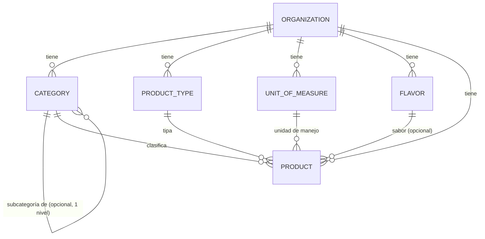

# ETAPA 2 — Catálogo, Maestros y Primera Versión Visible del Sistema

Versión: 1.0 · Fecha: 2026-09-03 · Autor: Claude (a pedido del socio programador)
Rama: `claude/etapa-2-catalogo-maestros` (derivada del commit aprobado
`e918636e3fd50f2f8422d910896614b825622c56` de `claude/etapa-1-base-core`)

> Este documento describe lo que efectivamente se construyó en Etapa 2: el módulo
> de Catálogo y Maestros (Productos, Categorías, Sabores, unidades de manejo) y la
> primera versión visual/navegable del sistema. No implementa ningún motor de
> inventario (ledger, conteos, BOM funcional, mermas, caja, cierres, etc.) — ver
> sección 19, "Limitaciones", y sección 21, "Qué NO se implementó".

---

## 1. Objetivo

Establecer la estructura de datos maestros sobre la que van a funcionar, en etapas
posteriores, el inventario, los movimientos, los conteos, las ventas, el BOM, las
mermas y los reportes — y entregar una primera versión del sistema que se pueda
abrir en un navegador y usar de verdad, con el catálogo real del cliente cargado
(no datos ficticios de demostración).

---

## 2. Fuentes analizadas

Material original del cliente (`sistema grido.zip`, ya usado como fuente de verdad
en Etapa 0), con foco específico en catálogo/productos/sabores/grupos/unidades:

| #   | Fuente                                                                                                     | Qué se extrajo                                                                                                                                                                                                                                                                                                                                                                                                                  |
| --- | ---------------------------------------------------------------------------------------------------------- | ------------------------------------------------------------------------------------------------------------------------------------------------------------------------------------------------------------------------------------------------------------------------------------------------------------------------------------------------------------------------------------------------------------------------------- |
| 1   | `HELADERIAS_HABASH — Base de Datos.xlsx`, hoja `PRODUCTOS` (215 filas reales)                              | Estructura real del catálogo en producción: `ID, CATEGORIA, PRODUCTO, COSTO, BULTOS, PALLET, ACTIVO, STOCK_IDEAL, UNIDAD, PACK_X` + un código numérico sin encabezado (SAP). 35 categorías distintas, 2 valores estables en `PALLET` (HELADO/INSUMO), 4 valores en `UNIDAD` (CAJA/LATA/UN/UNIDAD).                                                                                                                              |
| 2   | Misma hoja, `ALIAS` y `ALIAS_ARTICULO`                                                                     | Confirman que el "alias" del sistema actual (RF-004) es un mecanismo de equivalencia de nombres para **importación de ventas/facturas**, no un atributo de catálogo en sí — ver sección 19 (por qué no se implementó acá).                                                                                                                                                                                                      |
| 3   | Misma hoja, `BOM_VENTA`                                                                                    | Confirma que el BOM (RF-007) es una tabla `articulo → insumo → cantidad`, ligada a consumo por venta — explícitamente fuera de Etapa 2.                                                                                                                                                                                                                                                                                         |
| 4   | `heladerias-habash/src/Productos.gs` (código real del sistema actual)                                      | Función `guardarProducto_`: confirma exactamente los mismos 10 campos de la hoja PRODUCTOS como el modelo real de alta/edición de producto.                                                                                                                                                                                                                                                                                     |
| 5   | `heladerias-habash/src/Setup.gs`, función `unidadDefault_`                                                 | Evidencia clave: la "unidad de manejo" (CAJA/LATA/UNIDAD) es hoy una **heurística por categoría/nombre** (`SABORES* → LATA`, `INSUMOS/TERMICOS → UNIDAD`, resto → CAJA), no una jerarquía de "presentaciones" separada — confirma que cada fila de `PRODUCTOS` ya es el SKU atómico, no un "producto padre" con múltiples presentaciones.                                                                                       |
| 6   | `lisarticulos.xls` (export real del ERP/POS de Grido, 1174 × 106 columnas)                                 | Confirma la existencia de un catálogo externo con `grupo`/`subgrupo`/`rubrocomercial` numéricos y composición de hasta 10 componentes — evidencia de un sistema externo, no el modelo a copiar para Habash (ver decisión D3 en la matriz).                                                                                                                                                                                      |
| 7   | `mixventas.xls` / `mixventas desa.xls`                                                                     | Confirman que `grupo`/`subgrupo` en el ERP de Grido son códigos numéricos con una descripción (`grudescrip`) — reafirma que la jerarquía grupo/subgrupo de Grido es de una fuente externa, no del catálogo propio de Habash.                                                                                                                                                                                                    |
| 8   | `estadsabores.xls`                                                                                         | Reporte de consumo por sabor — confirma que "sabor" ya es una unidad de análisis reconocida, aunque en el sistema actual no exista como tabla propia separada de producto.                                                                                                                                                                                                                                                      |
| 9   | `Planilla_Insumos_Roxana (1).xlsx`, hojas `GRUPOS`/`INSUMOS`                                               | Confirma explícitamente el patrón "grupo = lista mantenible, no hardcodeada" (columna `GRUPO` validada contra un desplegable cargado desde la hoja `GRUPOS`) — RESPALDA la decisión de que categorías sean datos persistidos, no un enum. También confirma `UNID. x BULTO` como el mismo concepto que `PACK_X`/equivalencia.                                                                                                    |
| 10  | `docs/ETAPA-0-ANALISIS-ARQUITECTURA.md` v1.2, secciones 4.1 (RF-001 a RF-008) y las reglas RN-001 a RN-006 | Fuente normativa ya aprobada: confirma código/UUID (RF-001), grupo+subgrupo opcional+tipo+unidad base+unidades por presentación (RF-002), sabores individuales (RF-003), alias (RF-004, fuera de esta etapa), conversión automática con "el factor de conversión del producto" en singular (RF-005/RN-006), conteo por tipo de ubicación (RF-006, motor de inventario, fuera de esta etapa), BOM (RF-007, fuera de esta etapa). |
| 11  | `docs/ETAPA-0.1-CORRECCIONES.md`                                                                           | Confirma que RF-008 (import automático del catálogo de Grido + BOM asistido) fue retirado y reclasificado como **R-002, recomendación no obligatoria** — no se adelanta como requisito.                                                                                                                                                                                                                                         |

---

## 3. Matriz de decisiones

| Elemento                                                                                                                | Fuente                                                                                                                                             | Clasificación                                                           | Decisión                                                                                                                                                                                                                                                                                                            |
| ----------------------------------------------------------------------------------------------------------------------- | -------------------------------------------------------------------------------------------------------------------------------------------------- | ----------------------------------------------------------------------- | ------------------------------------------------------------------------------------------------------------------------------------------------------------------------------------------------------------------------------------------------------------------------------------------------------------------- |
| Entidad `Product` (código, nombre, categoría, tipo, unidad de manejo, equivalencia, sabor, activo)                      | Doc §7 (Etapa 0 RF-001/RF-002), hoja `PRODUCTOS`, `Productos.gs`                                                                                   | CONFIRMADO                                                              | Implementada tal cual RF-001/RF-002 (sección 4).                                                                                                                                                                                                                                                                    |
| `Product.id` UUID como clave real; `code` sólo referencia humana opcional                                               | RF-001, "nunca el nombre como clave"                                                                                                               | CONFIRMADO                                                              | `id` UUID interno; `code` string opcional, único por organización cuando se define.                                                                                                                                                                                                                                 |
| Categoría/grupo como tabla persistida (no enum)                                                                         | Etapa 2 §5, `Planilla_Insumos_Roxana` (`GRUPOS` como lista mantenible)                                                                             | CONFIRMADO + RESPALDADO                                                 | `Category`, datos persistidos, administrable por API.                                                                                                                                                                                                                                                               |
| Grupo + subgrupo (jerarquía de un nivel)                                                                                | RF-002/RN-002 ("un producto pertenece a un grupo y opcionalmente a un subgrupo")                                                                   | CONFIRMADO                                                              | `Category.parentCategoryId` auto-referencial, máximo 1 nivel — ver sección 4.1.                                                                                                                                                                                                                                     |
| Grupo/subgrupo numérico jerárquico del ERP de Grido (`mixventas.xls`) como modelo del catálogo propio                   | `mixventas.xls`, `lisarticulos.xls`                                                                                                                | EXISTENTE (en fuente externa) → **descartado como modelo propio**       | Es evidencia de un sistema ajeno (POS de Grido), no un requisito del catálogo de Habash. El catálogo propio usa el modelo plano+1 nivel de `PRODUCTOS` (Habash), no el de Grido.                                                                                                                                    |
| "Tipo" de producto (HELADO/INSUMO)                                                                                      | RF-002 (campo confirmado); valores RESPALDADOS por columna `PALLET` real (155+ filas, sólo 2 valores)                                              | RESPALDADO                                                              | Tabla `ProductType`, catálogo técnico sembrado (no API de alta esta etapa — ver sección 9).                                                                                                                                                                                                                         |
| Unidad de manejo (UNIDAD/LATA/CAJA)                                                                                     | Etapa 2 §7, columna `UNIDAD` real                                                                                                                  | CONFIRMADO + RESPALDADO                                                 | Tabla `UnitOfMeasure`, catálogo técnico sembrado.                                                                                                                                                                                                                                                                   |
| Equivalencia = "unidades por presentación" (RF-002) como campo único del producto, sin tabla de "Presentación" separada | RN-006 ("el factor de conversión del producto", singular); `Setup.gs` `unidadDefault_` (cada SKU/presentación ya es una fila de producto distinta) | RESPALDADO                                                              | `Product.unitsPerHandlingUnit` (entero positivo). Se descarta modelar una entidad `Presentation` jerárquica: el material real no la sostiene — dos presentaciones del mismo producto (ej. "PALITO BOMBON X 20" vs "X 10") ya son productos/códigos distintos en el sistema real, no variantes de un producto padre. |
| Sabor como entidad propia, separada de `Product`                                                                        | RF-003/RN-003 (CONFIRMADO), Etapa 2 §6                                                                                                             | CONFIRMADO                                                              | `Flavor`, con `Product.flavorId` opcional. Hoy 1:1 en la práctica (evidencia real), pero desacoplado para que un futuro reporte "por sabor" no dependa de la presentación/envase.                                                                                                                                   |
| Alias/equivalencias de nombres (RF-004)                                                                                 | RF-004 CONFIRMADO en Etapa 0; su único uso real es matching de importación de ventas/facturas                                                      | CONFIRMADO (el requisito) pero **PENDIENTE/FUTURO** (la implementación) | No se construye esta etapa: su propósito completo es la importación de ventas/facturas, explícitamente fuera de Etapa 2. Se documenta como pendiente, ligado a esa etapa futura.                                                                                                                                    |
| BOM (RF-007)                                                                                                            | CONFIRMADO en Etapa 0, explícitamente fuera de Etapa 2                                                                                             | CONFIRMADO (futuro)                                                     | No se implementa ninguna tabla de BOM esta etapa.                                                                                                                                                                                                                                                                   |
| Costo (a nivel de grupo, RN-002/RN-003)                                                                                 | RN-002/RN-003 (CONFIRMADO); implementación real es RF-039, **P3, fuera del Hito 1**                                                                | CONFIRMADO (futuro, según Etapa 0)                                      | No se agrega ningún campo de costo en Etapa 2 — ligado a costeo (RF-039), ya clasificado como fuera del Hito 1 en Etapa 0.                                                                                                                                                                                          |
| Código SAP/externo de Grido (columna sin encabezado en `PRODUCTOS`)                                                     | Evidencia real (`lisarticulos.xls`, columna `PRODUCTOS`)                                                                                           | RESPALDADO (existe) → PENDIENTE (no modelado)                           | No se agrega campo `externalCode`: su único consumidor previsible es matching con el ERP de Grido (ligado a alias/importación, fuera de esta etapa). Se documenta como pendiente no bloqueante.                                                                                                                     |
| Stock mínimo/ideal (columna `STOCK_IDEAL`)                                                                              | Evidencia real, mayormente vacía en los datos reales                                                                                               | EXISTENTE (en la fuente) → FUERA DE ALCANCE                             | Pertenece al motor de inventario (etapa futura), no al catálogo.                                                                                                                                                                                                                                                    |
| Baja lógica (activo/inactivo) en los 5 maestros nuevos, sin DELETE físico expuesto por API                              | Etapa 2 §10                                                                                                                                        | CONFIRMADO (regla del prompt)                                           | Ningún maestro de catálogo tiene endpoint de eliminación física en esta etapa.                                                                                                                                                                                                                                      |
| Permisos: sólo ADMIN administra catálogo                                                                                | RF-001 a RF-007 de Etapa 0, columna Actor = Admin en todos los casos                                                                               | CONFIRMADO                                                              | `requireRole('ADMIN')` en todas las rutas de catálogo — ver sección 9.                                                                                                                                                                                                                                              |
| Lectura de catálogo abierta a otros roles autenticados (para cuando Shop PWA lo consuma)                                | No hay evidencia de necesidad HOY (Shop PWA es sólo shell en esta etapa)                                                                           | PENDIENTE (no bloqueante)                                               | Se deja restringido a ADMIN por ahora, la opción más conservadora y reversible; se amplía cuando exista una pantalla real que lo necesite.                                                                                                                                                                          |
| `ProductType`/`UnitOfMeasure` sin API de alta (sólo lectura)                                                            | No hay evidencia de necesidad de administración dinámica; ambos con pocos valores estables en el material real                                     | RECOMENDACIÓN técnica                                                   | Catálogos técnicos sembrados por `packages/db/src/seed.ts`. Documentado como decisión reversible: si el cliente confirma que necesita agregar unidades/tipos nuevos, se agrega CRUD sin migración de esquema.                                                                                                       |
| Importador inicial de catálogo                                                                                          | Etapa 2 §19-20; hay certeza suficiente por la evidencia de la hoja `PRODUCTOS`                                                                     | RESPALDADO                                                              | Se construye y se ejecuta contra desarrollo — ver sección 12.                                                                                                                                                                                                                                                       |

---

## 4. Modelo implementado

### 4.1. Entidades

- **`Category`** (categoría/grupo) — auto-referencial (`parentCategoryId`), un único nivel de subcategoría permitido (grupo → subgrupo). Nombre, estado activo, organización.
- **`ProductType`** (tipo/línea: HELADO, INSUMO) — catálogo técnico sembrado.
- **`UnitOfMeasure`** (unidad de manejo: UNIDAD, LATA, CAJA) — catálogo técnico sembrado.
- **`Flavor`** (sabor) — nombre, estado activo, organización.
- **`Product`** (producto) — entidad central: `code` (opcional), `name`, `categoryId`, `productTypeId`, `unitOfMeasureId`, `unitsPerHandlingUnit` (equivalencia), `flavorId` (opcional), `active`.

### 4.2. Por qué no hay una entidad `Presentation` separada

El prompt de Etapa 2 plantea, sólo como concepto, `Producto → presentación → unidad de manejo → equivalencia`, aclarando explícitamente que no hay que adoptarlo literalmente si los datos reales piden otra estructura. La evidencia real (`Productos.gs`, la hoja `PRODUCTOS`, y la función `unidadDefault_`) muestra que en el sistema actual **cada combinación producto+presentación ya es un producto/código distinto** (ej. "PALITO BOMBON X 20" y "PALITO BOMBON X 10" son dos filas/IDs distintos, no una jerarquía). Por eso el modelo implementado aplana el concepto: el producto ya tiene su unidad de manejo y su equivalencia como atributos propios, sin una tabla intermedia. Esto es una decisión técnica de modelado, documentada y justificada por evidencia — no una decisión funcional (el dato en sí, "cuántas unidades contiene la presentación", queda igual de representado y disponible para inventario/pedidos en etapas futuras).

### 4.3. Qué NO incluye `Product` (y por qué)

- **Costo**: RN-002/RN-003 lo ubican conceptualmente a nivel de categoría, pero su implementación real (costo vigente, historial) es RF-039, ya clasificado **fuera del Hito 1** en Etapa 0 — no se adelanta.
- **Código externo/SAP y alias**: RF-004 es un requisito confirmado, pero su único uso es matching de importación de ventas/facturas (fuera de Etapa 2) — ver sección 19.
- **BOM**: RF-007, explícitamente fuera de Etapa 2.
- **Stock mínimo/ideal**: pertenece al motor de inventario, no al catálogo.

---

## 5. Diagrama



`PRODUCT.unitsPerHandlingUnit` (equivalencia) es un atributo de `PRODUCT`, no una
entidad separada — ver sección 4.2.

---

## 6. Tablas nuevas

Migración `20260903120307_catalog_masters` (ver sección 13): `category`,
`product_type`, `unit_of_measure`, `flavor`, `product`. Detalle completo de columnas
en `packages/db/prisma/schema.prisma`.

---

## 7. Restricciones

Implementadas en PostgreSQL (no sólo en frontend/backend):

- **Claves únicas**: `category(organization_id, parent_category_id, name)`,
  `product_type(organization_id, code)`, `unit_of_measure(organization_id, code)`,
  `flavor(organization_id, name)`, `product(organization_id, code)`.
- **Foreign keys** con `onDelete: Restrict` en todas las relaciones (organización,
  categoría, tipo, unidad, sabor) — nunca se puede borrar un maestro referenciado
  por un producto por accidente de cascada.
- **Valores positivos**: `CHECK (units_per_handling_unit > 0)` agregado a mano en
  la migración (Prisma no expresa `CHECK` de forma declarativa — mismo criterio ya
  documentado en Etapa 0, "customizing migrations").
- **Aislamiento organizacional**: `organization_id NOT NULL` + índice en las 5
  tablas nuevas, igual patrón que `Location`/`AppUser` de Etapa 1.
- **Límite de "una categoría con NULL como padre puede colisionar de nombre"**:
  Postgres trata cada `NULL` como distinto en una constraint `UNIQUE`, así que el
  índice de la base **no** alcanza para detectar dos categorías raíz con el mismo
  nombre. Se corrigió con una validación explícita en el backend
  (`assertNameNotTaken`, `apps/api/src/services/catalog.ts`) — encontrada y
  corregida durante el desarrollo de los tests de esta etapa (ver sección 14).
- **Relaciones cross-organization**: validadas explícitamente en el backend antes
  de crear/actualizar (`assertCategoryValid`, `assertProductTypeValid`,
  `assertUnitOfMeasureValid`, `assertFlavorValid`), mismo patrón ya establecido en
  Etapa 1.1 para `AppUser.defaultLocationId`.

---

## 8. API

Todas las rutas requieren autenticación (`fastify.authenticate`) y rol `ADMIN`
(`requireRole('ADMIN')`) — ver sección 9.

| Método | Ruta                    | Descripción                              |
| ------ | ----------------------- | ---------------------------------------- |
| GET    | `/api/categories`       | Listar categorías (con subcategorías)    |
| POST   | `/api/categories`       | Crear categoría o subcategoría           |
| PATCH  | `/api/categories/:id`   | Editar / activar / desactivar            |
| GET    | `/api/flavors`          | Listar sabores                           |
| POST   | `/api/flavors`          | Crear sabor                              |
| PATCH  | `/api/flavors/:id`      | Editar / activar / desactivar            |
| GET    | `/api/product-types`    | Listar tipos de producto (sólo lectura)  |
| GET    | `/api/units-of-measure` | Listar unidades de manejo (sólo lectura) |
| GET    | `/api/products`         | Listar productos                         |
| GET    | `/api/products/:id`     | Detalle de un producto                   |
| POST   | `/api/products`         | Crear producto                           |
| PATCH  | `/api/products/:id`     | Editar / activar / desactivar            |

Ningún endpoint de este módulo toca stock/inventario. Respuesta uniforme
(`ApiSuccess`/`ApiErrorBody`), errores tipados, validación Zod en cada ruta que
recibe input, logging estructurado, auditoría en toda escritura — reutilizando
íntegramente la infraestructura de Etapa 1/1.1, sin cambios.

---

## 9. Permisos

Todo RF de catálogo en Etapa 0 (sección 4.1) tiene como Actor confirmado
exclusivamente **Admin** — ninguna otra fila involucra a Empleada/Encargado de
depósito para altas/ediciones de catálogo. Por eso, **todas** las rutas de este
módulo (lectura y escritura) están restringidas a `ADMIN` en esta etapa —
incluida la lectura, aunque en el futuro (cuando Shop PWA consuma el catálogo real
para conteos/pedidos) probablemente otros roles necesiten leerlo. Esa ampliación
queda como **PENDIENTE no bloqueante** (sección 20): es una decisión reversible y
conservadora, no bloquea nada de esta etapa, y se resuelve cuando exista la
pantalla real que lo necesite — no antes.

La autorización real está siempre en el backend (`requireRole`); el frontend
oculta navegación por rol sólo como ayuda de UX (ya documentado así desde Etapa
1), nunca como control de acceso.

---

## 10. Auditoría

Reutiliza `fastify.audit.log()` (Etapa 1), módulo `CATALOG`, acciones
`CATEGORY_CREATED/UPDATED/ACTIVATED/DEACTIVATED`,
`FLAVOR_CREATED/UPDATED/ACTIVATED/DEACTIVATED`,
`PRODUCT_CREATED/UPDATED/ACTIVATED/DEACTIVATED` (constantes centralizadas en
`@sistema-grido/shared-types`, archivo `catalog.ts`). Registra usuario,
organización, acción, entidad, id, valor anterior/nuevo, fecha/hora, resultado —
igual patrón que usuarios.

Recordatorio de la decisión de Etapa 1.1: este mecanismo es **best-effort** (un
fallo al auditar no revierte la operación), correcto y suficiente para altas/bajas
de maestros de catálogo, pero **no** será suficiente como única garantía para las
futuras operaciones críticas de inventario (ajustes, cierres, reversiones) — ver
`docs/ETAPA-1-BASE-CORE.md`, sección 7.1. No se toca esa decisión en Etapa 2.

---

## 11. Frontend

`apps/admin-web`: tres pantallas nuevas (`ProductsPage`, `CategoriesPage`,
`FlavorsPage`), con navegación agregada al layout. Cada una: formulario de
alta/edición reutilizado, tabla con búsqueda (y filtro por categoría en
Productos), badges de estado, confirmación (`window.confirm`) antes de
activar/desactivar, estados de carga/vacío/error visibles, feedback de éxito
(recarga de la lista) y de error (mensaje del backend). No hay pantalla separada
de "Presentaciones/Unidades de manejo" — la unidad y la equivalencia se
administran como parte del formulario de Producto (ver sección 4.2); "Unidades de
manejo" y "Tipos de producto" no tienen pantalla propia porque no tienen alta vía
API en esta etapa (sección 9 de la matriz de decisiones) — se usan como
desplegables dentro del formulario de Producto.

`apps/shop-pwa`: el shell (`Layout`, `HomePage`) ahora muestra también la
**sucursal** de la persona logueada, agregada al DTO `UserProfile`
(`defaultLocationName`, ver "Desviaciones", sección 22) — pedido explícito de la
sección 18 del prompt. Sigue sin ninguna pantalla operativa.

**Verificación real en navegador** (no sólo tests automatizados): se levantó el
backend real contra Postgres real con el catálogo importado, y ambos frontends,
usando un doble mínimo de Supabase Auth (sólo para inyectar una sesión válida,
sin credenciales reales de un proyecto Supabase disponibles en este entorno — ver
sección 16). Se probó: login, listar/crear/buscar/desactivar un producto de punta
a punta, y el shell de Shop PWA con sucursal. Este proceso encontró y corrigió un
bug real (ver sección 15, CORS).

---

## 12. Importación inicial

Separación en tres capas, tal como pide la sección 19 del prompt:

1. **Migración estructural** — `packages/db/prisma/migrations/20260903120307_catalog_masters/` (sección 13).
2. **Seed técnico** (`packages/db/src/seed.ts`, extendido en esta etapa) — agrega
   los `ProductType` (HELADO, INSUMO) y `UnitOfMeasure` (UNIDAD, LATA, CAJA)
   sembrados; **no** agrega categorías, sabores ni productos reales (esos no son
   datos técnicos, son catálogo del cliente).
3. **Importación inicial de catálogo** (`packages/db/src/import-catalog.ts`,
   script administrativo nuevo, `npm run db:import-catalog -- <ruta>`) — lee la
   hoja `PRODUCTOS` del archivo real del cliente (nunca commiteado al repo) y
   puebla `Category`/`Flavor`/`Product` con mapping explícito por columna (ver
   comentario de cabecera del script y sección 2 de este documento). Reproducible,
   validado (filas inválidas se reportan y se saltan, nunca se importan a medias),
   **idempotente** (upsert por `code`: correrlo dos veces no duplica — verificado:
   primera corrida 214 creados/0 actualizados, segunda corrida 0 creados/214
   actualizados), sin sobrescrituras silenciosas (reporta explícitamente qué se
   creó, qué se actualizó y qué se saltó).

**Ejecutado contra la base de desarrollo local** en esta etapa: 214 productos, 36
categorías y 37 sabores reales del catálogo de Habash. **No** se ejecutó contra
ningún entorno de staging real (no hay uno desplegado todavía — ver sección 16).

**Deliberadamente no importado** (documentado, no un olvido): costo, bultos,
stock ideal, código SAP, alias — ver sección 4.3 y la matriz de decisiones.

---

## 13. Migraciones

Nueva migración versionada, **no se editó** la migración ya aplicada de Etapa 1
(`20260902145407_init_core`): `20260903120307_catalog_masters`. Reproducible desde
base vacía Etapa 1 → Etapa 2 — verificado en esta etapa aplicando `prisma migrate
deploy` contra dos bases recreadas desde cero (dev y test), con las dos
migraciones aplicándose en orden sin errores.

---

## 14. Tests

56 tests de Etapa 1.1 + **56 tests nuevos** = **112 tests, 100% en verde**.

| Área                                                                                          | Tests nuevos | Qué cubre                                                                                                                                                                                                                                                                                                                                                                                                                                        |
| --------------------------------------------------------------------------------------------- | ------------ | ------------------------------------------------------------------------------------------------------------------------------------------------------------------------------------------------------------------------------------------------------------------------------------------------------------------------------------------------------------------------------------------------------------------------------------------------ |
| `apps/api` — `categories.test.ts`                                                             | 11           | Autenticación/autorización, creación válida, duplicado en el mismo nivel (raíz y con `NULL` — ver hallazgo abajo), subcategoría válida, máximo 1 nivel, padre inexistente, padre de otra organización, actualización, desactivación con auditoría, 404 cross-organization.                                                                                                                                                                       |
| `apps/api` — `flavors.test.ts`                                                                | 8            | Autorización, creación, duplicado, actualización, desactivación con auditoría, relación con otra organización (404).                                                                                                                                                                                                                                                                                                                             |
| `apps/api` — `products.test.ts`                                                               | 25           | Creación válida con auditoría, código duplicado, dos productos sin código (no colisionan), categoría/sabor de otra organización, referencias inexistentes, `unitsPerHandlingUnit` inválido (Zod + CHECK de la base, probado directo contra Prisma), actualización, desactivación con antes/después, 404 cross-organization, autorización, lectura (listar/detalle/404), `/api/product-types` y `/api/units-of-measure` (listado + autorización). |
| `apps/api` — `server-cors.test.ts`                                                            | 3            | Preflight `OPTIONS` real para GET/POST/PATCH — ver hallazgo de CORS, sección 15.                                                                                                                                                                                                                                                                                                                                                                 |
| `packages/db` — `import-catalog.test.ts`                                                      | 9            | Parser puro del importador: fila válida, normalización `UN→UNIDAD`, `PACK_X` por defecto, y cada motivo de fila salteada (ID/PRODUCTO/CATEGORIA faltante, tipo/activo/unidad desconocidos, `PACK_X` inválido).                                                                                                                                                                                                                                   |
| `apps/admin-web` — `CategoriesPage.test.tsx`, `FlavorsPage.test.tsx`, `ProductsPage.test.tsx` | 9            | Render con datos, creación vía formulario (incluida la interacción real de elegir categoría/tipo/unidad), manejo de error del backend.                                                                                                                                                                                                                                                                                                           |
| `apps/admin-web` — `App.test.tsx` (agregado, no se tocaron los 3 tests previos)               | 1            | Navegación de catálogo visible sólo para ADMIN.                                                                                                                                                                                                                                                                                                                                                                                                  |

**Hallazgos reales encontrados por los tests de esta etapa** (no simulados, corregidos):

1. **Duplicado de categoría raíz no detectado por la constraint de la base**:
   Postgres trata cada `NULL` como distinto en una constraint `UNIQUE`, así que
   `@@unique([organizationId, parentCategoryId, name])` no bloqueaba dos
   categorías de primer nivel (`parentCategoryId = NULL`) con el mismo nombre. Se
   corrigió con una validación explícita en el servicio (`assertNameNotTaken`).
2. **`PATCH` bloqueado por CORS en un navegador real** (ver sección 15) —
   encontrado al probar la Etapa 2 en un navegador, no por ningún test: se agregó
   `server-cors.test.ts`, que simula el preflight real y hubiera detectado este
   bug si hubiera existido antes.

**Regresión**: los 56 tests de Etapa 1.1 siguen intactos, sin modificar, **salvo
uno** (`apps/shop-pwa/src/App.test.tsx`), documentado a continuación porque
cambió legítimamente:

> El test verificaba el texto exacto `'Empleada de heladería'` en el header del
> shell. Al agregar la sucursal al mismo elemento (sección 18 del prompt: "el
> shell debe mostrar también la sucursal"), ese `<span>` ahora contiene
> `"Empleada de heladería · Heladería Demo 1"`. El test se ajustó para verificar
> por substring (`/Empleada de heladería/` y `/Heladería Demo 1/`) en vez de
> igualdad exacta — el comportamiento verificado (mostrar el rol) sigue intacto,
> sólo se agregó información adicional al mismo elemento.

---

## 15. Seguridad

- **CORS — bug real encontrado y corregido**: el default de `@fastify/cors` es
  `methods: 'GET,HEAD,POST'` — **no** incluye `PATCH`. Esto significa que
  cualquier `PATCH` real desde un navegador (activar/desactivar, editar — usado
  también por `/api/users/:id` desde Etapa 1) quedaba bloqueado en el preflight
  con un error de CORS, **invisible en los 82 tests de backend previos** porque
  `app.inject()` no reproduce un preflight `OPTIONS` real de navegador. Se
  encontró recién al probar Etapa 2 en un navegador real (ver sección 11), se
  corrigió agregando `methods: ['GET', 'POST', 'PATCH']` explícito en
  `apps/api/src/server.ts`, y se agregó `server-cors.test.ts` (sección 14) para
  que no vuelva a pasar desapercibido. Los orígenes permitidos (`CORS_ORIGINS`)
  siguen siendo explícitos por variable de entorno, nunca `*` — sin cambios
  respecto de Etapa 1.
- Autorización real en backend en las 12 rutas nuevas (sección 9), nunca
  sólo en frontend.
- Ningún secreto nuevo en el repo. `.env` sigue en `.gitignore`; se verificó que
  ningún archivo real del cliente (el `.xlsx` usado para importar) se haya
  commiteado — vive fuera del repositorio.
- `npm audit --audit-level=high`: **0 vulnerabilidades** — incluyendo la nueva
  dependencia del importador (`exceljs`, elegida en vez de `xlsx`/SheetJS
  precisamente porque esa última tiene 2 vulnerabilidades altas sin parche
  disponible en npm; `exceljs` trajo una vulnerabilidad moderada transitiva vía
  `uuid`, resuelta agregando `uuid: "^11.1.1"` a `overrides`, mismo mecanismo ya
  usado en Etapa 1 para `deepmerge-ts`).
- Errores de Supabase y de la base de datos nunca se exponen tal cual al
  cliente — sin cambios respecto del mecanismo ya establecido en Etapa 1
  (`error-handler.ts`).
- Logs sin tokens ni contraseñas — sin cambios respecto de Etapa 1 (`redact` de
  Pino).

---

## 16. Staging

**No se desplegó ningún entorno real de Vercel/Render/Supabase en esta etapa**:
este entorno de desarrollo no tiene credenciales ni acceso a esas plataformas.
Conforme a la regla explícita del prompt ("si Claude no dispone de
credenciales/acceso... NO simular el despliegue"), se dejó toda la configuración
preparada y se documentaron instrucciones exactas para el mínimo paso manual
necesario:

- `render.yaml` (raíz del repo) — blueprint del backend (`apps/api`): build
  command, start command, healthcheck (`/health`), variables de entorno
  declaradas sin valores (`sync: false`).
- `apps/admin-web/vercel.json` y `apps/shop-pwa/vercel.json` — rewrite de SPA
  (`/(.*) → /index.html`), necesario para que las rutas de React Router
  (`/productos`, `/categorias`, etc.) funcionen al refrescar la página en
  producción.

### Pasos manuales exactos para desplegar

**1. Supabase** (base de datos + Auth):

1. Crear un proyecto en [supabase.com](https://supabase.com) (o usar uno
   existente).
2. Copiar de _Project Settings → API_: `Project URL` → `SUPABASE_URL` /
   `VITE_SUPABASE_URL`; `anon public key` → `SUPABASE_ANON_KEY` /
   `VITE_SUPABASE_ANON_KEY`; `service_role key` → `SUPABASE_SERVICE_ROLE_KEY`
   (**secreta**, sólo backend).
3. Copiar de _Project Settings → Database_: la connection string con pooler
   (puerto 6543) → `DATABASE_URL`; la connection string directa (puerto 5432) →
   `DIRECT_URL`.
4. Desde una máquina con Node y el repo clonado, con esas dos variables
   exportadas: `npm ci && npm run build --workspace packages/shared-types && npm
run db:generate && npm run db:migrate:deploy` — aplica las 2 migraciones
   (Etapa 1 + Etapa 2) contra Supabase.
5. `npm run db:seed` (con las mismas variables) — crea los 3 roles, la
   organización única y sus ubicaciones/tipos/unidades técnicas (sin datos
   reales del cliente).
6. (Opcional, cuando el mapping esté validado por el cliente) `npm run
db:import-catalog -- <ruta-al-xlsx-real>` — carga el catálogo real. **Nunca**
   commitear ese archivo al repo.
7. **Primer usuario ADMIN** (único paso con SQL manual, inevitable porque no
   existe otro Admin que lo invite): en Supabase Dashboard → Authentication →
   Add user (marcar "Auto Confirm User"), copiar el UID generado, y ejecutar en
   el SQL Editor de Supabase (reemplazando los valores entre `< >`):
   ```sql
   insert into app_user (id, organization_id, role_id, display_name, email, auth_subject, active, created_at, updated_at)
   select gen_random_uuid(), o.id, r.id, '<Nombre visible>', '<email-real>', '<UID-copiado-de-Auth>', true, now(), now()
   from organization o, role r
   where r.code = 'ADMIN';
   ```
   Cualquier usuario siguiente se invita normalmente desde la app (`POST
/api/users`), sin volver a tocar SQL.

**2. Render** (backend, `apps/api`):

1. New → Blueprint, conectar el repo de GitHub, Render detecta `render.yaml`.
2. Completar en el dashboard las variables marcadas `sync: false`:
   `DATABASE_URL`, `DIRECT_URL`, `SUPABASE_URL`, `SUPABASE_ANON_KEY`,
   `SUPABASE_SERVICE_ROLE_KEY` (los mismos valores del paso Supabase) y
   `CORS_ORIGINS` (completar en el paso 3, una vez que existan las URLs de
   Vercel — se puede dejar temporalmente con `http://localhost:5173` y
   corregir después).
3. Deploy. Verificar `https://<tu-servicio>.onrender.com/health` → `{"ok":true,...}`.

**3. Vercel** (`apps/admin-web` y `apps/shop-pwa`, dos proyectos separados):

1. New Project → importar el mismo repo, dos veces (uno por app).
2. Para cada uno: _Root Directory_ = `apps/admin-web` (o `apps/shop-pwa`);
   Framework Preset = Vite; **Install Command** =
   `cd ../.. && npm ci`; **Build Command** =
   `cd ../.. && npm run build --workspace packages/shared-types && npm run
build --workspace apps/admin-web` (cambiar el último workspace por
   `apps/shop-pwa` en ese proyecto); **Output Directory** = `dist`.
3. Variables de entorno: `VITE_SUPABASE_URL`, `VITE_SUPABASE_ANON_KEY` (iguales a
   las de Supabase) y `VITE_API_URL` = la URL real de Render del paso anterior.
4. Deploy. Anotar las dos URLs `https://<proyecto>.vercel.app`.

**4. Cerrar el círculo de CORS**: volver a Render, actualizar `CORS_ORIGINS` con
las dos URLs reales de Vercel separadas por coma, y hacer un manual redeploy
(o restart) del servicio.

**5. Probar**: abrir la URL de `admin-web`, loguearse con el Admin creado en el
paso Supabase-7, verificar que el catálogo importado aparezca — usar
`docs/ETAPA-2-PRUEBA-MANUAL.md` como checklist completo.

---

## 17. Variables de entorno

Sin cambios en los **nombres** respecto de Etapa 1 (`apps/api/.env.example`,
`apps/admin-web/.env.example`, `apps/shop-pwa/.env.example`,
`packages/db/.env.example`) — Etapa 2 no agrega ninguna variable nueva al
backend ni a los frontends. El único agregado es el argumento/variable del
**script administrativo** de importación (no una variable de la app):
`CATALOG_SOURCE_XLSX_PATH` (opcional; alternativa a pasar la ruta como
argumento de línea de comandos), documentado en la cabecera de
`packages/db/src/import-catalog.ts`. Nunca se versiona ningún valor real.

---

## 18. URLs

**No hay URLs reales de staging** — no se realizó ningún despliegue en esta
etapa (sección 16). No se inventan URLs. Los pasos y las URLs de configuración
(dashboards de Supabase/Render/Vercel) están en la sección 16.

---

## 19. Limitaciones

- El catálogo real (214 productos, 36 categorías, 37 sabores) sólo está cargado
  en la base de **desarrollo local** de este entorno — no en ningún staging real
  (sección 16).
- La verificación visual en navegador (sección 11) usó un doble mínimo de
  Supabase Auth (sólo el endpoint `GET /auth/v1/user`) porque este entorno no
  tiene un proyecto Supabase real disponible — mismo tipo de limitación ya
  aceptada y documentada en Etapa 1/1.1. El flujo de login real (con
  `signInWithPassword` contra Supabase real) no se pudo probar de punta a punta
  en este entorno; sí se validó exhaustivamente por tests automatizados
  (incluidos los de Etapa 1: `auth-flow.test.ts`) y por la simulación de sesión
  ya autenticada, que ejercita el resto del sistema (autorización, catálogo,
  auditoría) contra el backend y la base de datos reales.
- `ProductType`/`UnitOfMeasure` no tienen alta vía API esta etapa (decisión
  documentada en la matriz de decisiones, sección 3) — si el cliente confirma
  que necesita agregar unidades o tipos nuevos dinámicamente, hace falta una
  iteración menor (no requiere migración de esquema).
- **Bug de npm al regenerar el lockfile desde cero**: se encontró que `npm
install` (sin lockfile previo) falla de forma determinística con
  `TypeError: Cannot read properties of null (reading 'edgesOut')`, un bug de
  `@npmcli/arborist` al resolver el árbol de peer dependencies opcionales de
  `vitest@4.1.11` (relacionado con su soporte opcional de "browser mode" vía
  `msw`/`@vitest/browser-playwright`) — reproducido de forma aislada, sin
  relación con `exceljs` ni con los `overrides` agregados en esta etapa. Se
  resolvió generando el `package-lock.json` una vez con `npm install
--legacy-peer-deps`, y agregando `@testing-library/dom` como devDependency
  explícita en `apps/admin-web`/`apps/shop-pwa` (ese flag desactiva la
  auto-instalación de peer dependencies normales de npm, lo que había dejado
  sin instalar esa dependencia real de `@testing-library/react`, rompiendo
  `screen`/`waitFor` en los tests de frontend hasta corregirlo). **Con el
  lockfile ya generado, `npm ci` y `npm install` normales funcionan sin ningún
  flag especial** — verificado explícitamente en esta etapa. El flag sólo hace
  falta si alguna vez se borra `package-lock.json` y se reinstala desde cero.

---

## 20. Pendientes

**Bloqueantes**: ninguno nuevo generado por esta etapa.

**No bloqueantes**:

- Ampliar la lectura de catálogo a roles distintos de ADMIN cuando exista una
  pantalla real de Shop PWA que lo necesite (conteos, pedidos) — sección 9.
- `ProductType`/`UnitOfMeasure` sin API de alta — sección 19.
- Ningún entorno de staging desplegado todavía — requiere que el socio
  programador complete los pasos manuales de la sección 16 (crear proyecto
  Supabase, servicio Render, proyectos Vercel) con sus propias credenciales.

**Futuros** (informativo, fuera de todo alcance de Etapa 2):

- Alias/equivalencias de nombres (RF-004) — ligado a importación de
  ventas/facturas.
- BOM (RF-007).
- Costo a nivel de categoría (RN-002/RN-003, implementación real RF-039).
- Código externo/SAP en `Product`.
- Todo lo ya listado como fuera de alcance en `docs/ETAPA-1-BASE-CORE.md` y en
  la sección "IMPORTANTE" del prompt de Etapa 2 (ledger, conteos, ventas, BOM
  funcional, mermas, caja, cierres, Mercado Pago, reportes, predicción, IA).

---

## 21. Desviaciones

Dos adiciones fuera de la enumeración literal del prompt, ambas señaladas para
auditoría externa (ninguna adelanta funcionalidad de negocio de etapas futuras):

1. **`UserProfile.defaultLocationName`** (nuevo campo en el DTO de usuario,
   `packages/shared-types/src/user.ts`, y su mapeo en
   `apps/api/src/services/users.ts`): agregado porque la sección 18 del prompt
   pide explícitamente que la Shop PWA muestre la sucursal de la persona
   logueada, y el DTO existente (Etapa 1) sólo tenía el `id` de la ubicación, no
   su nombre. No agrega ninguna tabla ni cambia el modelo de datos — sólo
   incluye el nombre ya existente de `Location` en la respuesta de
   `/api/me`/`/api/auth/session`/`/api/users`. Se documenta acá porque toca un
   archivo de Etapa 1, aunque el cambio en sí está dentro del alcance explícito
   de Etapa 2 (sección 18).
2. **Fix de CORS en `apps/api/src/server.ts`** (sección 15): corrección de un
   bug real preexistente desde Etapa 1 (`PATCH` bloqueado por el navegador),
   encontrado al hacer la verificación visual obligatoria de esta etapa. Se
   señala como desviación porque modifica configuración de Etapa 1, aunque es
   estrictamente una corrección de un defecto, no una funcionalidad nueva.

Fuera de estas dos, **ninguna** desviación respecto de la arquitectura, modelo de
datos o convenciones aprobadas en Etapa 0/0.1/1/1.1.

---

## 22. Trazabilidad (Etapa 2)

| Requisito                                                                 | Fuente            | Backend                                                          | DB                                                       | Frontend                         | Test                                        | Estado                                                                                                                          |
| ------------------------------------------------------------------------- | ----------------- | ---------------------------------------------------------------- | -------------------------------------------------------- | -------------------------------- | ------------------------------------------- | ------------------------------------------------------------------------------------------------------------------------------- |
| RF-001 (catálogo único, UUID)                                             | Etapa 0 §7        | `services/catalog.ts` (Product)                                  | `product.id`                                             | `ProductsPage`                   | `products.test.ts`                          | **IMPLEMENTADO**                                                                                                                |
| RF-002 (grupo/subgrupo/tipo/unidad base/unidades por presentación/activo) | Etapa 0 §7        | `services/catalog.ts`                                            | `product`, `category`, `product_type`, `unit_of_measure` | `ProductsPage`, `CategoriesPage` | `products.test.ts`, `categories.test.ts`    | **IMPLEMENTADO**                                                                                                                |
| RF-003 (sabores individuales)                                             | Etapa 0 §8        | `services/catalog.ts` (Flavor)                                   | `flavor`, `product.flavor_id`                            | `FlavorsPage`                    | `flavors.test.ts`                           | **IMPLEMENTADO**                                                                                                                |
| RF-004 (alias/equivalencias de nombres)                                   | Etapa 0 §7.1      | —                                                                | —                                                        | —                                | —                                           | **NO IMPLEMENTADO** (PENDIENTE/FUTURO — ligado a importación de ventas, sección 20)                                             |
| RF-005 (conversión automática entre presentaciones)                       | Etapa 0 §9        | `unitsPerHandlingUnit` como dato disponible                      | `product.units_per_handling_unit`                        | Campo del formulario de Producto | `products.test.ts` (validación del dato)    | **PREPARADO** (el dato existe y está validado; la conversión operativa en conteos/pedidos es motor de inventario, etapa futura) |
| RF-006 (unidades de conteo por tipo de ubicación)                         | Etapa 0 §9        | `requireLocationAccess` ya existe (Etapa 1), sin uso en catálogo | —                                                        | —                                | —                                           | **NO IMPLEMENTADO** (motor de inventario, fuera de Etapa 2)                                                                     |
| RF-007 (BOM)                                                              | Etapa 0 §7/§18    | —                                                                | —                                                        | —                                | —                                           | **NO IMPLEMENTADO** (fuera de Etapa 2)                                                                                          |
| Categorías/grupos, datos persistidos                                      | Etapa 2 §5        | `services/catalog.ts`                                            | `category`                                               | `CategoriesPage`                 | `categories.test.ts`                        | **IMPLEMENTADO**                                                                                                                |
| Baja lógica en maestros                                                   | Etapa 2 §10       | `active` en las 4 entidades de escritura                         | `active` boolean, sin DELETE expuesto                    | badges de estado                 | todos los `*.test.ts` de catálogo           | **IMPLEMENTADO**                                                                                                                |
| Integridad de datos (únicas, FK, positivos, cross-org)                    | Etapa 2 §11       | `assert*Valid`, `isUniqueConstraintError`                        | `@@unique`, FK `Restrict`, `CHECK`                       | —                                | `products.test.ts` (CHECK directo a Prisma) | **IMPLEMENTADO**                                                                                                                |
| API de administración (listar/detalle/crear/modificar/activar/desactivar) | Etapa 2 §12       | 12 rutas (sección 8)                                             | —                                                        | —                                | 44 tests de rutas de catálogo               | **IMPLEMENTADO**                                                                                                                |
| Permisos (sólo ADMIN)                                                     | Etapa 2 §13       | `requireRole('ADMIN')`                                           | —                                                        | —                                | Casos 403 en cada `*.test.ts`               | **IMPLEMENTADO**                                                                                                                |
| Auditoría de maestros                                                     | Etapa 2 §14       | `fastify.audit.log`                                              | `audit_log` (reutilizada)                                | —                                | Casos de auditoría en cada `*.test.ts`      | **IMPLEMENTADO**                                                                                                                |
| Frontend administrativo (Productos/Categorías/Sabores)                    | Etapa 2 §15       | —                                                                | —                                                        | 3 páginas + nav                  | 9 tests de componente                       | **IMPLEMENTADO**                                                                                                                |
| Primera versión visual y navegable                                        | Etapa 2, objetivo | Backend real levantado                                           | Datos reales importados                                  | Verificado en navegador real     | — (verificación manual, sección 11)         | **IMPLEMENTADO** (local); **PENDIENTE** en staging real (sección 16)                                                            |
| Importador inicial de catálogo                                            | Etapa 2 §19-20    | `import-catalog.ts`                                              | —                                                        | —                                | `import-catalog.test.ts` (parser)           | **IMPLEMENTADO**                                                                                                                |
| Shop PWA — shell con sucursal                                             | Etapa 2 §18       | `defaultLocationName` en `UserProfile`                           | — (reutiliza `location.name`)                            | `Layout`, `HomePage`             | `App.test.tsx` (shop-pwa)                   | **IMPLEMENTADO**                                                                                                                |
| Staging desplegado (Vercel/Render/Supabase)                               | Etapa 2 §26-28    | `render.yaml` preparado                                          | —                                                        | `vercel.json` × 2 preparados     | —                                           | **PREPARADO** (sin credenciales para desplegar realmente, sección 16)                                                           |

---

## 23. Control de alcance

Búsqueda explícita en el código, antes de cerrar la etapa, de cualquier
funcionalidad de etapas posteriores implementada por accidente:

- `grep` de términos de dominio de etapas futuras (`inventory_movement`,
  `stock_count`, `waste_event`, `weekly_closing`, `bom_line`, `sale_import`,
  `mercadopago`, `variable_expense`, `inventory_snapshot`, `adjustment_reason`)
  sobre `apps/` y `packages/` → **0 resultados**.
- Modelos Prisma existentes tras esta etapa: `Organization`, `Location`, `Role`,
  `AppUser`, `AuditLog` (Etapa 1) + `Category`, `ProductType`, `UnitOfMeasure`,
  `Flavor`, `Product` (Etapa 2) → exactamente lo esperado, ninguna tabla de
  inventario/ventas/BOM/mermas/caja/cierres.
- Rutas registradas en `apps/api/src/server.ts`: `health`, `auth`, `me`, `users`,
  `locations` (Etapa 1) + `categories`, `flavors`, `product-types`,
  `units-of-measure`, `products` (Etapa 2) → sin ninguna ruta de inventario.
- Rutas de frontend (`<Route>` en ambos `App.tsx`): login, dashboard, usuarios,
  categorías, sabores, productos (admin-web); login, home (shop-pwa) → sin
  ninguna pantalla operativa.

**Resultado: sin hallazgos.** Ninguna funcionalidad de etapas posteriores quedó
implementada por accidente.
