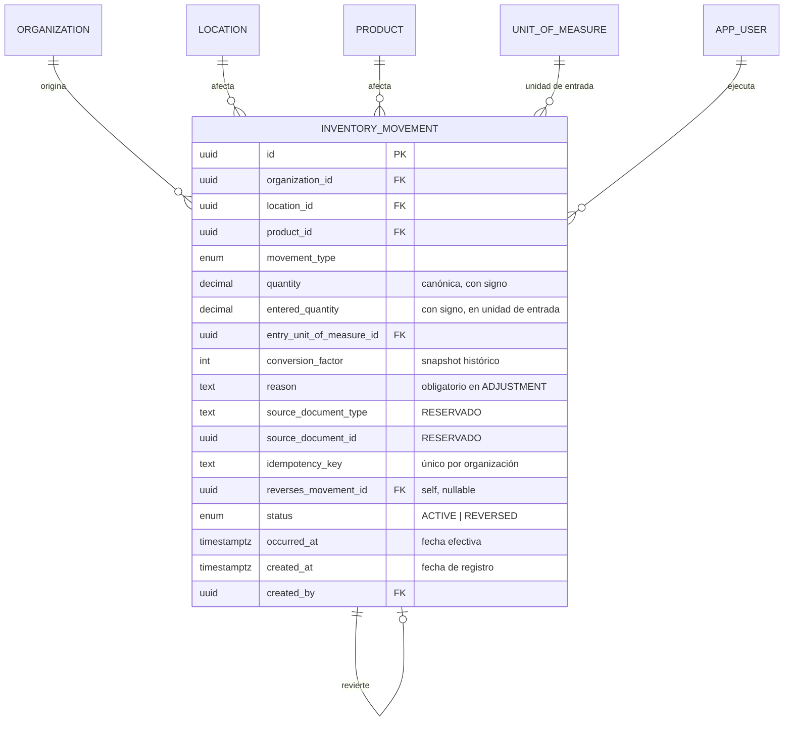

# ETAPA 3 — Motor de Inventario / Ledger de Stock

Versión: 1.0 · Fecha: 2026-09-07 · Autor: Claude (a pedido del socio programador)
Rama: `claude/etapa-3-motor-inventario` (derivada del commit aprobado
`c67a034b3cd4b3813950ff1aa3fa30a761e6a878` de `claude/etapa-2-catalogo-maestros`)

> Este documento describe lo que efectivamente se construyó en Etapa 3: el
> motor central de inventario — el ledger append-only de movimientos de
> stock, su cálculo de saldo teórico, y las operaciones administrativas de
> stock inicial, ajuste y reversión. NO implementa la experiencia operativa
> completa de la heladería (conteo semanal, mermas con foto, baja de lata,
> ventas, caja, cierres, transferencias, etc.) — ver sección 25,
> "Limitaciones", y sección 26, "Pendientes".

---

## 1. Objetivo

Construir el motor central de inventario para que el backend y la base de
datos puedan responder de forma confiable: cuánto stock teórico existe, de
qué producto, en qué ubicación, por qué existe esa cantidad, qué movimientos
la produjeron, quién generó cada operación, cuándo ocurrió y qué documento la
originó cuando corresponde. El principio rector, confirmado por el cliente
desde Etapa 0 (Doc §3.2/§10, RN-007): **el stock no se edita directamente**,
siempre es la consecuencia de sumar movimientos de un ledger.

---

## 2. Fuentes revisadas

Antes de programar se revisó nuevamente, con foco específico en
stock/movimientos/ajustes/conteos/diferencias:

| #   | Fuente                                                                                           | Qué se usó                                                                                                                                                                                                                                                                                                                 |
| --- | ------------------------------------------------------------------------------------------------ | -------------------------------------------------------------------------------------------------------------------------------------------------------------------------------------------------------------------------------------------------------------------------------------------------------------------------- |
| 1   | `docs/ETAPA-0-ANALISIS-ARQUITECTURA.md`, secciones 7, 8, 10.3, 11 y "ETAPA 3" del plan de etapas | Ya contenía, CONFIRMADO por el propio documento del cliente, el esquema completo de `inventory_movement`, los 11 tipos de movimiento (RF-010), la fórmula de stock teórico (RF-015), el mecanismo de reversión (sección 11.4) y el recorte explícito de qué le corresponde a Etapa 3 vs. Etapa 4                           |
| 2   | `Informe Corregido Grido Stock v2 (2).docx` (extraído a texto plano para esta revisión)          | Se buscó explícitamente cualquier mención a "negativo"/stock negativo: **no hay ninguna** en las 307 líneas del documento — confirma que es una decisión no respaldada por el cliente (ver sección "Decisión de negocio consultada" más abajo)                                                                             |
| 3   | `heladerias-habash/src/Stock.gs`, `Ingresos.gs` (sistema actual)                                 | Evidencia de que el sistema viejo NO calcula un ledger real: `STOCK` es sólo el resultado de conteos manuales guardados como filas planas, `INGRESOS` es una tabla de altas con `ANULADO` como mecanismo de baja lógica (RESPALDADO: confirma el patrón "nunca DELETE físico", ya usado en el nuevo esquema desde Etapa 1) |
| 4   | `heladerias-habash/src/Pesajes.gs`                                                               | Único lugar del sistema viejo con una validación de cantidad (`cant < 0` sobre la cantidad _ingresada_, no sobre el _saldo resultante_) — evidencia de que ni siquiera el sistema actual impone una regla de "saldo nunca negativo"                                                                                        |

**Conclusión de la revisión**: la Etapa 0 ya había dejado el diseño del
ledger casi completamente especificado y CONFIRMADO por evidencia textual
directa del cliente; esta etapa lo implementa, sin reabrir decisiones ya
resueltas, salvo la única genuinamente pendiente (stock negativo).

---

## 3. Matriz de decisiones

| Concepto                                                                                           | Fuente                                                                                    | Clasificación                                                                                           | Etapa   | Decisión                                                                                                                                                                                                                                                                                              |
| -------------------------------------------------------------------------------------------------- | ----------------------------------------------------------------------------------------- | ------------------------------------------------------------------------------------------------------- | ------- | ----------------------------------------------------------------------------------------------------------------------------------------------------------------------------------------------------------------------------------------------------------------------------------------------------- |
| Ledger append-only como única fuente del stock                                                     | Doc §3.2/§10, RN-007                                                                      | CONFIRMADO                                                                                              | 3       | Implementado (`InventoryMovement`)                                                                                                                                                                                                                                                                    |
| Tipos de movimiento (11 valores)                                                                   | Doc §10, RF-010                                                                           | CONFIRMADO                                                                                              | 3       | Enum completo declarado; sólo `INITIAL_STOCK`/`ADJUSTMENT` con endpoint (ver sección 7)                                                                                                                                                                                                               |
| Reversión reutiliza el `movementType` del original                                                 | Arquitectura Etapa 0 §11.4                                                                | CONFIRMADO                                                                                              | 3       | Implementado                                                                                                                                                                                                                                                                                          |
| Cantidad con signo, `NUMERIC` no float                                                             | RN-010, Doc §10                                                                           | CONFIRMADO                                                                                              | 3       | `Decimal(14,3)`                                                                                                                                                                                                                                                                                       |
| Normalización a unidad canónica vía factor del producto                                            | RN-006                                                                                    | CONFIRMADO                                                                                              | 3       | Reutiliza `Product.unitsPerHandlingUnit` de Etapa 2 (RESPALDADO, no una entidad nueva)                                                                                                                                                                                                                |
| Factor de conversión preservado históricamente                                                     | Sección 6 del prompt de Etapa 3                                                           | RECOMENDACIÓN TÉCNICA (consecuencia directa de RN-008)                                                  | 3       | `conversionFactor` snapshot por movimiento                                                                                                                                                                                                                                                            |
| Stock inicial genera movimiento, es auditable                                                      | RF-011/RN-011                                                                             | CONFIRMADO                                                                                              | 3       | Implementado, mecanismo administrativo (no la pantalla de conteo, ver sección 25)                                                                                                                                                                                                                     |
| Protección contra carga de stock inicial duplicada                                                 | Sección 8 del prompt de Etapa 3                                                           | RECOMENDACIÓN TÉCNICA (el "cómo" no está especificado por el cliente)                                   | 3       | Índice único parcial + chequeo previo en backend                                                                                                                                                                                                                                                      |
| **Stock negativo: ¿se permite o se prohíbe?**                                                      | —                                                                                         | **PENDIENTE en todo el material** (ninguna mención en el documento del cliente ni en el sistema actual) | 3       | **Consultado directamente** — respuesta: se permite sin restricción, el motor nunca bloquea un movimiento válido por dejar el saldo negativo; el negativo queda visible como anomalía a investigar, sin corrección automática ni movimientos ficticios (ver sección "Decisión de negocio consultada") |
| Motivo obligatorio en ADJUSTMENT                                                                   | Arquitectura Etapa 0 (tabla de riesgos, §10.3)                                            | RESPALDADO                                                                                              | 3       | CHECK en base de datos + validación de aplicación                                                                                                                                                                                                                                                     |
| Catálogo cerrado de motivos de ajuste                                                              | RF-017 (motivos de _diferencia de conteo_, un mecanismo distinto)                         | Sin evidencia de un catálogo cerrado para ADJUSTMENT genérico                                           | 3       | Texto libre obligatorio (no se inventa una lista cerrada sin respaldo)                                                                                                                                                                                                                                |
| Auditoría transaccional para operaciones críticas de inventario                                    | Etapa 1.1 (docs/ETAPA-1.1-CORRECCIONES.md, sección 7.1), sección 18 del prompt de Etapa 3 | CONFIRMADO (decisión ya tomada, activada ahora)                                                         | 3       | `fastify.audit.logTx()` dentro de la misma transacción Postgres                                                                                                                                                                                                                                       |
| Quién consulta stock por ubicación                                                                 | Doc §6 (tabla de actores, Etapa 0 §7)                                                     | RESPALDADO                                                                                              | 3       | ADMIN ve todo; Encargado/Empleada sólo su ubicación asignada                                                                                                                                                                                                                                          |
| Quién carga stock inicial / ajusta / revierte                                                      | Doc §6 (tabla de actores): "ajustes" listado sólo para Admin                              | RESPALDADO                                                                                              | 3       | Sólo ADMIN en esta etapa (mecanismo administrativo, no la pantalla de conteo)                                                                                                                                                                                                                         |
| FKs compuestas multi-organización en el ledger                                                     | Aprendizaje de Etapa 2.1                                                                  | RESPALDADO                                                                                              | 3       | Aplicado a las 5 relaciones del ledger                                                                                                                                                                                                                                                                |
| Corrección de FKs pendientes de Etapa 2.1 (`AppUser.defaultLocationId`, `AuditLog.*`)              | docs/ETAPA-2.1-INTEGRIDAD-MULTIORGANIZACION.md, sección 14                                | Pendiente no bloqueante                                                                                 | 3       | Corregido en la misma migración (seguro, sin ampliar alcance funcional)                                                                                                                                                                                                                               |
| `stock_count`, `waste_event`, `variable_expense`, `stockout_event`, `transfer`, `purchase_receipt` | Arquitectura Etapa 0 (planificados para Etapa 3 en el boceto original)                    | El prompt de Etapa 3 vigente los excluye explícitamente                                                 | 3 → 4/8 | **NO implementados** en esta etapa — ver sección 25                                                                                                                                                                                                                                                   |

### Decisión de negocio consultada

Se preguntó explícitamente antes de programar (no se asumió): _¿el motor
debe permitir que el stock teórico quede negativo, o debe rechazar
movimientos que lo dejen negativo?_ Respuesta del socio programador,
en dos mensajes:

1. "Permitir sin restricción" (opción elegida entre tres alternativas
   presentadas).
2. Precisión adicional: el motor **debe permitir** que el stock quede
   negativo; no debe rechazarse un movimiento válido sólo porque el saldo
   resultante sea negativo; el saldo negativo se conserva en el ledger y
   queda visible como anomalía a investigar y corregir después mediante
   mecanismos trazables; **no** corregir automáticamente el saldo, **no**
   modificar movimientos históricos, **no** crear stock ficticio para
   llevarlo a cero; en esta etapa no se implementan alertas ni flujos
   operativos correspondientes a etapas posteriores — sólo dejar el motor
   compatible con la regla.

Esto se implementó literalmente: ningún endpoint ni constraint de base de
datos valida que el saldo resultante sea `>= 0`.

---

## 4. Modelo del ledger

`InventoryMovement` es la única tabla nueva de esta etapa — ver sección 6
para el detalle completo de columnas. Reutiliza `Organization`, `Location`,
`Product`, `UnitOfMeasure` y `AppUser`, ya existentes desde Etapas 1 y 2, sin
modificar su significado.

---

## 5. Diagrama



---

## 6. Tablas

Única tabla nueva: `inventory_movement` (ver
`packages/db/prisma/schema.prisma`, modelo `InventoryMovement`, y la
migración de la sección 22 para el DDL completo). No se crea ninguna tabla
de saldo cacheado (`stock_balance` materializada, etc.) — ver sección 11.

Además, esta etapa corrige (no crea) las FKs pendientes de Etapa 2.1 en
`app_user.default_location_id`, `audit_log.user_id` y
`audit_log.location_id` (ver sección 16).

---

## 7. Tipos de movimiento

Enum `MovementType` con los 11 valores CONFIRMADOS por RF-010 (lista textual
del cliente, Doc §10). Se declaran todos desde ahora para que ninguna etapa
futura necesite una migración sólo para agregar un valor a este enum sobre
una tabla que crece continuamente — pero sólo un subconjunto tiene, en esta
etapa, un servicio/endpoint que lo genere:

**IMPLEMENTADO** (tiene endpoint en `apps/api/src/routes/inventory.ts`):

- `INITIAL_STOCK` — `POST /api/inventory/stock/initial`
- `ADJUSTMENT` — `POST /api/inventory/adjustments`
- Una reversión (`POST /api/inventory/movements/:id/reverse`) reutiliza el
  `movementType` del movimiento que revierte — no es un tipo nuevo, es la
  misma naturaleza con `reversesMovementId` y cantidad de signo opuesto
  (arquitectura Etapa 0, sección 11.4).

**RESERVADO/PREPARADO** (el valor existe en el enum y en cualquier CHECK
condicional que lo mencione, para integridad referencial futura; ningún
endpoint de Etapa 3 lo genera): `PURCHASE_RECEIPT`, `TRANSFER_OUT`,
`TRANSFER_IN`, `SALE`, `BOM_CONSUMPTION`, `WASTE`,
`ICE_CREAM_CONTAINER_CLOSE`, `EXTERNAL_OUT`, `COUNT_CORRECTION`.

---

## 8. Cantidades y precisión

`quantity` y `enteredQuantity`: `Decimal` de Prisma / `NUMERIC(14,3)` de
PostgreSQL — nunca `float`/`double precision`. Escala de 3 decimales:
suficiente para unidades enteras y cajas (escala 0 efectiva) y deja margen
para kilos/fracciones de una etapa futura (pesajes) sin otra migración. No
se inventó ninguna regla comercial de redondeo: el valor se persiste tal
cual (`enteredQuantity × conversionFactor`), sin redondear.

La API serializa ambos campos como `string` de ancho fijo (`.toFixed(3)`,
nunca `.toString()` de `decimal.js`, que recorta ceros finales) — un formato
predecible para el frontend, que nunca sufre pérdida de precisión de punto
flotante en JSON porque nunca los trata como `number` para sumarlos (esa
cuenta la hace siempre el backend).

CHECK adicionales en base de datos (sección 22): `quantity <> 0`,
`entered_quantity <> 0`, `conversion_factor > 0` — un movimiento de
cantidad cero no representa ningún hecho real.

---

## 9. Unidades y normalización

RN-006 (CONFIRMADO): "toda cantidad ingresada en una presentación no-base se
convierte automáticamente a la unidad base mediante el factor de conversión
del producto". Etapa 2 ya modela esto: cada `Product` tiene exactamente una
`unitOfMeasureId` (su unidad de manejo) y un `unitsPerHandlingUnit` (cuántas
"unidades sueltas" contiene) — no hay ambigüedad de qué unidad usar al
cargar un movimiento, porque el producto ya la fija.

Estrategia (RESPALDADA por ese modelo ya existente, no una entidad nueva):

- El admin ingresa `enteredQuantity` en la unidad de manejo del producto
  (ej. "2" para un producto en cajas).
- El servicio resuelve `entryUnitOfMeasureId = product.unitOfMeasureId` y
  `conversionFactor = product.unitsPerHandlingUnit` en el momento de crear
  el movimiento.
- `quantity` (canónica) = `enteredQuantity × conversionFactor`, calculada
  una única vez.

**Preservación histórica** (sección 6 del prompt): `conversionFactor` se
copia al movimiento en el momento de crearlo. Si más adelante se corrige la
equivalencia del producto en el catálogo (`Product.unitsPerHandlingUnit`),
los movimientos ya creados no cambian de cantidad — verificado con un test
específico (sección 23).

---

## 10. Stock inicial

RF-011/RN-011 (CONFIRMADO). Mecanismo administrativo controlado —
`POST /api/inventory/stock/initial`, sólo ADMIN. Genera un movimiento
`INITIAL_STOCK`, auditable, asociado a organización/ubicación/producto/
usuario/fecha. Protección contra cargas accidentales repetidas en dos capas:

1. **Backend**: antes de insertar, se busca un `INITIAL_STOCK` activo y
   "original" (no una reversión) para la misma organización/ubicación/
   producto; si existe, se rechaza con `409 CONFLICT` y un mensaje claro.
2. **Base de datos**: índice único parcial (sección 22) — garantía final
   ante condiciones de carrera, incluso si el chequeo previo se saltea.

Esto es distinto del boceto original de Etapa 0 (que preveía cargar el
stock inicial únicamente vía la pantalla de conteo, en Etapa 4): el prompt
vigente de Etapa 3 pide explícitamente un mecanismo controlado ahora, así
que se implementó en Admin Web como una operación administrativa aparte —
sin construir la pantalla de conteo/blind-count, que sigue siendo de Etapa 4.

---

## 11. Cálculo de stock teórico

`GET /api/inventory/stock` — siempre calculado agregando el ledger en el
momento de la consulta (`SUM(quantity)` agrupado por
organización/ubicación/producto vía `groupBy` de Prisma), nunca almacenado
como fuente de verdad. No existe ninguna tabla/columna de saldo cacheado en
esta etapa (se prioriza corrección y trazabilidad sobre optimización
prematura, tal como pide la sección 9 del prompt) — si el volumen de
movimientos lo justificara en el futuro, una vista materializada sería
RECOMENDACIÓN TÉCNICA a evaluar entonces, documentando cómo se garantizaría
su consistencia.

**Importante**: el `SUM` no filtra por `status`. Una reversión ya aporta su
propia cantidad de signo opuesto (sección 13); si se excluyera el original
revertido del `SUM`, se restaría su efecto sin sumarlo de vuelta y el saldo
quedaría mal calculado. `status` sirve sólo para trazabilidad y para impedir
una doble reversión — nunca como filtro del cálculo de stock (ver
`docs/INVARIANTES-INVENTARIO.md`).

Sólo aparecen combinaciones ubicación/producto con al menos un movimiento —
no hay una fila "stock cero" implícita para todo el catálogo.

---

## 12. Ajustes

RN-008, secciones 11-12 del prompt. `POST /api/inventory/adjustments`, sólo
ADMIN. `enteredQuantity` con signo (positivo suma, negativo resta), `reason`
obligatorio (texto libre — no hay catálogo cerrado de motivos respaldado
para este caso, ver matriz de decisiones). Un ajuste que deje el saldo en
negativo se acepta (decisión consultada, sección 3). CHECK en base de datos
garantiza `reason IS NOT NULL` para `movement_type = ADJUSTMENT` (y también
para `COUNT_CORRECTION`, RESERVADO, por si se activa en el futuro sin
necesitar otra migración).

---

## 13. Reversiones

Sección 13 del prompt. `POST /api/inventory/movements/:id/reverse`, sólo
ADMIN, `reason` obligatorio. Mecanismo genérico (sirve para cualquier
movimiento, no sólo `INITIAL_STOCK`/`ADJUSTMENT`):

1. El movimiento original se busca por `id` + `organizationId`; si no existe
   o no está `ACTIVE`, se rechaza (`404`/`409`).
2. Dentro de una transacción: el original pasa a `status = REVERSED`
   (**el único campo que se le actualiza jamás** — `quantity`, `reason`,
   etc. quedan intactos para siempre) y se crea un nuevo movimiento del
   mismo `movementType`, cantidad de signo opuesto, `reversesMovementId`
   apuntando al original.
3. El original se marca `REVERSED` **antes** de insertar la reversión (no
   al revés): el índice único parcial de `INITIAL_STOCK` activo se evalúa
   de forma inmediata por sentencia, no diferida a `COMMIT` — invertir el
   orden dejaría, por un instante, dos filas `INITIAL_STOCK`/`ACTIVE`
   coexistiendo y violaría el índice.
4. Auditoría transaccional (sección 18) en el mismo `$transaction`.

**Doble reversión bloqueada**: revertir un movimiento ya `REVERSED` se
rechaza con `409 CONFLICT` (test cubierto, sección 23).

---

## 14. Idempotencia

Sección 14 del prompt: "el motor debe quedar preparado para recibir
movimientos de procesos automáticos". Columna `idempotencyKey` (nullable,
`@@unique([organizationId, idempotencyKey])` — NULL no colisiona con NULL,
así que las altas manuales sin clave conviven sin problema). Ninguna
operación de Etapa 3 la exige (son altas manuales de Admin, no eventos
externos repetibles), pero `createInitialStock`/`createAdjustment` ya
aceptan un `idempotencyKey` opcional: si se reenvía el mismo valor para la
misma organización, se devuelve el movimiento ya creado en vez de duplicar
(comportamiento verificado con test, sección 23) — el mecanismo general
queda listo para cuando existan importadores/ventas/cierres automáticos.

---

## 15. Concurrencia

El ledger es append-only: cada alta es un `INSERT` nuevo, nunca un
`UPDATE`/lectura-modificación-escritura sobre un saldo mutable, así que dos
procesos escribiendo movimientos simultáneos para el mismo producto/
ubicación no compiten por una fila — Postgres los aplica ambos vía MVCC sin
necesidad de locks explícitos. El saldo siempre se recalcula agregando en el
momento de la consulta (sección 11), así que no hay una caché que pueda
quedar desincronizada por una carrera.

El único punto de la etapa con una condición de carrera real es la
protección de `INITIAL_STOCK` único (sección 10): se resuelve con el índice
único parcial de PostgreSQL, no con un lock de aplicación — es la propia
base de datos la que arbitra, de forma atómica, cuál de dos inserts
concurrentes gana. No se implementó ningún mecanismo de lock adicional (ej.
`SELECT ... FOR UPDATE`) porque no hay evidencia de que se necesite: el
volumen de escritura de esta etapa es bajo (altas manuales de un Admin) y el
único invariante realmente en riesgo de carrera ya está cubierto por el
índice.

---

## 16. Multi-organización

Aplicando lo aprendido en Etapa 2.1: las 5 relaciones tenant-scoped de
`InventoryMovement` usan FK compuesta `(organization_id, x) ->
tabla_padre(organization_id, id)`, nunca FK simple:

| Relación                                    | Nullable | Protección DB                      |
| ------------------------------------------- | -------- | ---------------------------------- |
| `InventoryMovement.location`                | No       | FK compuesta                       |
| `InventoryMovement.product`                 | No       | FK compuesta                       |
| `InventoryMovement.entryUnitOfMeasure`      | No       | FK compuesta                       |
| `InventoryMovement.createdBy`               | No       | FK compuesta                       |
| `InventoryMovement.reversesMovement` (self) | Sí       | FK compuesta (no se exige si NULL) |

Además, esta etapa corrige el pendiente detectado en Etapa 2.1
(docs/ETAPA-2.1-INTEGRIDAD-MULTIORGANIZACION.md, sección 14): `AppUser.
defaultLocationId → Location` y `AuditLog.userId/locationId → AppUser/
Location` pasan de FK simple a FK compuesta, en la misma migración de esta
etapa — se evaluó que era seguro (mismo patrón ya probado, ninguna
migración de datos existente lo viola, no amplía alcance funcional) así que
se corrigió en vez de dejarlo pendiente otra vez.

Se agregaron tests directos de PostgreSQL (bypaseando la API y el servicio)
para cada una de las 5 relaciones del ledger — ver sección 23.

---

## 17. Autorización

Backend real (nunca sólo botones ocultos), evaluado contra la tabla de
actores de `docs/ETAPA-0-ANALISIS-ARQUITECTURA.md`, sección 7 (RESPALDADO,
no una regla inventada):

| Operación                   | ADMIN                | DEPOSIT_MANAGER             | SHOP_EMPLOYEE               |
| --------------------------- | -------------------- | --------------------------- | --------------------------- |
| Consultar stock / historial | Toda la organización | Sólo su `defaultLocationId` | Sólo su `defaultLocationId` |
| Cargar stock inicial        | Sí                   | No                          | No                          |
| Registrar ajuste            | Sí                   | No                          | No                          |
| Revertir movimiento         | Sí                   | No                          | No                          |

Justificación: la tabla de actores de Etapa 0 asigna "ajustes" únicamente a
Admin ("revisar y justificar diferencias; ajustes... ver dashboard/
reportes/stock completos"), mientras que a Empleada/Encargado los restringe
explícitamente de "corrección retroactiva" sin autorización de Admin. Como
esta etapa NO construye la pantalla de conteo (el único mecanismo por el
cual RF-011 preveía que Empleada/Encargado cargaran stock inicial), y sólo
expone un panel administrativo, restringir las tres operaciones de escritura
a ADMIN es la lectura RESPALDADA por esa evidencia, no una suposición.

Las consultas de lectura (`GET /api/inventory/stock`,
`GET /api/inventory/movements[/:id]`) sí están abiertas a los tres roles a
nivel de API (preparando el consumo futuro desde la Shop PWA, Etapa 4), con
alcance de ubicación restringido para Encargado/Empleada
(`requireLocationAccess`, infraestructura ya preparada desde Etapa 1). En
Admin Web (Etapa 3), las pantallas de Stock/Movimientos quedan detrás de
`RequireAuth roles={['ADMIN']}` — igual que el resto del panel — porque esta
etapa es explícitamente "interfaz administrativa/técnica" (sección 23 del
prompt): la experiencia de otros roles corresponde a la Shop PWA en Etapa 4.

---

## 18. Auditoría transaccional

Sección 18 del prompt, activando la decisión ya documentada en
`docs/ETAPA-1.1-CORRECCIONES.md` (sección 7.1: "el `audit.log()` best-effort
será insuficiente para operaciones críticas de inventario futuras").

`apps/api/src/plugins/audit.ts` agrega `fastify.audit.logTx(tx, input)`:
recibe el mismo `Prisma.TransactionClient` con el que se escribió el
movimiento y escribe el `AuditLog` DENTRO de esa misma transacción — a
propósito NO atrapa errores (a diferencia de `log()`, que sigue siendo
best-effort para lo no crítico): si la escritura de auditoría falla, debe
propagar y hacer `ROLLBACK` de toda la transacción, movimiento incluido.

Las tres operaciones críticas de esta etapa (`createInitialStock`,
`createAdjustment`, `reverseMovement`) envuelven movimiento + auditoría en
un único `fastify.db.$transaction(...)`. Verificado con un test que fuerza
un error en `logTx` y confirma que **ni el movimiento ni la auditoría**
quedan persistidos (sección 23) — "todo o nada", sin auditoría engañosa ni
movimiento parcial.

---

## 19. API

Base `/api/inventory`, todas detrás de `fastify.authenticate`:

**Consultas** (ADMIN, DEPOSIT_MANAGER, SHOP_EMPLOYEE, con alcance de
ubicación restringido para los últimos dos):

- `GET /api/inventory/stock?locationId=&productId=` — saldo teórico.
- `GET /api/inventory/movements?locationId=&productId=&movementType=&occurredFrom=&occurredTo=&page=&pageSize=` — historial paginado y filtrable.
- `GET /api/inventory/movements/:id` — detalle de un movimiento.

**Operaciones administrativas** (sólo ADMIN):

- `POST /api/inventory/stock/initial` — `{ locationId, productId, enteredQuantity, occurredAt?, idempotencyKey? }`.
- `POST /api/inventory/adjustments` — `{ locationId, productId, enteredQuantity, reason, occurredAt?, idempotencyKey? }`.
- `POST /api/inventory/movements/:id/reverse` — `{ reason }`.

No se implementan endpoints operativos de merma/pesaje/baja de lata/venta/
remito/transferencia (explícitamente fuera de Etapa 3).

---

## 20. Admin Web

Dos pantallas nuevas (`apps/admin-web/src/pages/`), ambas detrás de
`RequireAuth roles={['ADMIN']}`, agregadas al nav de `Layout.tsx`:

- **`InventoryStockPage` (`/stock`)**: formulario de carga de stock inicial,
  formulario de ajuste, y tabla de stock por ubicación/producto con filtros.
  Un saldo negativo se resalta (rojo + badge "Negativo"), nunca se oculta.
- **`InventoryMovementsPage` (`/movimientos`)**: historial paginado con
  filtros (ubicación, producto, tipo, rango de fechas); al hacer clic en una
  fila se abre un panel de detalle trazable (producto, ubicación, cantidad
  canónica e ingresada con su factor, fecha efectiva vs. de registro,
  usuario, motivo, estado) con el botón "Revertir movimiento" cuando
  corresponde. El detalle usa los datos que ya trae la fila del listado (la
  API ya expone el DTO completo ahí), sin una segunda llamada a
  `GET /movements/:id` sólo para mostrarlo -- ese endpoint sigue existiendo
  para acceso directo por id/enlace y está cubierto por tests de API.

Ningún UUID se muestra como información principal (sección 24 del prompt):
sólo aparece en la sección técnica del detalle. Verificado en un navegador
real (Chromium vía Playwright) contra el backend real y Postgres real, con
una sesión de Supabase simulada — carga de stock inicial, bloqueo de
duplicado, ajuste con conversión de unidades, listado, detalle y reversión
funcionaron correctamente de punta a punta; no se encontró ningún bug en
esta verificación (a diferencia de Etapa 2, donde la verificación en
navegador sí encontró bugs reales).

---

## 21. Índices/performance

En `inventory_movement`:

- `@@index([organizationId, locationId, productId, occurredAt])` — la
  consulta principal (stock e historial filtrado, sección 9/22 del prompt).
- `@@index([organizationId, sourceDocumentType, sourceDocumentId])` —
  trazabilidad por documento de origen (preparado para etapas futuras).
- `@@index([organizationId, movementType])` — filtro por tipo.
- `@@unique([organizationId, id])` — habilita las FKs compuestas de otras
  tablas que referencien un movimiento (la auto-referencia de reversión).
- `@@unique([organizationId, idempotencyKey])` — idempotencia (sección 14).
- Índice único parcial (`WHERE movement_type = 'INITIAL_STOCK' AND status =
'ACTIVE' AND reverses_movement_id IS NULL`) — protección de stock inicial
  único (sección 10).

No se agregaron índices sobre columnas que ningún filtro de esta etapa usa
(ej. `createdBy` en solitario, `reason`) — evitando sobreindexar sin
justificación, tal como pide la sección 29 del prompt.

---

## 22. Migración

Nueva migración versionada, no se editó ninguna migración ya aplicada:

```
packages/db/prisma/migrations/20260903150031_inventory_ledger/migration.sql
```

Contenido: 2 `CREATE TYPE` (enums `movement_type`, `movement_status`), la
tabla `inventory_movement` con sus CHECK constraints (`quantity <> 0`,
`entered_quantity <> 0`, `conversion_factor > 0`, `reason` obligatorio para
`ADJUSTMENT`/`COUNT_CORRECTION`, `reverses_movement_id <> id`), sus índices
(sección 21), las FKs compuestas de la sección 16, y — en la misma
migración — la corrección de las FKs pendientes de Etapa 2.1
(`app_user.default_location_id`, `audit_log.user_id`,
`audit_log.location_id`).

**Verificación de migración limpia**: se recreó una base de datos vacía y se
corrió `prisma migrate deploy` con las 4 migraciones en cadena
(`init_core` → `catalog_masters` → `multi_tenant_composite_fk` →
`inventory_ledger`), sin errores ni intervención manual — repetido dos veces
durante el desarrollo de esta etapa (una vez al crear la migración, otra vez
después de corregir el índice parcial de stock inicial, sección "Errores
encontrados y corregidos" más abajo).

### Errores encontrados y corregidos durante el desarrollo de esta etapa

1. **`onDelete: SetNull` inválido en FK compuesta**: al convertir
   `AppUser.defaultLocation`/`AuditLog.user`/`AuditLog.location` a FK
   compuesta, Prisma advirtió que `SetNull` no es válido cuando uno de los
   campos de la FK (`organizationId`) es `NOT NULL` — Postgres no puede
   poner en `NULL` una columna con esa restricción. Corregido a
   `onDelete: Restrict` (coherente con el resto del esquema; estas
   entidades nunca se borran físicamente).
2. **Cálculo de saldo restaba dos veces un movimiento revertido**: la
   primera versión de `getStockBalances` filtraba `status: 'ACTIVE'` en el
   `SUM`, excluyendo al original ya revertido — pero la reversión ya aporta
   su propia cantidad de signo opuesto, así que excluir el original además
   dejaba el saldo mal calculado (revertir un `+10` daba `-10` en vez de
   `0`). Corregido quitando el filtro de `status` del cálculo de saldo (ver
   sección 11); encontrado por un test que efectivamente revertía un
   movimiento y comprobaba el saldo resultante.
3. **La reversión de un `INITIAL_STOCK` bloqueaba cargar uno nuevo**: como
   la reversión reutiliza el `movementType` del original, revertir un
   `INITIAL_STOCK` dejaba una fila `INITIAL_STOCK`/`ACTIVE` nueva (la propia
   reversión) que el índice único parcial (y el chequeo previo del backend)
   interpretaban como "ya hay un stock inicial cargado", impidiendo cargar
   uno legítimo después. Corregido agregando `reverses_movement_id IS NULL`
   tanto al índice parcial como al chequeo del backend — una reversión no
   cuenta como "una carga de stock inicial".
4. **`Prisma.Decimal.toString()` recorta ceros finales**: la serialización
   inicial de `quantity`/`enteredQuantity` devolvía `"10"` en vez de
   `"10.000"`. Corregido a `.toFixed(3)`.
5. **`Prisma.PrismaClientKnownRequestError` no cubre violaciones de CHECK**:
   los tests de integridad de base de datos que esperaban un código `Pxxxx`
   de Prisma para las violaciones de CHECK constraint fallaban porque Prisma
   las expone como `PrismaClientUnknownRequestError` (sin código propio, a
   diferencia de `P2002`/`P2003`). Corregido el detector del test para
   inspeccionar el mensaje crudo de PostgreSQL en ese tipo de error.

Los 5 se encontraron y corrigieron durante el desarrollo de esta misma
etapa, antes de la entrega — se documentan acá por transparencia, no porque
sigan pendientes.

---

## 23. Tests

Regresión: los 120 tests reportados al cierre de Etapa 2.1 siguen pasando
sin modificarse ni deshabilitarse ninguno.

Tests nuevos:

- `apps/api/src/routes/inventory.test.ts` (26 tests, vía `app.inject()`):
  autenticación/autorización por rol y ubicación, stock inicial (válido,
  duplicado, cantidad inválida, normalización de unidades, preservación
  histórica de la equivalencia, idempotencia), ajustes (motivo obligatorio,
  negativo permitido), stock teórico (suma correcta, ubicaciones
  independientes, productos independientes, organizaciones independientes),
  reversión (contramovimiento, doble reversión bloqueada, motivo
  obligatorio, autorización, permite recargar stock inicial después),
  historial (paginación, filtro por tipo, detalle con nombres resueltos,
  404), y auditoría transaccional (falla simulada de `logTx` no deja
  movimiento ni auditoría persistidos).
- `apps/api/src/db-inventory-integrity.test.ts` (17 tests, Prisma directo,
  bypaseando la API y el servicio): movimiento válido, rechazo cross-org
  para las 5 relaciones del ledger (ubicación, producto, unidad, usuario,
  reversión), CHECK de cantidad/factor/motivo, CHECK de auto-reversión,
  índice único de stock inicial (rechazo del duplicado, permiso tras
  revertir), idempotencia (rechazo en la misma organización, permiso entre
  organizaciones distintas).

Total en `apps/api`: 90 (Etapa 2.1) + 43 nuevos = **133**, 0 fallos. Total del
monorepo: 120 (Etapa 2.1: `packages/db` 10 + `apps/admin-web` 16 +
`apps/api` 90 + `apps/shop-pwa` 4) + 43 nuevos = **163**, 0 fallos.

---

## 24. Resultado CI

No fue necesario modificar `.github/workflows/ci.yml`: el job existente ya
corre `db:migrate:deploy` (recoge la nueva migración automáticamente) antes
de lint/format/typecheck/test/build. Se dispara con el push de esta rama;
ningún paso se deshabilitó ni se saltó.

---

## 25. Limitaciones

Explícitamente fuera de esta etapa (corresponden a Etapa 4 u otras
posteriores, por instrucción directa del prompt):

- Flujo completo de conteo semanal/inicial en PWA (blind count).
- Captura de mermas con fotos.
- Pesajes operativos.
- Flujo operativo de baja/cierre de lata.
- Quiebres de stock desde PWA (`stockout_event`).
- Importación funcional de ventas y descuento automático por venta.
- BOM funcional (consumo de insumos).
- Caja, cierre semanal, Mercado Pago.
- Pedidos, remitos, transferencias inter-ubicación.
- Reportes avanzados, proyecciones, IA.

Ninguna de estas tiene tabla propia todavía (`stock_count`, `waste_event`,
`variable_expense`, `stockout_event`, `transfer`, `purchase_receipt`, etc.
NO se crearon en esta etapa) — se prepararon únicamente los 9 valores
RESERVADOS del enum `MovementType` (sección 7), porque ya estaban
CONFIRMADOS por el propio documento del cliente y evita una migración
futura sobre una tabla que crecerá continuamente; no se preparó ninguna otra
estructura que no fuera imprescindible para el motor actual.

---

## 26. Pendientes

**Bloqueantes**: ninguno.

**No bloqueantes**:

- Ninguno detectado en esta etapa (el único pendiente heredado de Etapa 2.1
  — las FKs de `AppUser`/`AuditLog` — se corrigió en esta misma etapa, ver
  sección 16).

**Futuros**:

- Umbrales de reconteo cerrado vs. granel (P-002, Etapa 0) — no bloquea
  Etapa 3, bloquea activar el disparo automático de reconteo en Etapa 4.
- Política de corrección/anulación de bajas de lata (P-009) — antes de
  construir esa pantalla en Etapa 4.
- Si el volumen del ledger llegara a justificarlo, evaluar una vista
  materializada de saldo (documentando su estrategia de consistencia) en
  vez de agregar siempre en vivo.
- Cuando se implementen ventas/mermas/transferencias (tipos RESERVADOS),
  revisar si conviene una política de stock negativo distinta para esos
  flujos automáticos — la decisión consultada en esta etapa fue explícita
  en que las alertas/flujos operativos de esa situación quedan para más
  adelante.

---

## 27. Desviaciones

Una, ya explicada en la matriz de decisiones y en la sección 10: el stock
inicial se implementó como mecanismo administrativo (Admin Web, sólo ADMIN)
en Etapa 3, mientras que el boceto original de Etapa 0 preveía cargarlo
únicamente vía la pantalla de conteo en Etapa 4. No es una desviación
respecto del prompt vigente (que pide explícitamente "implementar un
mecanismo controlado" ahora), sino respecto del plan de etapas _original_ de
Etapa 0 — se documenta acá para que quede trazable el cambio de criterio
entre ambos documentos.

Ninguna otra desviación.
